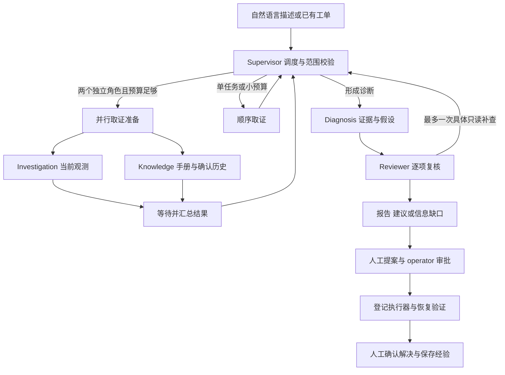

# IT Incident Agent

面向内部服务故障的诊断与处置辅助系统，主要展示 AI Agent 编排与 Harness 工程：自然语言生成工单、受限自主取证、证据诊断、独立复核、一次定向补查，以及人工审批后的受控修复。

## 快速体验

使用 Python 3.12，在项目独立虚拟环境中安装 `requirements.txt`。免费演示不需要模型 Key、数据库或 Docker：

```powershell
.\.venv\Scripts\python.exe scripts/demo_interview.py
.\.venv\Scripts\python.exe scripts/demo_parallel_collection.py
```

第一条命令生成历史经验核查、冲突证据、复核补查三个演示及本地展示页；第二条比较相同脚本响应的串行与并行取证。输出保存在被 Git 忽略的 `output/` 批次目录。

演示使用真实 LangGraph 和工具执行器，但模型响应预设、观测合成。它验证控制流程，不能作为自主推理准确率。并行演示使用人工延迟，不能外推真实模型提速比例。完整免费检查与模拟审批闭环可运行：

```powershell
.\.venv\Scripts\python.exe scripts/showcase_incident.py
```

实际后端、数据库、身份及前端启动步骤见 [Windows 本地启动](README_LOCAL.md)。真实模型诊断需要显式授权和预算，修复需要独立审批及执行确认。

## 当前能力与执行流程



- 五个业务角色使用同一基础模型的不同提示词与局部消息历史，由 LangGraph 节点编排。Investigation / Knowledge 同轮独立任务可并行，诊断、复核及定向补查顺序执行。
- 六个只读工具：指标、日志、变更、负责人、手册检索、已确认历史工单检索。执行前检查身份、角色、服务、环境、版本与时间范围。
- RunContext 原子计数并约束模型、工具及时间预算；分支持有独立台账，汇总证据并保留失败缺口。严格输出契约、服务端来源引用、查询去重、任务检查与单次结构修复构成 Harness。
- 默认最多16次模型请求、24次工具尝试、180秒，预留3次模型/20秒收尾；最多4次调度、6个任务、1轮补查、1次结构修复。实际额度由已授权请求决定。
- 工单与运行按服务端身份隔离，PostgreSQL 保存结果、事件与修复阶段，SSE 支持续读。JSON 日志位于 `logs/incident.log`，指标位于 `/metrics`。
- 登记服务可接入 Prometheus/Loki 与私有确认历史；未登记渠道明确返回缺口。提供知识库 Worker、API、PostgreSQL、Redis 的配置示例，数据库与缓存示例目前只有运维日志。
- 修复独立于诊断：Agent 候选或人工提案 → 绑定证据、工单版本及配置 → operator 审批 → 单次执行 → 有界恢复验证。当前默认执行器只支持精确登记 Docker 容器的重启，拒绝任意脚本、Shell、扩缩容与回滚。

`completed` 表示诊断流程完成，`passed` 表示本次复核通过；二者都不表示工单已解决、唯一根因已确认或修复已批准。修复验证通过也不会自动关闭工单。

## 源码目录

| 路径 | 职责 |
| --- | --- |
| `app/api/`、`app/app_main.py` | FastAPI 入口、认证、工单、运行回放及修复接口 |
| `app/agents/` | 五角色契约与提示词、自主工具循环、单 Agent 对照路径 |
| `app/workflow/` | LangGraph、调度、问题台账、补查、复核与收尾 |
| `app/runtime/` | 全局和分支预算、调用计数与追踪 |
| `app/tools/`、`app/providers/` | 受限工具执行、登记来源、查询及历史适配 |
| `app/evidence/` | 来源、引用、诊断完整性与报告渲染 |
| `app/repairs/` | 提案、审批、固定执行器及恢复验证 |
| `app/storage/`、`app/observability/` | PostgreSQL 与迁移、JSON 日志和指标 |
| `front/agent_front/` | Vue / TypeScript 调试台、报告、审批及执行进度 |
| `scripts/` | 本地演示、登记预检、只读试连与显式评测入口 |
| `tests/`、`evals/`、`fixtures/` | 免费回归、冻结对照数据和受控评测 |
| `examples/` | 服务登记示例、面试材料和公开验证摘要 |
| `archive/research/` | 只供追溯的原研究成果，不参与当前运行和安装 |

后端入口为 `main.py` 与 `local_run.py`。结果读取使用 `/api/v1/runs/{run_id}`；旧研究运行 URL 仅保留只读兼容。Python 包构建与 `requirements.txt` 使用相同的锁定依赖，不再安装研究、Milvus 或 Redis 检查点依赖。

## 验证与面试材料

- [五分钟讲解与追问](examples/showcase/interview-guide.md)、[编排与 Harness 设计](examples/showcase/design.md)、[Harness 证据](examples/showcase/harness.md)。
- [并行取证与免费验证](examples/showcase/parallel-collection.md)、[完整公开展示入口](examples/showcase/README.md)。
- [定向真实模型对照](examples/showcase/curated-live-guide.md)：保留失败、partial、版本及报告哈希。当前结果未证明多 Agent 整体诊断质量领先。
- [历史开发说明](examples/showcase/development-history.md)：集中保留此前实施过程、真实对照和验收限制，不用旧阶段结果替代当前验证。
- [本次清理与收尾](examples/showcase/cleanup-closeout.md)：删除项、历史归档、打包与免费验证结果。

GitHub Actions 检查免费后端控制、前端类型与构建、隔离 PostgreSQL 集成。各次验证成绩绑定对应源码与记录；不把脚本结果当作真实模型成绩，不宣称生产规模或 SLA。当前没有 checkpoint 恢复、跨进程调度、服务管理页面或索引任务查询工具。

真实 `.env`、身份令牌、`services.local.json`、数据库与原始运行数据不提交。`docs/` 继续本地维护并由 `.gitignore` 排除。已提交的研究覆盖与审计源码和历史验收证据保留，未删除或恢复旧草稿。
