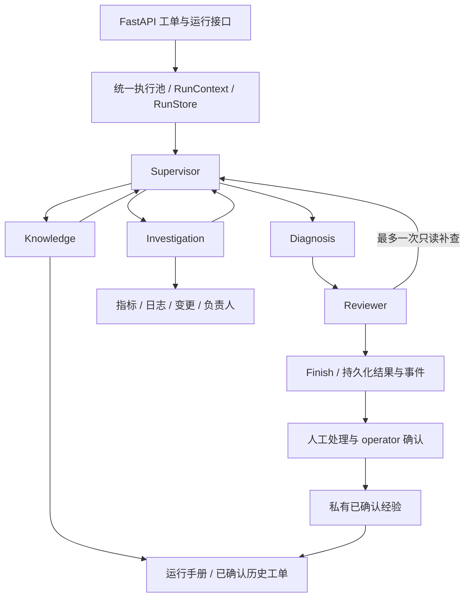

# IT Incident Agent

面向内部服务故障工单的诊断与处置辅助系统：读取工单范围内的指标、日志和变更，形成有引用的原因假设，独立复核，输出处理建议，最后由运维人员确认处理结果。

当前已完成后端主链路收敛：**默认服务只开放 IT 工单功能，五个 Agent 通过真实 LangGraph 节点运行**。本轮先完善后端，前端保留现状，后续再统一整理。

## 当前后端架构



- Supervisor 选择角色与任务；Investigation 负责四种当前观测工具；Knowledge 使用两个知识工具；Diagnosis 形成假设与建议；Reviewer 逐项复核。
- 图负责节点切换，原有 Harness 负责全流程预算、调用计数、超时和审计；原有引用校验负责从已登记的来源字段展开引用。
- 默认最多 16 次模型请求、24 次工具尝试、180 秒，预留 3 次模型/20 秒收尾；真实执行必须显式选择 live 并提供预算。最多 4 次调度、6 个任务、1 次补查和1次结构修复。
- 工单、运行、事件和人工确认复用 PostgreSQL 存储。SSE 支持续读和回放；进程中断会标记失败，目前不恢复图执行。

## 已实现和边界

已支持创建/修订工单、六个开发案例、有界诊断、证据回放、人工确认解决、私有经验检索，以及同预算单/多 Agent 对照。六个工具都只读，执行前校验身份、角色、服务和时间范围。

自由工单仍需接入真实观测 Provider；当前开发案例使用合成观测。系统生成处置建议，重启、回滚、扩容、数据修改和权限变更由人员执行。诊断 completed 不代表工单已解决，也不代表业务准确率已验收。

本轮免费回归涉及 182 个测试：修正查询窗口记录的旧断言后，177 个通过，5 个 PostgreSQL 集成测试因未配置测试 DSN 跳过。六案例单/多共 12 次免费流程检查通过，结果不计入业务质量评分。本轮没有付费调用。历史真实复测的语义质量缺口仍保留，M5 尚未整体验收。

## 后端入口

```powershell
cd D:\code\it_incident_agent
$env:PYTHONIOENCODING='utf-8'
.\.venv\Scripts\python.exe main.py --fake --case case_003 --output output/incident
.\.venv\Scripts\python.exe local_run.py backend
```

`main.py` 默认运行 IT 协作图；单角色取证可显式选择 `--workflow investigation`。后端运行结果与事件使用 `/api/v1/runs/{run_id}` 和 `/api/v1/runs/{run_id}/events`。旧 `/api/v1/research/runs/...` 地址保留只读兼容，供现有页面与历史链接使用。

默认 IT 后端只需要 PostgreSQL；免费 CLI 不需要数据库、模型 Key、Milvus 或搜索 Key。新环境可使用 `requirements-incident.txt` 安装 IT 运行依赖；现有完整环境继续可用。详细启动步骤见 [Windows 本地启动](README_LOCAL.md)。

研究代码、覆盖/审计模块和历史提交保留；研究创建与记忆 API 默认关闭，仅在 `ENABLE_LEGACY_RESEARCH=true` 时启用历史兼容功能。数据库原表名和已有监控标签保留以兼容现存记录。未改动其他项目。

## 交付与后续

本轮流程、文件、验证及未完成项见 [后端收敛与 LangGraph 实施记录](docs/后端收敛与LangGraph实施记录.md)。下一步优先接入真实日志/指标来源并完成一条真实工单后端闭环，接口稳定后再收敛前端。

设计材料见 [完整实施与交接方案](docs/IT_Incident_Agent-完整实施与新对话交接方案.md)，实施状态以源码及交付记录为准。历史阶段记录保留：

- [M0–M2 实施](docs/M0-M2-实施记录.md)、[M2 验收](docs/M2-验收报告.md)。
- [M3 实施](docs/M3-实施记录.md)、[M3 验收](docs/M3-验收报告.md)。
- [M4 工单闭环](docs/M4-实施与验收记录.md)、[M5 对照准备](docs/M5-开发集与对照准备.md)。
- [最近一次真实复测与缺口](docs/M5-升级对象修复后真实复测记录.md)、[历史研究底座](README_RESEARCH.md)。

Git 提交信息使用简体中文；不提交密钥、令牌、运行原始数据或环境。本仓库基于已提交研究源码建立独立历史，保留已有成果。
