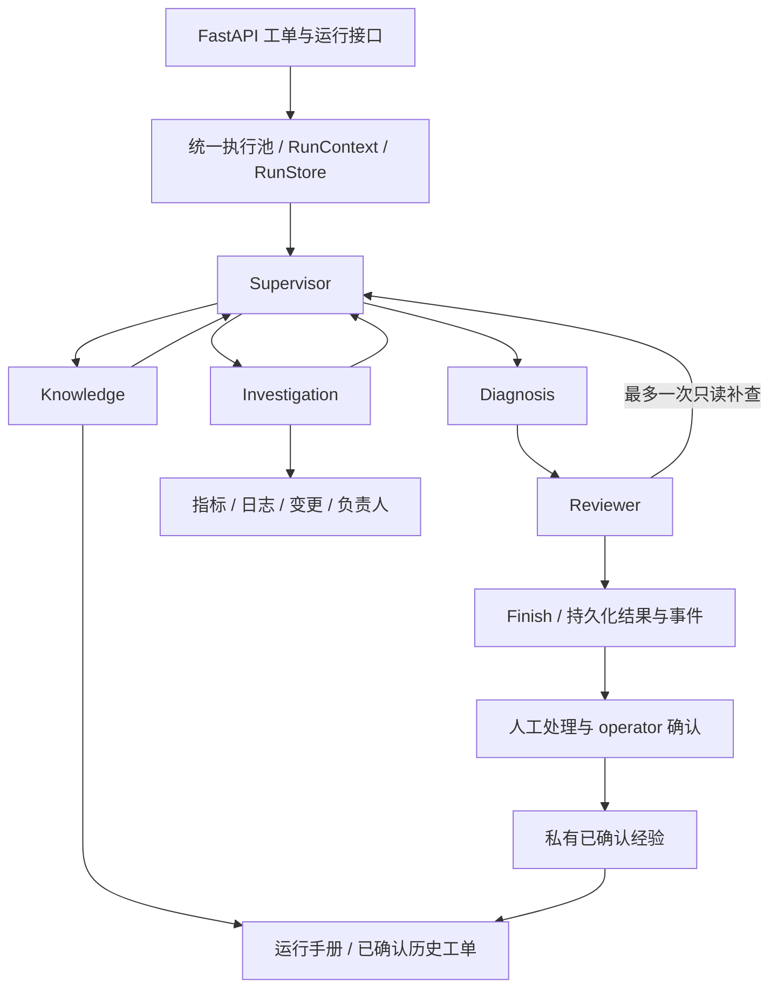

# IT Incident Agent

面向内部服务故障工单的诊断与处置辅助系统：读取工单范围内的指标、日志和变更，形成有引用的原因假设，独立复核，输出处理建议，最后由运维人员确认处理结果。

当前后端已整理为独立 IT 系统：**研究执行与启用开关已移除，五个 Agent 通过真实 LangGraph 节点运行**。模块按 API、Agent、工作流、工具、Provider、证据、运行控制、监控和存储组织。现提供轻量 IT 调试前端：身份验证、服务选择、工单编辑、显式预算诊断、报告与事件回放，以及已登记目标的修复提案、审批、执行与阶段结果查看。

## 当前后端架构



- Supervisor 选择角色与任务；Investigation 负责四种当前观测工具；Knowledge 使用两个知识工具；Diagnosis 形成假设与建议；Reviewer 逐项复核。
- 图负责节点切换，原有 Harness 负责全流程预算、调用计数、超时和审计；原有引用校验负责从已登记的来源字段展开引用。
- 默认最多 16 次模型请求、24 次工具尝试、180 秒，预留 3 次模型/20 秒收尾；真实执行必须显式选择 live 并提供预算。最多 4 次调度、6 个任务、1 次补查和1次结构修复。
- 工单、运行、事件和人工确认复用 PostgreSQL 存储。SSE 支持续读和回放；进程中断会标记失败，目前不恢复图执行。

## 已实现和边界

已支持创建/修订工单、六个开发案例、有界诊断、证据回放、人工确认解决、私有经验检索，以及同预算单/多 Agent 对照。六个工具都只读，执行前校验身份、角色、服务和时间范围。

自由工单可通过服务端ServiceRegistry绑定Prometheus/Loki观测Provider，查询模板、目标、租户和用户范围由管理员登记。开发案例继续使用合成观测。真实来源诊断必须显式live和预算，未登记来源返回信息缺口。

新增独立修复流程：Agent结构化候选或人工提案 → 绑定证据、工单版本和服务配置 → operator审批 → 单次执行 → 有界验证。Docker HTTP/CLI执行器支持精确登记容器的restart_service，要求有效HEALTHCHECK、启动时间改变、健康及登记症状指标恢复。独立临时容器重启已验证；本地知识库试点已登记 Worker 重启与新鲜活跃指标验证，用户确认修复成功且文档成功入库。扩缩容/回滚目前只有动作契约及平台扩展机制，默认执行器明确拒绝。诊断completed或修复verified都不会自动解决工单。

2026-10-10 最新收尾验收：前端已提供修复提案、独立审批、显式执行与阶段查看。诊断者和复核者共享经过校验的登记修复能力及症状规则，复核区分“有条件适用的建议”和“恢复已经成功”，仍保留完整性、证据、权限及执行门禁。用户反馈本次修复成功、知识库文档成功入库；该业务结果以用户反馈为依据，正式闭单和检索结果未另行核验。

本批源码的定向免费回归71项全部通过；前端类型检查、生产构建和9个模拟浏览器场景通过。此前全量回归为203项：196通过、7项隔离数据库测试跳过，两批结果分别记录，不合并为新的全量成绩。提交收尾不重复付费诊断或业务重启。试点闭环通过不代表整体 M5 或生产级验收通过。详细本地记录见[前端修复流程](docs/前端修复提案审批与执行-20261010.md)、[有条件建议复核修正](docs/有条件修复建议与复核修正-20261010.md)。

后续完善：修复方案现已完整保存适用条件、风险和预期验证，并纳入审批摘要。从诊断建议创建时由后端读取已复核原文、保存建议来源；人工提案在页面填写三项内容，修改建议后按人工提案保存。刷新读取创建时快照，旧方案明确提示缺失且不补写。此批定向后端回归37项、隔离数据库7项和模拟浏览器11个场景通过，前端类型检查及构建通过；没有真实模型调用或业务修复写操作。

通用接入配置、API和验证边界见[通用接入与受控修复](docs/通用接入与受控修复.md)，登记结构参考examples/services.example.json。各阶段历史测试结果保留在原验收记录中。

服务登记现支持 `scripts/register_service.py template` 生成独立的只读模板，以及 `check` 免费离线预检。复用已有通用/知识库配置示例，模板不携带修复权限、不覆盖现有文件；预检与后端启动共用字段、来源、范围及症状验证规则，错误不输出配置值或凭据。结构通过后可显式运行已有 `probe_registered_service.py` 只读试连，再将核对后的条目加入 `services.local.json`。具体命令见 [Windows 本地启动](README_LOCAL.md)。

## 后端入口

2026-10-09历史验收：真实修复同时验证容器健康与原症状指标，阶段事件逐步持久化，新增详情/事件续读、固定标签修复指标及Docker Desktop原生CLI执行器。独立临时PostgreSQL的7项集成和临时容器重启已实测通过；当时166项由一次全量加定向验证覆盖，未解决失败0。该次检查无付费调用，未覆盖真实业务修复闭环。详见[后端完善与持久化验收](docs/后端完善与持久化验收-20261009.md)。

```powershell
cd D:\code\it_incident_agent
$env:PYTHONIOENCODING='utf-8'
.\.venv\Scripts\python.exe main.py --fake --case case_003 --output output/incident
.\.venv\Scripts\python.exe scripts/demo_remediation.py
.\.venv\Scripts\python.exe local_run.py backend
```

`main.py` 默认运行 IT 协作图；单角色取证可显式选择 `--workflow investigation`。后端运行结果与事件使用 `/api/v1/runs/{run_id}` 和 `/api/v1/runs/{run_id}/events`。旧 `/api/v1/research/runs/...` 地址保留只读兼容，供现有页面与历史链接使用。

默认 IT 后端只需要 PostgreSQL；免费 CLI 不需要数据库、模型 Key、Milvus 或搜索 Key。新环境使用 `requirements.txt` 安装67个锁定的 IT 运行依赖；`requirements-incident.txt` 仅作为兼容入口。现有环境继续可用。详细启动步骤见 [Windows 本地启动](README_LOCAL.md)。

研究专用代码、原测试及覆盖/审计成果移入 `archive/research/`，只供历史追溯，不提供重新启用入口。52个归档文件保存内容哈希，保护已提交成果；历史验收报告不改写。现有 `config.json` 与本地凭据原样保留，运行只读取 IT 字段。

数据库现有表名及旧只读运行 URL 保留兼容，避免破坏数据和现有页面。日志改为 `logs/incident.log`，指标使用 `it_incident_*`。Compose只声明本项目的 PostgreSQL，旧 Milvus 容器/卷及其他项目未操作。

## 交付与后续

`docs/` 文档在本地维护，已加入 `.gitignore` 并停止 Git 跟踪；下列文档链接供本地阅读，Git 历史保留已提交版本。

目录、职责与调用关系见 [项目结构与模块说明](docs/项目结构与模块说明.md)；目录清理记录见 [研究退役与目录整理记录](docs/研究退役与目录整理记录.md)。图迁移记录见 [后端收敛与 LangGraph 实施记录](docs/后端收敛与LangGraph实施记录.md)。真实日志/指标接入、轻量调试前端、试点恢复闭环、审批依据保存展示及登记模板/免费预检已实现。后续可逐服务扩展登记范围。当前不增加索引任务查询能力或服务管理页面。

设计材料见 [完整实施与交接方案](docs/IT_Incident_Agent-完整实施与新对话交接方案.md)，实施状态以源码及交付记录为准。历史阶段记录保留：

- [M0–M2 实施](docs/M0-M2-实施记录.md)、[M2 验收](docs/M2-验收报告.md)。
- [M3 实施](docs/M3-实施记录.md)、[M3 验收](docs/M3-验收报告.md)。
- [M4 工单闭环](docs/M4-实施与验收记录.md)、[M5 对照准备](docs/M5-开发集与对照准备.md)。
- [最近一次真实复测与缺口](docs/M5-升级对象修复后真实复测记录.md)、[历史研究底座](README_RESEARCH.md)。

Git 提交信息使用简体中文；不提交密钥、令牌、运行原始数据或环境。本仓库基于已提交研究源码建立独立历史，保留已有成果。
