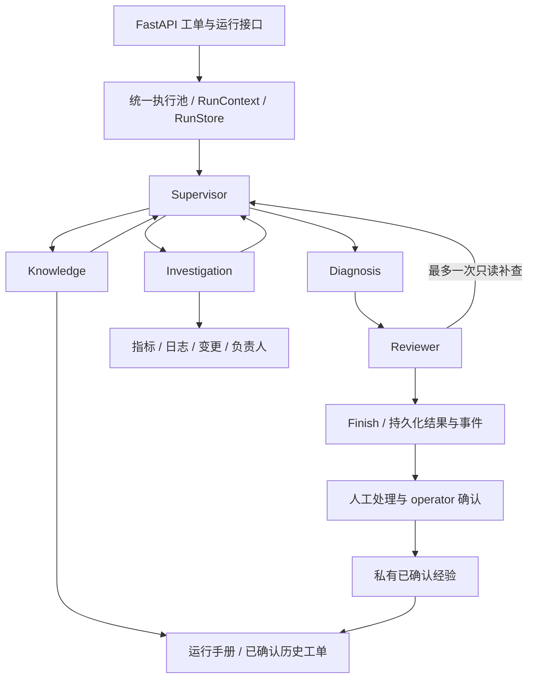

# IT Incident Agent

面向内部服务故障工单的诊断与处置辅助系统：读取工单范围内的指标、日志和变更，形成有引用的原因假设，由 Reviewer 角色单独复核，输出处理建议，最后由运维人员确认处理结果。

当前后端已整理为独立 IT 系统：**研究执行与启用开关已移除，五个 Agent 通过真实 LangGraph 节点运行**。模块按 API、Agent、工作流、工具、Provider、证据、运行控制、监控和存储组织。现提供轻量 IT 调试前端：身份验证、服务选择、工单编辑、显式预算诊断、报告与事件回放，以及已登记目标的修复提案、审批、执行与阶段结果查看。

## Agent 编排与 Harness 展示

新增[定向真实对照与面试讲解](examples/showcase/curated-live-guide.md)：两个展示场景加一次工单修订，共6次真实运行、47次模型/16次合成工具。实际展示Reviewer拒绝为不充分候选背书，保留完整对照和原报告哈希；没有证明多Agent完整诊断质量领先，不能把目的性展示集当独立准确率测试。[配对记录](examples/showcase/curated-live-comparison.json)与[真实复核片段](examples/showcase/curated-review-evidence.json)可核查。

面试展示入口：[五分钟讲解与追问](examples/showcase/interview-guide.md)。运行 `.\.venv\Scripts\python.exe scripts/demo_interview.py` 可生成历史经验核查、冲突证据与复核补查三个本地演示及展示页。真实LangGraph与工具执行器配合脚本角色响应和合成观测，付费调用为零；展示协作机制，不作为模型胜率结论。

项目重点是**模型驱动的任务与工具选择，以及程序控制的权限、预算、证据和审批边界**。五角色使用同一底层模型的不同提示词；LangGraph 当前串行执行，没有 checkpoint 恢复。格式与引用正确不能保证因果判断正确。

安装根目录依赖后，一条命令运行三条演示、六案例同预算模拟对照、五类 Harness 约束和模拟审批闭环：

```powershell
.\.venv\Scripts\python.exe scripts/showcase_incident.py
```

不需要数据库、Docker 或密钥，不调用真实模型，不执行真实修复。输出路径会显示在终端，打开其中的 `index.html` 查看任务和节点轨迹；原始控制报告及 `summary.json` 同时保留。正常诊断、实际执行一次复核补查、预算不足受控退出均已验证。模拟结果只证明程序控制行为，模型质量标为 `excluded_scripted`。

展示材料可随仓库阅读：[演示与五分钟讲解](examples/showcase/README.md)、[设计取舍](examples/showcase/design.md)、[Harness 证据](examples/showcase/harness.md)、[历史真实模型对照](examples/showcase/historical-comparison.json)。历史对照是一组旧版本合成开发案例：单 Agent 6 次模型/24.234 秒，多 Agent 13 次模型/62.672 秒，两者均 partial；未证明多 Agent 质量提升。报告哈希和机械检查已核验，逐项助手分析与正式人工评分分开，人工评分仍待确认，不宣称生产准确率。

2026-10-10 经用户授权补充[当前版本真实对照](examples/showcase/current-comparison.json)：同一 case_003、qwen-turbo、每条16模型/8工具上限，各运行一次。单 Agent 2模型/4工具、10.438秒、completed/not_performed，必要检查4/4；多 Agent 6模型/1工具、18.328秒、completed/passed，必要检查3/4，未查询获取连接超时日志。当前单 Agent 更快、取证更全，多 Agent 建议更谨慎；内部复核通过不等于完整诊断，未证明综合质量领先。总共8次模型调用，没有追加重测；正式人工评分仍待审阅。

当前以已有 Worker 诊断、人工审批恢复及用户反馈入库成功作为业务闭环案例。接下来优先完善评测与展示，暂缓更多运维指标、服务管理页面和修复动作。

针对上述对照暴露的“执行结束被误当作目标完成”问题，多 Agent 任务新增 `checks`（最多两项具体只读检查）、`execution_status` 和程序生成的 `completion`。检查仍经已有工具权限、登记和范围校验；初次取证由叶子 Agent 选择工具，复核补查复用既有执行流程。声明的检查未执行、失败、截断或所需指标缺少样本时，整份报告不能直接 `passed`，实际补查满足后可解除缺口。

Diagnosis 和 Reviewer 现在同时接收工单症状、任务目标、实际检查和未满足项，复核须区分异常指标、近端机制、具体触发原因及建议条件。`checks_satisfied` 只证明声明的查询取得样本，不能证明因果关系或连续健康；未声明检查的兼容任务标为 `not_specified`，不声称程序已核验目标。单 Agent 原提示词保持不变，当前真实对照文件保留原始结果，优化后的模型质量仍需另行显式授权复测。实现和验证边界见 [任务检查与复核](examples/showcase/design.md#任务检查与复核)。

随后经用户要求执行[优化后一次真实对照](examples/showcase/optimized-comparison.json)：沿用 case_003、qwen-turbo 及每条16模型/8工具上限。单 Agent 2模型/4工具、10.063秒、completed，必要取证4/4；多 Agent 3模型/0工具、8.157秒、failed，在取证角色没有调用工具后，重复调度被 `DUPLICATE_TASK` 门禁终止，必要取证0/4，尚未运行 Diagnosis/Reviewer。门禁识别缺口，但执行推进未成功；失败退出耗时不能当作效率提升。单 Agent 扩容建议的容量条件和审批标记仍有问题。总共5次付费模型调用，没有追加重测，不宣称多 Agent 质量提升；正式人工评分仍待确认。

上述提前结束路径现已修复：叶子返回最终 JSON 时，若声明检查尚未执行且步骤、预算足够，循环内最多提醒一次实际调用工具，并为结果总结保留步骤。仍未调用工具则记录 `NO_TOOL_PROGRESS`；已有当前观测时转入诊断与复核，否则带明确缺口返回 partial，避免重复派发同一任务。已满足的检查可复用，空结果和失败查询不因这条纠正逻辑自动重查。7 项新增响应重放场景通过，完整免费回归257项中250通过、7项隔离数据库测试跳过，免费演示通过；未追加真实模型复测或业务写操作，历史对照成绩保持不变。

随后按用户要求完成[修复后一次真实对照](examples/showcase/leaf-fix-comparison.json)：相同案例、模型、身份及预算，单 Agent 2模型/4工具、10.234秒、completed，必要取证4/4；多 Agent 15模型/5工具、44.718秒、partial/needs_information，必要取证2/4。执行提醒真实生效，多 Agent 实际查询变更并进入诊断复核，但 Supervisor 漏派 pool_usage/pool_wait，空依赖日志又占用查询与任务，Reviewer 未提出具体补查，最终保留缺口并剔除扩容建议。两条机械检查全部通过，不能据此称诊断完整。共17次付费模型请求、9次合成只读工具尝试，无追加重跑；仍未证明多 Agent 综合优势。助手分析另存 [辅助审阅](examples/showcase/leaf-fix-assistant-review.json)，正式人工评分待确认。

针对本次调度缺口，进一步优化了检查选择与补查闭环：任务可声明 `expected_value`，候选机制传给后续角色；已覆盖检查在派发及同批任务执行前复用，完整空查询的更窄筛选不再访问 Provider，空结果仍保留缺口。Reviewer 可用 `request_evidence.target_id=A1` 补查建议条件，同时保持相关 H 的支持结论；有预算但只写 uncertain 缺口时，最多一次提醒选择具体检查或填写 `follow_up_reason`。一轮补查、权限和全局预算边界继续生效。新增11项免费场景通过，定向81项通过，完整268项中261通过、7项隔离数据库测试跳过，免费演示通过；本轮没有真实模型调用，尚未证明优化后质量提升。设计细节见 [检查选择与建议补查](examples/showcase/design.md#检查选择与建议补查)。

随后经用户授权完成[检查选择优化后真实验证](examples/showcase/information-gain-comparison.json)：同一案例、模型、身份和预算，单 Agent 2模型/4工具、9.968秒、completed，取证4/4；多 Agent 12模型/3工具、48.109秒、completed/passed，取证3/4，实际执行一轮 Reviewer 请求的 db_cpu 补查、修订和二次复核。相比前组多 Agent 的15模型/5工具、取证2/4，检查选择与补查有所改善，但耗时未缩短，仍缺 POOL_ACQUIRE_TIMEOUT 日志，容量适用性也未完成。单 Agent 本次扩容建议的审批标记为 false；多 Agent 建议需审批，但内部 passed 不代表完整原因或修复条件已确认。A目标补查、复核提醒及查询/任务复用本次未触发，继续以免费测试为依据。共14次付费模型请求、7次合成只读工具尝试，没有追加重跑；[助手分析](examples/showcase/information-gain-assistant-review.json)与待确认的正式人工评分分开，仍未证明多 Agent 综合优于单 Agent。

在上述真实验证后，按用户要求补齐共享证据需求：Supervisor、Investigation、Diagnosis、Reviewer 共用 `evidence_needs`，独立记录症状、机制与替代解释问题，不以局部任务完成证明整体取证充分。任务可通过 `need_ids` 关联问题，复核通过 `need_assessments` 单独评价全部问题；缺失评估保持 uncertain，关键问题未解决时报告为 partial。深层原因和人工前置条件可保留为明确限制，不强制巡检全部渠道，不读取运行时 gold。报告及事件包含问题状态、引用和理由。新增9项免费场景通过；完整回归277项中270通过、7项隔离PostgreSQL测试跳过，最终定向43项通过。单Agent基线保持，当前优化尚未进行真实模型复测，不宣称质量或成本提升。设计见[共享证据需求与完成门禁](examples/showcase/design.md#共享证据需求与完成门禁)。

共享证据需求改造后，按用户要求执行[一次真实对照](examples/showcase/evidence-needs-comparison.json)：同一case_003与预算，单Agent5模型/6工具、21.391秒，实际取得4/4预设观测但负责人引用纠正后仍无效，最终partial/MODEL_OUTPUT_INVALID；多Agent8模型/2工具、36.547秒，取证3/4，Reviewer实际将N2从supported改回pending，重复空配置变更补查被拒绝，最终partial/REVIEW_INCOMPLETE。清单、任务关联和独立问题评估真实生效，但未完成诊断，也未证明调度与补查质量提升。共13次付费模型请求，不追加重跑；[助手分析](examples/showcase/evidence-needs-assistant-review.json)与待确认人工评分分开，历史成绩保留。

## 当前后端架构

另有[多Agent专项能力测试集](evals/targeted/README.md)：历史经验误导、证据范围冲突、区分性取证各两个不同业务事件，并保留两例普通对照。开发/普通5例、保留3例，数据与规则冻结；复用原单/多Agent、六工具和同预算执行器，没有为案例调整应用提示词或门禁。评分保留假设的支持/排除/未知状态、建议条件及不可执行待确认项，专项与普通结果分别汇总。默认免费计划或模拟控制，付费入口每批最多两例且须明确授权；当前未证明多Agent质量优势。

随后经用户授权完成[专项集首批真实对照](examples/showcase/targeted-first-comparison.json)：probe_001/probe_002各single/multi一次，共22次模型请求、11次合成工具尝试、124178已知Token；没有额度或认证错误。单Agent分别4模型/3工具、2模型/1工具，H/A为空而partial；多Agent分别7模型/2工具、9模型/5工具，均在Supervisor先REQUIRED_EVIDENCE_NEED、纠正后UNEXPECTED_TASKS，未进入Diagnosis/Reviewer而partial。四条机械检查通过，正式人工评分待确认；[助手审阅](examples/showcase/targeted-first-assistant-review.json)另存。无追加重跑、应用修改或保留集运行，未证明多Agent优势。

评测现新增[独立合成测试集与评分说明](evals/independent/README.md)：保留旧6例开发回归，另有6例验证和4例默认禁用的最终保留案例。观测与参考答案分离，数据/规则以哈希冻结；语义评分允许不同取证路径，不以固定字段覆盖或内部复核通过代替正确率。`scripts/compare_independent.py`默认免费计划，真实批次需显式授权和预算。本次仅完成免费结构、运行与评分控制验证，没有新增真实诊断成绩。

随后经用户授权完成[独立验证集首轮真实对照](examples/showcase/independent-comparison.json)：eval_001、eval_004各single/multi一次，共32次真实模型请求、15次合成工具尝试。eval_001单Agent取到DNS日志但负责人引用纠正失败，多Agent漏查依赖日志且未完成有效补查，两者partial；eval_004单Agent形成证书原因与需审批的更新建议，多Agent取到证书日志但叶子输出和复核协议错误导致partial。四份保存报告机械校验通过，正式人工评分待确认；[助手审阅](examples/showcase/independent-assistant-review.json)另存。保留集未释放，没有重跑或修改Agent行为；这两个小样本尚未证明多Agent综合优势。

独立对照后的通用修正：查询执行完成与证据充分分开记录，完整空日志/变更/检索不再被标为未执行，仍保留查询范围限制且不生成事实引用；空指标继续保留缺样本门禁。新空查询会交回 Supervisor 判断是否需要另一条有价值的渠道。有效补查与关联 N 的已支持状态冲突时，仅将该 N 收紧为 uncertain 并记录事件，不增加结构纠正额度；被拒绝请求可在原预算内得到最多一次选择提醒。负责人使用独立引用契约和动态 `owner_options`。多 Agent 提示词去掉具体案例说明并合并重复规则。151项定向免费回归、验证集12条脚本运行的六项机械校验通过；数据冻结校验通过，0真实模型请求、0真实业务操作。单 Agent 原系统提示词保留，但共享负责人契约改变版本标识，后续对照须记录新基线；尚未证明漏查率、质量或成本改善。详见[查询推进与输出协议](examples/showcase/design.md#查询推进与输出协议)。

随后经用户要求完成[通用协议修正后真实验证](examples/showcase/protocol-validation-comparison.json)：沿用eval_001、eval_004、qwen-turbo及每条16模型/8工具上限，各single/multi一次，共27次真实模型请求、16次合成工具尝试。DNS单Agent纠正负责人后输出有效观测但H/A为空；多Agent被request_info仍携带tasks的UNEXPECTED_TASKS终止。证书多Agent从空变更查询转向日志并形成获支持H，但建议和替代解释评估未完成；单Agent取证及证书更新建议合理，H为空。四条机械校验通过，无重跑或保留集运行；两条单Agent的completed不算完整诊断通过。[助手定性审阅](examples/showcase/protocol-validation-assistant-review.json)与正式人工评分分开，仍未证明多Agent综合优势。源码及冻结测试集在批次内保持一致。

针对这批结果，后续修正了三项通用协议：叶子每轮请求刷新`check_completion`与`collection`，任务交接明确程序台账是查询执行状态依据、模型摘要尚未验证；Supervisor非dispatch携带tasks或dispatch缺少tasks的校验进入已有一次纠正流程，Schema同时表达动作分支；单/多Agent共用诊断完整性函数，缺少观测、原因假设或建议时保留已有内容并partial结束，状态核查仅要求观测。新增8项失败类型重建场景与172项相关免费回归通过，独立验证集12条脚本运行机械检查通过。没有新增真实模型调用，原始对照和冻结数据未修改；输入及完成门禁已变，后续配对需记录新源码指纹。实现见[实时查询状态与诊断完整性](examples/showcase/design.md#实时查询状态与诊断完整性)。

修复后已完成[一次同预算真实对照](examples/showcase/live-ledger-comparison.json)：eval_001、eval_004各single/multi一次，共30次模型请求、15次合成工具尝试、146261个已知Token。DNS多Agent形成当前DNS机制和补查建议，仍因N3缺口partial；单Agent缺H/A，被新门禁正确标partial。证书单AgentF/H/A齐全但未查证书日志，只定位TLS方向；多Agent重复空配置日志请求后收尾，未定位证书原因。四条机械检查通过，无重跑或保留集运行；[助手分析](examples/showcase/live-ledger-assistant-review.json)与待确认人工评分分开。协议冲突本轮未出现，真实纠正分支未触发，仍未证明多Agent综合优势。

最新通用修复增加一次有界调度推进：重复完整空查询且核心问题仍pending时可返回Supervisor选择新检查；准备诊断但关键问题未评估时可使用同一份一次提醒，要求关联need_ids并说明expected_value，也可据已有观测评估或明确停止理由。复核补查按程序先执行checks、叶子一次解释的实际路径估算预算，保留原总上限及收尾预留。新增8项控制场景、相关180项免费回归及独立验证集12条脚本控制机械检查通过，0付费调用；未修改案例或释放保留集，尚未证明真实模型质量提升。实现与限制见[有界调度推进与补查预算](examples/showcase/design.md#有界调度推进与补查预算)。

随后完成[保留集首两例真实配对](examples/showcase/general-progress-holdout-comparison.json)：eval_007、eval_008各single/multi一次，源码`a08f8b27ef7f719b`，共25次模型请求、10次合成只读工具、134168个已知Token。四条均partial；single都只取得指标后结束，multi都取到WARN关键日志，但均漏查配置变更且最终建议为空。配额multi定位局部限流；缓存multi的过期/泄漏假设被Reviewer过度支持。六项机械检查均通过，新增调度推进机会未触发，复核提醒触发一次但补查重复被拒绝；未完成真实返工，不宣称综合质量领先。[助手定性分析](examples/showcase/general-progress-holdout-assistant-review.json)与正式人工评分分开，无重跑或真实业务写入。两例已释放，后续属于已见案例；另外两例未运行。本轮未修改Agent。

诊断语义现已集中调整：H区分机制、触发原因和替代解释，A区分只读核查、人工变更和登记修复。完成条件允许已排除候选和明确的非关键未知，仍要求已复核观测、至少一个有支持的机制、有效下一步且无关键缺口。待确认建议单独显示、不能进入修复执行入口。新增10项免费控制场景，全量324项回归中317通过、7项数据库集成跳过；冻结验证集12条脚本机械核验、离线演示及模拟审批闭环通过。没有付费复测，不能宣称模型质量改善；共享契约改变了版本，历史结果保留。详见[诊断层级、建议类型与报告完成](examples/showcase/design.md#诊断层级建议类型与报告完成)。



- Supervisor 选择角色与任务；Investigation 负责四种当前观测工具；Knowledge 使用两个知识工具；Diagnosis 形成假设与建议；Reviewer 逐项复核。
- 图负责节点切换，原有 Harness 负责全流程预算、调用计数、超时和审计；原有引用校验负责从已登记的来源字段展开引用。
- 默认最多 16 次模型请求、24 次工具尝试、180 秒，预留 3 次模型/20 秒收尾；真实执行必须显式选择 live 并提供预算。最多 4 次调度、6 个任务、1 次补查和1次结构修复。
- 工单、运行、事件和人工确认复用 PostgreSQL 存储。SSE 支持续读和回放；进程中断会标记失败，目前不恢复图执行。

## 已实现和边界

已支持创建/修订工单、六个开发案例、有界诊断、证据回放、人工确认解决、私有经验检索，以及同预算单/多 Agent 对照。六个工具都只读，执行前校验身份、角色、服务和时间范围。

自由工单可通过服务端ServiceRegistry绑定Prometheus/Loki观测Provider，查询模板、目标、租户和用户范围由管理员登记。开发案例继续使用合成观测。真实来源诊断必须显式live和预算，未登记来源返回信息缺口。

新增独立修复流程：Agent结构化候选或人工提案 → 绑定证据、工单版本和服务配置 → operator审批 → 单次执行 → 有界验证。Docker HTTP/CLI执行器支持精确登记容器的restart_service，要求有效HEALTHCHECK、启动时间改变、健康及登记症状指标恢复。独立临时容器重启已验证；本地知识库试点已登记 Worker 重启与新鲜活跃指标验证，用户确认修复成功且文档成功入库。扩缩容/回滚目前只有动作契约及平台扩展机制，默认执行器明确拒绝。诊断completed或修复verified都不会自动解决工单。

2026-10-10 最新收尾验收：前端已提供修复提案、独立审批、显式执行与阶段查看。诊断者和复核者共享经过校验的登记修复能力及症状规则，复核区分“有条件适用的建议”和“恢复已经成功”，仍保留完整性、证据、权限及执行门禁。用户反馈本次修复成功、知识库文档成功入库；该业务结果以用户反馈为依据，正式闭单和检索结果未另行核验。

本批源码的定向免费回归71项全部通过；前端类型检查、生产构建和9个模拟浏览器场景通过。此前全量回归为203项：196通过、7项隔离数据库测试跳过，两批结果分别记录，不合并为新的全量成绩。提交收尾不重复付费诊断或业务重启。试点闭环通过不代表整体 M5 或生产级验收通过。详细本地记录见[前端修复流程](docs/前端修复提案审批与执行-20261010.md)、[有条件建议复核修正](docs/有条件修复建议与复核修正-20261010.md)。

后续完善：修复方案现已完整保存适用条件、风险和预期验证，并纳入审批摘要。从诊断建议创建时由后端读取已复核原文、保存建议来源；人工提案在页面填写三项内容，修改建议后按人工提案保存。刷新读取创建时快照，旧方案明确提示缺失且不补写。此批定向后端回归37项、隔离数据库7项和模拟浏览器11个场景通过，前端类型检查及构建通过；没有真实模型调用或业务修复写操作。

通用接入配置、API和验证边界见[通用接入与受控修复](docs/通用接入与受控修复.md)，登记结构参考examples/services.example.json。各阶段历史测试结果保留在原验收记录中。

服务登记现支持 `scripts/register_service.py template` 生成独立的只读模板，以及 `check` 免费离线预检。复用已有通用/知识库配置示例，模板不携带修复权限、不覆盖现有文件；预检与后端启动共用字段、来源、范围及症状验证规则，错误不输出配置值或凭据。结构通过后可显式运行已有 `probe_registered_service.py` 只读试连，再将核对后的条目加入 `services.local.json`。具体命令见 [Windows 本地启动](README_LOCAL.md)。

新增知识库 API、PostgreSQL 和 Redis 的只读接入示例与三个模板 profile，见 `examples/services.enterprise-stack.example.json`。本机登记已追加三项并加载到工单目录，负责人均经用户确认为alice；原索引 Worker 保持原配置。API登记4个HTTP指标和QA运维事件，数据库与缓存仅登记固定运维状态日志，缺少直接指标明确保留提示；新三项不开放修复动作。36项定向测试及实际登记离线预检通过。后续四服务真实只读联调已完成：20次工具尝试、0模型调用，provider错误0、24条实质引用全部校验通过；报告保留Worker日志截断、API事件空结果及数据库/缓存指标缺口，不代表完整健康验收通过。详见 [四服务统一只读联调结果](docs/四服务统一只读联调结果-20261010.md)。

## 后端入口

2026-10-09历史验收：真实修复同时验证容器健康与原症状指标，阶段事件逐步持久化，新增详情/事件续读、固定标签修复指标及Docker Desktop原生CLI执行器。独立临时PostgreSQL的7项集成和临时容器重启已实测通过；当时166项由一次全量加定向验证覆盖，未解决失败0。该次检查无付费调用，未覆盖真实业务修复闭环。详见[后端完善与持久化验收](docs/后端完善与持久化验收-20261009.md)。

```powershell
cd D:\code\it_incident_agent
$env:PYTHONIOENCODING='utf-8'
.\.venv\Scripts\python.exe main.py --fake --case case_003 --output output/incident
.\.venv\Scripts\python.exe scripts/demo_remediation.py
.\.venv\Scripts\python.exe local_run.py backend
```

`main.py` 默认运行 IT 协作图；单角色取证可显式选择 `--workflow investigation`。后端运行结果与事件使用 `/api/v1/runs/{run_id}` 和 `/api/v1/runs/{run_id}/events`。旧 `/api/v1/research/runs/...` 地址保留只读兼容，供现有页面与历史链接使用。

默认 IT 后端只需要 PostgreSQL；免费 CLI 不需要数据库、模型 Key、Milvus 或搜索 Key。新环境使用 `requirements.txt` 安装67个锁定的 IT 运行依赖；`requirements-incident.txt` 仅作为兼容入口。现有环境继续可用。详细启动步骤见 [Windows 本地启动](README_LOCAL.md)。

研究专用代码、原测试及覆盖/审计成果移入 `archive/research/`，只供历史追溯，不提供重新启用入口。52个归档文件保存内容哈希，保护已提交成果；历史验收报告不改写。现有 `config.json` 与本地凭据原样保留，运行只读取 IT 字段。

数据库现有表名及旧只读运行 URL 保留兼容，避免破坏数据和现有页面。日志改为 `logs/incident.log`，指标使用 `it_incident_*`。Compose只声明本项目的 PostgreSQL，旧 Milvus 容器/卷及其他项目未操作。

## 交付与后续

2026-10-10：[Supervisor 协议容错与证据保留](examples/showcase/supervisor-protocol-resilience.md)已实现，缩小调度契约、保留核心问题、审计冗余任务，并允许一次预算内的诊断与独立复核收尾。全量343项中336通过、7项隔离数据库集成跳过；本轮无付费验证，真实效果待独立授权复测。

`docs/` 文档在本地维护，已加入 `.gitignore` 并停止 Git 跟踪；下列文档链接供本地阅读，Git 历史保留已提交版本。

目录、职责与调用关系见 [项目结构与模块说明](docs/项目结构与模块说明.md)；目录清理记录见 [研究退役与目录整理记录](docs/研究退役与目录整理记录.md)。图迁移记录见 [后端收敛与 LangGraph 实施记录](docs/后端收敛与LangGraph实施记录.md)。真实日志/指标接入、轻量调试前端、试点恢复闭环、审批依据保存展示及登记模板/免费预检已实现。后续可逐服务扩展登记范围。当前不增加索引任务查询能力或服务管理页面。

设计材料见 [完整实施与交接方案](docs/IT_Incident_Agent-完整实施与新对话交接方案.md)，实施状态以源码及交付记录为准。历史阶段记录保留：

- [M0–M2 实施](docs/M0-M2-实施记录.md)、[M2 验收](docs/M2-验收报告.md)。
- [M3 实施](docs/M3-实施记录.md)、[M3 验收](docs/M3-验收报告.md)。
- [M4 工单闭环](docs/M4-实施与验收记录.md)、[M5 对照准备](docs/M5-开发集与对照准备.md)。
- [最近一次真实复测与缺口](docs/M5-升级对象修复后真实复测记录.md)、[历史研究底座](README_RESEARCH.md)。

Git 提交信息使用简体中文；不提交密钥、令牌、运行原始数据或环境。本仓库基于已提交研究源码建立独立历史，保留已有成果。
