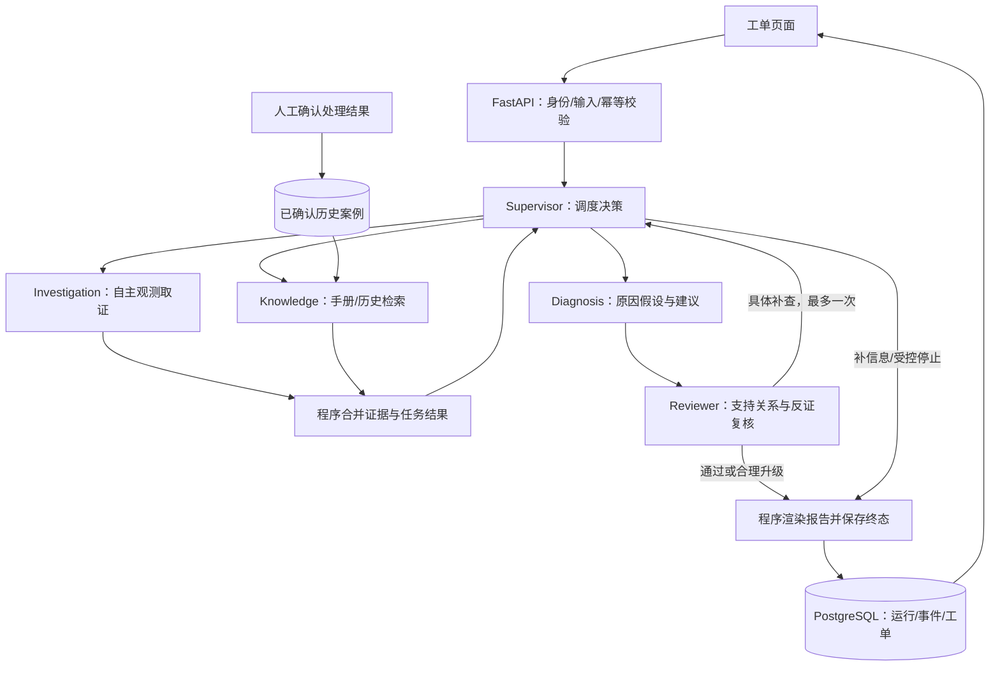

# IT Incident Agent：完整实施与新对话交接方案

编写日期：2026-10-08。用途：在 Codex 新工作中接续开发。本文是实施设计，不是功能完成说明。

## 1. 项目目标与当前状态

项目目标：在现有工程底座上构建“企业内部服务故障工单多 Agent 协同助手”，用于大四 Agent 开发方向求职。需要展示自主工具选择、证据驱动的角色协作与 Harness 工程控制，同时保持单机项目的可理解性和交付规模。

用户已有独立 RAG 项目，因此本项目的重点是故障诊断与有界协作，RAG 只承担短手册和已确认案例检索。

### 1.1 仓库与运行环境

| 项目 | 当前事实 |
| --- | --- |
| 新 GitHub 仓库 | https://github.com/Heresy0/IT_Incident_Agent，公开 |
| 新项目目录 | `D:\code\it_incident_agent` |
| 新仓库初始提交 | `d30e0187c167d6275d8f26c45aa1ba14a5899644` |
| 原始源码基线 | 研究项目提交 `a40d80c0e0dc1231f7ca87c185508f33b18be311` |
| 当前产品行为 | 研究工作流；IT 工单功能尚未实现 |
| 原研究项目 | `D:\code\deep_research`，保留作为独立保底项目 |
| 新项目端口 | 前端 5174、后端 8003、PostgreSQL 5434、Milvus 19531、Milvus 健康接口 9092 |
| Compose 项目名 | `it-incident-local`，使用独立数据卷 |
| 默认模型 | 配置示例为 `qwen-turbo`；工具调用兼容性待验证 |
| 依赖环境 | 副本未复制 `.venv`、`node_modules`；需新建环境 |
| 密钥和身份 | 未复制 `.env.local`、真实 API Key、身份注册表、演示令牌 |
| 数据 | 未复制数据库、知识集合、原用户记忆或本地运行日志 |

此前在副本上借用原 Python 环境验证：59 项免费控制/身份/评测回归通过；20 个研究评测案例及 5 段固定资料校验通过；Compose 配置解析通过。未启动新项目服务，未在副本完成前端构建或数据库集成检查。不能据此声称全链路已部署成功。

新工作必须以本仓库最新状态为准；上述提交用于溯源，不要求回退到初始提交。

### 1.2 已有能力：优先复用

- LangGraph 固定研究流程，FastAPI API，Vue 前端。
- 博查网络搜索、Milvus 基础知识检索。
- PostgreSQL 运行记录、顺序事件、事务终态、检查点。
- 服务端 Bearer 令牌身份：由服务端确定 `tenant_id/user_id/role`。
- 运行/回放归属授权，私有资料范围隔离，可管理的两层记忆。
- Harness：原子调用预算、有限结构修复、错误分类、证据引用检查。
- JSON 日志、应用调用轨迹、Prometheus 格式指标、SSE 回放。
- 免费回归、PostgreSQL 集成测试、研究评测脚本、GitHub Actions。

当前研究角色由固定图编排，业务工具主要由 Python 节点执行。不能因为存在多个角色或安装了 Agent 库，就声称已经实现自主工具调用和动态协商。

### 1.3 旧文档中需要纠正的内容

`docs/实施方案-IT故障工单协同.md` 是早期设计。遇到冲突时，先核对当前代码，本文采用以下更新：

1. `coverage.py`、`validation.py`、`nodes.py`、`state.py` 中的覆盖与审计功能已进入已提交基线，不再是待清理草稿。不得按旧说明删除、恢复或重置这些文件。
2. 认证、用户/租户隔离和记忆管理已经存在。IT 新接口必须沿用这些能力，不能恢复成客户端自报身份的模式。
3. 研究评估体系已经存在，应复用评测工程能力，但研究案例和分数不能充当 IT 场景成绩。
4. 原项目已有独立仓库，本仓库是 IT 项目。在新仓库保留研究后端及测试用于回归即可，不需要长期维护两个完整产品前端。
5. 旧方案的天数估计不作为本次承诺。按阶段交付物和验收推进，不先安排大规模平台建设。

## 2. 产品范围：一个可验证的小闭环

面向接收内部服务故障的一线支持、值班开发和小团队运维人员。

输入工单 → 自主选择只读检查 → 查手册/已确认历史案例 → 提出原因假设 → 复核证据与反证 → 必要时补查一次 → 输出建议、缺口与升级对象 → 人工确认实际处理结果。

### 2.1 首版覆盖三类故障

| 故障类别 | 典型症状 | 区分原因所需的观测 |
| --- | --- | --- |
| 依赖不可用 | API 5xx、超时、部分功能异常 | 下游错误、依赖状态、其他接口对照、时间线 |
| 配置错误 | 发布后认证/连接失败 | 配置摘要、变更时间、错误码、版本适用性 |
| 资源或连接池耗尽 | 延迟升高、等待增加、请求积压 | 应用连接等待、使用率、负载、数据库正常对照 |

范围为内部应用服务排障，不覆盖整个企业 ITSM。缺少关键信息时，正确结果可以是要求补充信息或人工升级。

### 2.2 首版必须完成

- 最小工单创建、列表、详情、补充信息、人工确认。
- 六个有范围限制的只读工具，以及受控工具循环。
- 五种角色职责；调度与查询路径根据实际证据变化。
- 至多一轮由具体质疑触发的补查。
- 有来源、时间、反证、审查状态的诊断结果。
- 服务端身份和资源归属隔离。
- 数据库幂等、运行回放、预算与错误可观察。
- 固定案例评估、单/多 Agent 公平对照、可重复演示。

### 2.3 首版后移

不建设注册/密码找回、Keycloak、CMDB、SLA、值班排班、通知平台、Jira/ServiceNow 集成、可视化流程编辑器、Agent 自由群聊、持久化队列、跨进程调度、完整 OpenTelemetry 后端、复杂 RAG 或自动处置系统。

不增加任意 Shell、SQL、HTTP 目标、文件写入工具。重启、回滚、删数据、改权限只形成建议。`requires_approval` 是风险说明字段，首版没有自动执行或审批接口。

## 3. 架构与角色

外层用程序保证生命周期、权限、预算、审查和终止；内层由模型选择任务、工具和查询参数。固定的是约束，动态的是查什么、谁来查和证据不足时如何调整。



### 3.1 五种角色

| 角色 | 职责 | 工具/权限 | 原角色可复用的部分 |
| --- | --- | --- | --- |
| Supervisor | 拆任务、选择角色、判定补查价值、决定停止或升级 | 只调度已注册角色 | Planner 的构建与结构化输出方式 |
| Investigation | 查指标、日志、变更和负责人 | 四种只读观测工具 | WebScout 的取证思想；提示词需重写 |
| Knowledge | 找适用手册和已确认历史案例 | 两种检索工具 | LocalScout 与基础检索封装 |
| Diagnosis | 综合当前证据，提出假设、反证和建议 | 首版不直接调用外部工具 | Analyst 的结构化分析方式 |
| Reviewer | 复核事实、时间、适用性、反证，提出具体补查 | 首版不直接查监控 | EvidenceJudge 的审查与引用理念 |

“复用角色”指复用构建、调用与校验机制，不是把旧提示词替换名称。工单场景的输出契约、工具和提示词应单独定义。

Writer 首版不承担事实写作，报告由模板生成。IntentRouter 保留在旧研究接口，工单入口直接做字段和范围校验。

不是每个工单都必须调用全部角色。已有明确观测、无需历史依据时可以不派 Knowledge；结论存在时必须进入复核。五种职责先验证收益，再决定是否合并角色。

### 3.2 子任务隔离与动态协商

子 Agent 只接收目标、范围、必要证据和局部上下文，不读取所有角色聊天记录。子 Agent 不能委派其他 Agent；补查必须回到 Supervisor。

协商用结构化记录实现：`propose_hypothesis/challenge/request_evidence/revise/accept/escalate`。记录发送角色、目标、假设 ID、证据 ID、简短理由和所需检查。只保存可公开的决策理由，不保存或要求模型隐含思维链。

例如：历史案例指向数据库故障，但当前数据库负载正常；Reviewer 质疑证据不充分并要求检查应用连接等待；Supervisor 派发有范围的检查；Diagnosis 根据新证据修订假设。只有任务路径或结果实际变化，才算实现了协商闭环。

Supervisor 决策采用 Pydantic 契约，允许 `dispatch/diagnose/request_info/escalate/finish`。模型不能生成可信的任务归属、端点、身份或运行状态；这些字段由服务端填入。

程序拒绝未知角色、重复任务、越界查询和未经复核的 finish。Supervisor 不得用措辞绕过复核；预算不足时输出观测、待验证假设和缺口。

### 3.3 并行的实施顺序

先串行验证协作闭环，再让相互独立的 Investigation 与 Knowledge 最多两个子任务并行。不要在第一阶段同时处理工具兼容、并行和数据库幂等。

并行时子任务返回不可变结果，由主图统一合并。任务/证据按 ID 去重；同一来源的新版本保留。共享原子全局预算，每线程显式建立 ContextVar 上下文和父子 span，不依赖隐式传播。

父运行池与子任务池分开，避免父池中的工作线程提交到同一满池后等待而死锁。保留父运行最多 2 个，子任务最多 2 个并行；不要引入无界待执行队列。

## 4. 只读工具、数据来源与证据

### 4.1 六个工具

| 工具 | 模型可选内容 | 必须由服务端控制 | 结果上限 |
| --- | --- | --- | --- |
| `get_service_metrics` | 注册指标、粒度、窗口内时间 | 服务/环境、数据 Provider、允许窗口 | 每指标 60 点；明确单位与聚合口径 |
| `get_service_logs` | 类别、等级、错误码、窗口 | 日志来源、服务/环境；无路径/自由查询语言 | 50 条 |
| `get_recent_changes` | 变更类别、窗口 | 当前服务范围；敏感配置字段屏蔽 | 10 条 |
| `search_runbooks` | 查询、故障类别 | 可读集合、适用服务/环境/版本 | 4 段 |
| `search_incidents` | 症状、错误码、版本线索 | 当前身份、可见案例范围、确认状态 | 4 个案例 |
| `get_service_owner` | 已登记的服务别名 | 当前身份可访问的服务目录 | 注册团队与升级路径 |

工具参数使用类型/枚举/额外字段拒绝策略。工具范围不是 prompt 中的提醒：执行前必须校验身份、角色许可、服务、环境、时间窗口和参数。

每个任务的全局 scope 来自当前工单；关联其他服务的检查只能使用该工单服务目录中允许的依赖。不能让模型自行填写租户或扩大访问范围。

### 4.2 Provider 与模拟范围

先实现 `FixtureProvider`，按服务器绑定的中性案例 ID、工具参数和范围返回数据。模拟的是监控/日志数据源，模型决策和工具执行路径真实运行。

工具必须真正过滤时间、指标或日志类别，支持空结果、错误和截断。不得始终返回完整案例，更不能把实际根因或评测答案放入工具结果。

普通自由录入工单只有在存在对应观测数据时才能排查；没有数据源时应明确返回不可用或需要补充信息，不能套用一个相似演示案例制造观测。

中性演示目录由服务器维护，例如 `case_001`，用户选择目录中的案例，服务端校验可见范围。ID/页面标题不能包含正确根因。Provider 和评测真值必须分开，Agent 无自由文件读取能力。

### 4.3 证据结构

工具统一返回 `status=ok/empty/error`、`evidence`、`truncated`、`error`。正常空结果不等于调用错误，也不等于“系统正常”。

证据至少包含：

```text
evidence_id              程序分配，模型只引用
kind                     observation / runbook / past_incident
provider                 数据源标识
service, environment     适用范围
observed_from/to         观测时间；文本资料记录更新时间/适用版本
retrieved_at             获取时间
payload                  有界真实结构化结果
excerpt                  程序提取的真实片段或规范化数值摘要
locator                  可定位到源记录的标识
data_version, hash       数据版本与内容哈希
```

三类证据分别展示，历史案例不能单独证明当前故障根因。首次获取保存不可变快照，同来源同内容去重，内容变化生成新版本。

数值结论优先引用 `evidence_id + payload 字段路径 + 原值/单位/时间`，不要只让 Reviewer 判断一句自然语言像不像正确。引文必须能在真实片段中匹配；ID、值、时间和单位先由程序校验，语义支持关系再由 Reviewer 和评测人工核查。

工单 `used_evidence_ids` 从结构化审查结果产生，不依赖扫描 Markdown。原 WEB/LOC 引用规范留给旧研究接口，不能强行用旧正则解析全部工单证据。

## 5. 诊断、复核与业务状态

### 5.1 结构化结果

- `hypotheses`：原因、支持证据、反证、状态和待完成检查。
- `findings`：事实/推断/建议类型、结论、证据引用、相关假设。
- `review`：逐项支持/不支持/不确定，适用性与缺口。
- `recommended_actions`：建议、适用条件、预期验证结果、风险、是否需要人工批准。
- `missing_information`：缺少什么、如何获得。
- `escalation`：是否升级、服务目录中的团队、理由与交接摘要。
- `evidence/task_results/negotiation/run_summary`：取证、协作与执行记录。
- `final`：程序生成的 Markdown，便于复用现有结果显示。

假设状态使用 `tentative/supported/refuted/unresolved`。`supported` 只是当前证据支持，不能显示成“根因已确认”。模型自报 confidence 不作为确认依据。

Reviewer 补查请求必须包含：目标假设、现有证据、缺少的观测、建议检查、预期区分价值。Supervisor 可以拒绝重复、越界、无效或预算不足的补查，并记录理由。

### 5.2 状态分开表达

| 层次 | 示例 | 含义 |
| --- | --- | --- |
| 运行技术状态 | running / completed / partial / failed | 诊断执行是否完成、是否有缺口 |
| 诊断业务结果 | needs_information / diagnosis_available / escalation_recommended | 给用户的下一步 |
| 工单状态 | open / investigating / awaiting_confirmation / resolved | 人工业务生命周期 |

合理升级并且流程完整可以是 completed。预算/关键证据/复核不足通常为 partial。模型、存储或全部关键观测渠道不可用且无法有效诊断时为 failed。

只有人工确认实际处理结果，才能把工单设为 resolved。补充信息和重新诊断创建新 run_id，保留 incident_id。刷新页面和重连 SSE 不创建运行。

首版没有自动恢复：后端重启时将中断运行标记为 PROCESS_INTERRUPTED。事件回放、检查点持久化和断点续跑是不同能力，不混用概念。

## 6. Harness：约束真实执行

### 6.1 工具循环

顺序：模型选择 → 校验工具及参数/范围 → 预占全局额度 → 执行 → 记录真实结果 → 模型继续或结束。选择工具的消息不等于工具已执行；记录两个不同事件。

优先验证现有依赖和模型是否支持标准工具调用。现有 requirements 中 LangChain 1.0.7、LangGraph 1.0.3 等版本应先保持。具体 API 以安装版本签名、代码和受控探针为准。

可用框架中间件时，将计数接到每一个模型/工具边界；若适配不完整，用小型显式循环。显式循环也应使用模型真实工具调用协议，或明确标注结构化动作协议的替代实现，不能演示写死查询后称为模型自主选工具。

ChatTongyi 不兼容时先尝试同供应商可用的兼容适配或支持工具调用的模型，并记录变更原因；只改必要依赖。不要整套升级或增加多 Agent 框架来掩盖兼容问题。

### 6.2 初始预算

| 项目 | 首版起点 |
| --- | --- |
| 全局模型调用 | 16 次，包括调度、子 Agent、诊断、复核、结构修复 |
| 全局业务工具实际调用 | 24 次，每次实际重试也计数 |
| 总时间 | 180 秒，到限停止发起新调用 |
| 收尾预留 | 3 次模型调用、20 秒，供诊断/复核/有限修复使用 |
| 单子任务模型步骤 | 最多 4 次，含结束输出步骤 |
| 总派发任务 | 最多 6 个，同时活动最多 2 个 |
| Supervisor 调度 | 最多 4 次 |
| Reviewer 定向返工 | 最多 1 轮；复核最多 2 次 |
| 单次模型请求超时 | 初始 30 秒，实际适配需验证 |
| 同参数工具重试 | 最多 1 次，只针对明确可重试错误 |
| 结构修复 | 全运行最多 1 次，计入模型预算 |

这些是上限，不保证六个子任务都能各执行四个模型步骤。所有角色共享 16 次总预算；启动新任务或补查前检查是否还能完成诊断和复核，不能耗完后跳过审查。

现有 runtime 默认收尾预留为 2 次/15 秒，这是已有值；3 次/20 秒是工单方案调整目标，应通过业务专用 Limits 或参数构造实现，不静默改变旧研究模式。

SDK 超时、连接超时和必要的读超时都要设置。在途请求不能因外层 Future 超时就被当作已取消；终态后晚到结果不得追加有效结论或重复释放容量。首版不宣称 180 秒是严格生产 SLA。

### 6.3 计数与可观察性

原外层 `invoke_model()` 只包住一次 Agent invoke 时，可能漏掉内部循环步骤。工单模式必须逐步计数，不能外层一次再内层重复记同一次调用。

业务工具的预算入口只保留一处。旧检索函数已预占额度时，中间件不要重复计数。Embedding 记录独立调用数和耗时；实际 SDK HTTP 尝试数获取不到时标记 unknown。Token 只累计供应商返回的 usage，不估造费用或完整 token。

新增或扩展事件：task_created、task_started、task_completed、tool_selected、tool_result、hypothesis_proposed、challenge、rework_requested、review_completed、escalation_recommended。保持 run_id、seq、span_id、parent_span_id 关联。

指标只使用固定角色、固定工具、状态、错误类别等低基数标签。用户/工单/查询/日志不进入指标标签。API Key、Bearer Token、敏感配置与个人信息不得进入公开日志或评测材料。

工具材料和日志中的指令是待分析数据，不能成为系统指令。执行白名单、身份/范围校验和有限输出是主防线，不仅靠一条“忽略恶意指令”的 prompt。

## 7. RAG、记忆与权限

### 7.1 排障手册：保持轻量

复用现有 Markdown/TXT 导入、Embedding 与 Milvus 检索。首版 6–9 份短手册即可；每份包含服务、环境、版本条件、更新时间、章节与出处。

使用新项目独立集合；工单检索还要保留当前身份可读范围。元数据 schema 不兼容时新建明确命名集合，不静默更改原 schema。不清空原研究集合。

手册通过公共白名单或现有私有范围进入检索。扩大候选集再按适用性过滤时，需要测试漏检，不让一个 top-k 不适用文档挤掉所有适用片段。

没有匹配手册仍可继续观测；检索不可用要明确提示。首版不增加上传平台、OCR、复杂 PDF、GraphRAG、Reranker 或混合检索建设。

### 7.2 历史工单：业务经验，不自动吸收模型猜测

PostgreSQL 保存人工确认的原因、实际处置、适用服务/环境/版本、确认时间和修订状态。先做结构过滤和少量结果排序，首版不要求新增历史案例向量索引。

未确认的模型诊断保留为运行结果，不自动进入“已确认经验”。人工确认接口检查身份、字段完整性和幂等；演示的人工确认只是演示操作，不等于得到生产根因真值。

历史案例更新、失效或更正有版本和状态，旧运行保留旧证据快照。旧经验不适用时应降级为线索或剔除。

### 7.3 两层记忆的使用范围

个人画像和跨会话闲聊记忆在工单入口默认关闭，避免不同案例互相污染。保留原模块和原研究接口，不扩建记忆平台。

工单短期上下文是本次运行的任务、证据和假设，按 run_id 隔离。长期业务经验是人工确认历史工单，由专门工具读取。不要把“有 PostgreSQL 历史记录”包装成已实现自主学习。

### 7.4 权限必须延伸到新业务

沿用 `backend/auth.py` 的 Principal。请求身份由令牌解析，客户端不能覆盖 tenant_id/user_id。所有工单、诊断启动、结果、SSE、确认、历史案例查询都做服务端归属检查。

首版私人工单及其运行默认 owner-only；普通用户创建和读取自己的工单。人工确认使用 operator 权限，并仍限制在该身份有权访问的工单范围；operator 不是跨租户管理员。

已确认案例默认保留相同归属。预置公开合成案例可通过显式目录共享；若将私人案例扩大到租户共享，必须额外定义发布权限和脱敏流程，后移首版。不自动把原始私有日志发布为共享知识。

服务目录、案例目录和 Provider 也校验身份范围。新增表至少包含 tenant_id/user_id；相关查询、幂等键和业务约束考虑复合身份。只在 URL 不暴露用户名不足以证明隔离。

## 8. 存储、API 与前端闭环

### 8.1 数据库设计

复用 `research_runs/research_events` 表名和运行查询，新增 `task_type=incident` 等元数据，不为新项目重写全部运行存储。

新增两张小业务表：

| 表 | 核心字段 |
| --- | --- |
| incidents | id、tenant_id、user_id、title、service、environment、service_version、symptoms、occurred_at、window、impact、reported_severity、business_status、revision、latest_run_id、created_at/updated_at |
| confirmed_incident_cases | id、tenant_id、user_id、incident_id、service/environment/version、tags/error_codes、confirmed_cause、resolution、confirmed_at、confirmation_source、validity、revision |

工单快照、任务、假设、证据、协商和结果先存运行 JSONB 与事件。避免首版增加一组复杂任务表。

诊断启动事务包括：锁定有权访问的工单 → 检查相同 request_key → 检查活动运行与容量 → 建立带不可变范围快照的 run → 更新 latest_run_id/业务状态 → 保存启动事件。

数据库实现同一工单最多一个 running 诊断和 request_key 幂等；相同键重试返回原 run_id，即使已终态也不能重新执行。不同键遇到活动运行返回 409。可在 config JSONB 上建立工单模式的部分唯一索引，键包含身份与 incident_id；不要只在 Python 内存或页面去重。

容量预占后数据库创建失败必须释放；已提交运行但 executor 提交失败必须写失败终态并释放。final 事件与运行终态原子提交。幂等返回不得触发第二次提交。

活动运行期间禁止修改范围或确认关闭。完成后修改工单增加 revision，新运行保存新快照，旧结果不被新工单内容覆盖。人工确认在一个事务中更新工单和确认案例，重复确认有幂等约束。

迁移脚本只改本项目数据库，可重复执行且有版本记录。测试使用独立测试库，只清理本次测试数据。

### 8.2 统一执行服务

现有 WorkflowService 依赖研究 request/state 字段，不能直接塞入 incident 请求后认为已复用。

先定义少量工作流适配接口：构建初态、执行、收集结果、生成中断/失败终态。抽取现有接收、限流、事件、运行终态能力，研究与工单共用一个执行池和 RunStore。

提取范围只为承接第二种业务，不写通用工作流平台。同步更新 PROCESS_INTERRUPTED 的结果构造，使工单中断信息包含 task_type、incident_id 和正确的用户提示。

### 8.3 API

| 方法/路径 | 用途 |
| --- | --- |
| POST `/api/v1/incidents` | 创建工单，201 |
| GET `/api/v1/incidents` | 当前用户分页列表 |
| GET `/api/v1/incidents/{id}` | 工单详情及运行摘要 |
| PATCH `/api/v1/incidents/{id}` | 补充字段/修订，活动运行时限制范围修改 |
| POST `/api/v1/incidents/{id}/diagnoses` | 幂等启动诊断，202，返回 run_id/result_url/events_url |
| GET `/api/v1/research/runs/{run_id}` | 复用结果查询；继续校验归属 |
| GET `/api/v1/research/runs/{run_id}/events` | 复用按 seq 回放和 SSE |
| POST `/api/v1/incidents/{id}/resolution` | operator 人工确认处理结果，幂等写入历史案例 |
| GET `/api/v1/incident-demo-cases` | 可选：只返回当前身份可见的中性演示目录 |

诊断启动与订阅分离。页面仅第一次点击调用 POST，收到 run_id 后用 GET 订阅，刷新/断线先读原运行。

现有 Bearer 身份不适合无头部的原生 EventSource；复用携带 Authorization 的 fetch SSE 实现，不把令牌放入 URL。

### 8.4 页面

复用现有 Vue 页面与 SSE/结果恢复逻辑，拆出必要组件而不是建设管理后台：

- 小型工单列表、字段表单和演示案例快捷填充。
- 当前角色、任务、工具及真实结果的过程面板。
- 原因假设卡：支持、反证、复核状态、还缺什么。
- 建议/升级卡：步骤、风险、负责团队、交接摘要。
- 证据详情：来源、时间、服务/环境、版本和真实片段。
- 人工确认表单，明确区分运行完成与故障解决。

多 Agent 的价值应通过“查了什么、为什么补查、结论如何修订”看到，而不只是五个头像或聊天气泡。

## 9. 数据集与评估

### 9.1 先做三个开发案例

1. 依赖异常：局部接口超时，指标/日志支持某依赖不可用。
2. 配置异常：发布后失败，需核对错误与配置版本，不能仅凭时间相关认定因果。
3. 连接池耗尽：数据库指标正常，应用连接等待异常；历史案例误导时需要补查。

每个包含工单、指标、日志、变更、负责人、可用手册/历史案例；真值单独放 `evals/incident/gold/`。手工核对时间线、单位和反证，不用模型大量生成看似完整的数据后直接当标准答案。

### 9.2 完整小数据集

目标 18 个案例：12 个核心故障案例（三类各四个）+ 6 个异常/对抗案例。开发集 6 个核心案例；验收集 6 个核心 + 6 个异常，总计 12 个。同一事件快照的近似变体不能跨集。

异常/对抗案例：缺服务/时间、全部观测不可用、限流/超时、过期历史误导、证据冲突、工具材料夹带越权指令。预算竞态、重复启动与资源隔离另有确定性工程测试。

另准备 6–9 份短手册、约 20 个已确认合成历史案例。模拟样本标明 synthetic，不称为企业生产数据。

金标准标注实际原因、必要区分观测、合理假设/升级、禁止结论。不能把金标准或标题提示塞进模型上下文；运行脚本与业务 Provider 不加载 gold。

开发集调提示词与参数。验收集在参数冻结后运行；看到验收失败再改过实现，应如实改称回归使用，不继续声称未见测试集。需要泛化结论时再补新样本。

### 9.3 工程测试

- 工具未知/越界参数被拒绝；身份、服务、时间窗口不可扩大。
- 多线程预算原子性、无双重计数、收尾预留、晚到结果处理。
- 重复工具/任务去重；最大轮次和递归边界。
- 空结果、错误、超时和不可用有正确语义。
- 伪造 ID、数值、单位、引文或来源版本被拒绝。
- 历史案例不能越权读取，未确认诊断不能进入可信历史。
- POST 幂等、同工单活动限制、线程/提交失败释放。
- final 与终态事务一致，SSE 断线/刷新不重新执行。
- 用户/租户读取、订阅、更新、确认和检索均隔离。

数据库事务和并发约束必须用真实独立 PostgreSQL 集成测试；只测内存适配器不够。保留原研究的 59 项免费回归与现有集成检查。

### 9.4 业务质量与对照

必做两种模式：

- SingleAgent：同模型、同工具、同范围，一个 Agent 自主取证并输出相同契约；不额外加独立 Reviewer。
- DynamicMultiAgent：本方案的专业分工、Supervisor 和 Reviewer。

两者使用同一案例、数据、预算上限、确定性引用检查、上下文输出上限和评分标准。多角色额外调用/提示词/延迟都计入成本；记录固定模型标识、参数、代码提交、提示词/工具/数据版本。

先各跑 6 个开发案例，即 12 个运行；质量和实现稳定后，各跑 12 个验收案例，即 24 个运行。关键修正案例按需额外重复并报告波动，不默认把全部案例反复跑多轮。

比较业务结果正确率、必要检查覆盖、证据支持率、过度确定率、升级质量、无效工具/派单、模型/工具次数、已知 Token 与耗时。记录诊断初稿和复核后结果，检查质疑是否有依据以及修改是否实际改善，避免把 Reviewer 的肯定次数当收益。

ID 有效率只证明引用关系。LLM-as-judge 可辅助，关键语义与业务结果人工复核；没有人工复核时标明待确认。未通过或未知 usage 的样本不能悄悄删除。

首版拟定门槛：工程/数据库检查全通过；越权执行、预算超限和重复启动为零；证据 ID/字段引用有效率 100%；6 个异常案例规定处理全正确；12 个验收案例至少 10 个业务结果正确。最后一项是小样本交付目标，不是已有成绩或生产准确率。

MultiAgent 不必在所有案例上胜出。若简单问题 SingleAgent 更便宜且效果相当，保留结果；若复杂/冲突案例也没有收益，先检查职责和数据，必要时合并角色，不追求漂亮提升数字。

### 9.5 检索与真实观测

另做少量真实 Milvus 查询，验证手册召回、版本过滤和出处；固定 Provider 案例评测不能证明向量检索质量。

收尾时做一个小型隔离观测演示：专用本地示例 API + 依赖，开发者手动通过演示脚本制造依赖不可用，工具读取实际生成的日志与统计。Agent 仍只读；无需部署一套监控平台。

示例服务使用新的 Compose 项目、端口和数据，不停止/更改原研究项目或其他数据库服务。演示只能证明实际数据适配与链路可运行，不代表生产故障自动定位能力。

## 10. 目录与复用边界

```text
app/mult_agents/incident/
  contracts.py       工单、范围、任务、证据、假设、审查契约
  agents.py          角色构建、模型与工具绑定
  prompts.py         业务提示词
  graph.py           调度、派发、合并、诊断、复核、收尾
  tools.py           注册、权限与参数边界、结果规范化
  providers.py       FixtureProvider；后续真实观测适配
  render.py          确定性报告
app/mult_agents/harness/
  agent_loop.py      如确有需要，新增每步执行/计数边界
app/backend/
  schemas/incident.py
  router/incident_router.py
  service/incident_service.py
  service/incident_store.py
  service/workflow_service.py  小范围提取共享生命周期
fixtures/incident/   Agent 可见工单与观测、手册、历史样本
evals/incident/      分集清单、独立 gold、单/多评测和汇总
tests/              工具/协作/权限/数据库等必要测试
scripts/            资料初始化与演示；必要时独立 SQL 迁移入口
docs/               实施记录、演示、评估、限制
```

目录是建议，可合并过小文件，不创建空抽象。现有 harness/runtime、telemetry、embeddings，RAG、auth、RunStore、SSE、启动入口、Compose 和 CI 优先复用。

旧 graph/nodes/prompts 保留研究功能，新 incident 包承接新契约。原研究公式、WEB/LOC 引用和章节逻辑不生硬套到故障诊断。不要引入新的 Supervisor 平台、Swarm 框架或重新写运行持久化。

## 11. 分阶段实施与验收

每阶段都形成可执行的小闭环，记录增加/修改的文件、测试结果和未完成项。不要先写完全部角色再补数据与控制。

| 阶段 | 工作 | 验收 | 提交范围 |
| --- | --- | --- | --- |
| M0 基线/工具探针 | 检查最新代码和环境；独立依赖；恢复回归；当前模型标准工具调用与逐步计数探针 | 已有检查正常；受控工具调用成功或明确最小适配；不消耗大批评测额度 | 环境/探针/必要适配，暂不铺五角色 |
| M1 契约/数据/工具 | 工单 scope、证据契约；三个开发案例；六个 Provider 工具及边界 | 时间/参数过滤实际生效；空/错/截断可区分；gold 不进入工具 | 契约、数据、工具、控制测试 |
| M2 单角色自主排查 | Investigation 工具循环；预算/超时/权限/事件/输出 | 三个案例选择不同检查；不靠固定顺序；越权/重复/超预算被拒绝 | 可用 CLI，先不做完整 UI |
| M3 有界多角色协作 | Knowledge/Diagnosis/Reviewer/Supervisor；先串行，再必要并行 | 简单案例跳过非必要角色；冲突案例触发一次补查并改变结果；未复核不输出确定结论 | 协作与证据报告 |
| M4 工单闭环 | 业务表/迁移、共享执行 adapter、API、UI、人工确认、权限与幂等 | 刷新回放、不重复启动、确认后可检索；跨用户/租户访问失败；数据库测试通过 | 工单接口/页面/持久化 |
| M5 评测/展示 | 扩充18案例；单/多对照；手册检索；隔离真实观测；整理文档 | 公开真实成绩与失败；按门槛判断完成；启动/演示可复现 | 评估报告、演示与交付资料 |

依赖规则：M0 不兼容先解决适配；M1 数据不能区分原因先修数据；M2 预算/权限不稳不进入多角色；M3 没有真实补查与修订不扩页面；M4 幂等与隔离未过不做公开演示。

第一批只推进 M0–M2。此时应有“三个案例 + 六个受控工具 + 一个真实自主排查角色 + CLI 报告”，已经可以审阅最大技术风险。

不先承诺一个固定开发天数。底座可以节省启动、运行、鉴权和回放建设，新增工作主要集中在可信案例、工具循环、协作协议与工单闭环；是否完成用上述验收判断。

## 12. 展示与最终交付

准备三条主演示：

1. 正常排查：输入症状，模型选择检查，报告引用真实记录，展开时间与原始数值。
2. 协商修正：过期历史/相似症状误导初稿，Reviewer 依据反证补查，最终修订或合理升级。
3. 受控失败：工具超时/预算不足，保留已得观测、缺口和升级建议，刷新后仍是同一 run。

追加人工确认后，新运行能检索到已确认案例；确认前不会进入可信历史。

交付资料包括启动文档、业务架构图、工具与证据契约、数据范围、测试报告、单/多对照、真实观测步骤、失败案例和已知限制。GitHub README 逐步更新“已实现/待实现”，不提前写效果提升或生产承诺。

面试应能说明：为何动态决策仍有程序状态机；为何只有两个角色直接使用业务工具；如何逐步计数；为何当前观测与历史经验分开；怎样防止并行状态覆盖与身份越权；为何 completed 不等于 resolved；SSE 回放为何不是恢复执行；如何用对照证明多角色价值。

完成对应能力后再使用简历表述：

> 基于 LangGraph、FastAPI 和 PostgreSQL 构建内部服务故障工单协同助手，支持只读工具范围内的自主取证、动态任务派发与独立复核驱动的有限补查；通过身份隔离、全局预算、证据契约和持久化事件约束执行。以固定故障案例比较单/多 Agent 的质量、调用成本与延迟，并完成隔离示例服务的真实观测演示。

填写实际样本量与指标，不使用未测得的百分比。目标是讲得清、测得出、演示稳定，不靠增加组件数量展示工程化。

## 13. 新 Codex 工作的协作要求

1. 新工作必须选择 `D:\code\it_incident_agent`，先读本文件、README、README_LOCAL 和实际源码。不要在原研究目录实施改造。
2. 先检查 Git 状态；用户已有修改需保留。创建 `codex/incident-foundation` 开发分支，禁止按旧设计清理已提交覆盖/审计模块。
3. 当前副本没有独立依赖和实际密钥；新建自身 `.venv/node_modules`，不复制/打印原项目 API Key 或令牌。需要用户填写密钥时明确文件和字段，不读取后展示秘密。
4. 按 M0→M1→M2 逐步实现，每阶段交付实际结果和必要测试。普通实现选择自行判断；不要反复只回复计划或请求“是否继续”。
5. 工具调用探针默认先用 fake 模型和受控工具免费验证。真实模型探针使用显式 live 入口；初次最多 3 次模型请求、6 次只读工具执行，不自动扩大到批量评测。无有效 Key 时继续可独立完成的契约、工具和测试，并说明受阻项。
6. 大批付费评测先准备数据/脚本和运行清单，再明确预计运行数、模型配置与已知用量信息，由用户决定是否执行。默认 CI 不调用付费 API。
7. 只操作新项目自己的数据库/Compose/测试记录。不要停止其他服务，不清空旧知识库，不用全目录 Git reset 或递归删除解决问题。
8. 不新增未经需要的基础设施。遇到真实约束改变方案时，说明证据、最小改动和影响。
9. 每阶段报告：增加/修改什么、数据和调用怎么流转、如何验证、仍有什么限制、下一步做什么。测试和日志不能替代业务质量评估。
10. 分阶段整理本地提交，提交信息只描述实际技术变化。首次新阶段 push 按用户指令进行；不得因本方案自行公开新增业务数据或凭据。

## 14. 可粘贴到新对话的开场指令

```text
请在 D:\code\it_incident_agent 开发 IT_Incident_Agent。
GitHub：https://github.com/Heresy0/IT_Incident_Agent（公开）。
请先阅读 docs/IT_Incident_Agent-完整实施与新对话交接方案.md、README.md、README_LOCAL.md，并核对实际源码和最新 Git 状态。

背景：我是一名大四 Agent 开发方向求职者。这个仓库已从现有研究项目建立独立副本，首个提交 d30e018，源码基线 a40d80c。原项目 D:\code\deep_research 保留为保底项目，不能修改。本仓库当前仍是研究工作流，IT 工单功能尚未实现。

我希望做内部服务故障工单多 Agent 协同助手：依赖不可用、配置错误、资源/连接池耗尽三类故障；自主选择六个只读工具；Supervisor 动态派单、Investigation 取证、Knowledge 查手册/已确认历史、Diagnosis 提出假设、Reviewer 质疑并最多补查一次；程序输出带证据的建议与升级对象；人工确认后才形成可信历史案例。

请尽量复用已有 FastAPI/Vue、LangGraph、Harness、PostgreSQL 运行与事件、Milvus 基础检索、Bearer 身份隔离、SSE 回放、日志/指标和评测工具。我已有另一个 RAG 项目，这里不深挖 RAG。不开通自动重启/回滚/删数据/改权限，不引入 Keycloak、Redis/Celery、完整监控平台或自由群聊。个人跨会话记忆在工单入口默认关闭，长期经验来自人工确认工单。

特别注意：旧 IT 方案提到的 coverage.py、validation.py、nodes.py、state.py 草稿已经完成提交，不能恢复或删除。认证/权限/记忆和研究评估已经存在，不要从零重做，也不要把研究评测成绩当 IT 场景成绩。

本次先完成 M0–M2：检查/安装新项目自身环境；验证当前模型工具调用和每步计数；定义范围/证据契约；手工制作三个开发案例及隔离 gold；实现六个有过滤和权限限制的只读工具；完成一个受预算限制的 Investigation 自主排查循环、CLI 和必要控制测试。先验证最大技术风险，不要一开始铺五个角色或完整页面。

请先检查 Git 状态并创建 codex/incident-foundation 分支，保留已有用户修改。执行常规可逆开发无需反复问我是否继续。先完成免费探针和测试；真实模型初次探针按交接方案显式 live 和小预算执行，大批付费评测先给出具体运行清单再征求我决定。不要复制或输出原项目密钥/令牌，不操作原项目服务或数据。

完成每个阶段后详细解释修改文件、执行流程、验证结果和限制；同步维护实施记录。当前预算和验收指标都是实施目标，不要宣称已经达标。请先简要给出当前基线核对结果和第一批落地步骤，然后开始 M0–M2 实施。
```
