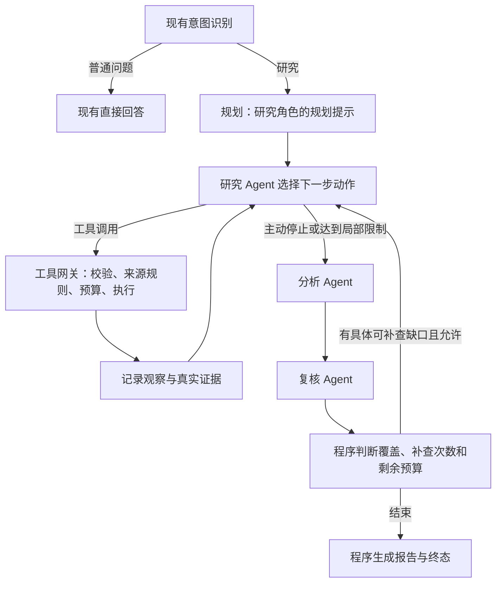

# 受控自主研究 Agent 实施方案

编制日期：2026-10-07。基于当前 `feat/tech-selection-finish` 工作区；本文是实施设计，不表示功能已经实现。本轮只增加方案文档。

## 1. 目标与范围

保留企业技术选型业务，将固定检索流水线调整为“研究 Agent 自主选择工具，分析 Agent 形成结论，复核 Agent 提出可执行反馈”的小闭环。

自主性集中在查询内容、工具选择、检索顺序和研究停止判断；执行权限、来源规则、预算、状态转换和报告生成仍由程序控制。

首版只开放两个研究工具：`search_web`、`search_local`，分别复用博查和 Milvus。网页正文读取、计算器、文件操作、长期记忆增强不纳入本轮。网络证据仍标记 `summary_only`。

不新增数据库、消息队列或服务，不扩展 RAG 文档解析，不实现自由协商、动态创建角色、进程中断续跑。已有普通问答分支保留。

## 2. 目标架构与角色



三个核心研究角色：

| 角色 | 输入 | 输出 | 工具权限 |
| --- | --- | --- | --- |
| Researcher | 研究计划、用户约束、已有证据、工具观察、复核任务、剩余预算 | 下一步动作，或研究阶段交接说明 | 搜索网络、搜索本地 |
| Analyst | 实际证据、研究任务、上轮结论和反馈 | 带来源 ID 与问题 ID 的事实、推断、建议 | 无 |
| Reviewer | 候选结论、实际引用片段、任务要求 | 支持判断、覆盖情况、结构化补查任务 | 无 |

规划作为独立节点，复用 Researcher 的模型配置，用独立规划提示执行；不额外引入一个 Planner 角色。普通问答的 Router/Responder 属于既有辅助分支，所以不能宣称整个应用只有三个模型角色。

Reviewer 首版不自行调用工具，通过反馈把补查交给 Researcher，避免两处检索循环与预算重复。

## 3. 自主工具选择的实现协议

首版使用结构化动作协议，与现有 JSON Schema 校验、一次修复及模型调用封装衔接。模型决定实际调用哪个工具和传什么参数；程序执行该决定。它属于受控工具使用循环，不能将其描述成模型 API 的原生 Function Calling。

一次模型响应只能选择一个动作，使用 Pydantic 判别联合约束，禁止额外字段。

```json
{
  "action": "tool_call",
  "tool": "search_web",
  "arguments": {
    "query": "候选平台 部署要求",
    "question_ids": ["q1"],
    "limit": 4
  },
  "reason": "需要公开部署资料支持 q1"
}
```

```json
{
  "action": "finish_research",
  "selected_source_ids": ["WEB1_1-1", "LOC1_2-1"],
  "unresolved_question_ids": ["q2"],
  "reason": "已有部署证据；尚未取得费用数据，交给分析与复核判断"
}
```

具体约束：查询不超过 500 字符；单次返回 1～4 条；reason 简短；问题 ID 必须来自当前任务；来源 ID 必须真实存在，选择与拒绝不允许冲突。

`finish_research` 只结束当前检索阶段，不代表任务成功。Researcher 的“已够用”判断必须经过分析和复核。

先采用这一种协议完成业务闭环，不同时维护两套动作循环。若后续要使用原生 Tool Calling，再单独验证当前模型、SDK、消息协议和用量采集兼容性；保持工具网关与状态契约一致。

## 4. 工具网关与证据处理

新增小型工具注册表，只有固定名字 `search_web`、`search_local`；未知工具不能执行，禁止由模型指定 Python 函数或任意代码。

统一顺序：

1. 校验动作结构、参数、问题 ID、角色权限和本轮限制。
2. 应用来源范围与查询去重，再检查运行级预算。
3. 调用现有检索适配器。
4. 保存真实结果与工具观察，发出事件。
5. 将受限的摘要、来源 ID 和状态反馈给 Researcher。

工具网关本身不重复扣减现有检索适配器和 Embedding 层已经扣减的预算。逻辑工具执行数另外统计，与 HTTP 重试次数、Embedding 调用次数区分。

工具观察结构示例：

```json
{
  "action_id": "a_3",
  "tool": "search_local",
  "status": "empty",
  "source_ids": [],
  "error_code": null,
  "message": "本次本地查询没有结果"
}
```

观察状态至少区分 `ok`、`empty`、`denied`、`duplicate`、`error`。空结果不是服务异常；认证/额度异常封锁对应服务；临时限流仍复用已有有限重试。

来源处理规则：

- 仅本地请求：程序拒绝 `search_web`；模型不能解除限制。
- 官方来源请求：复用现有官方目录、原生域名筛选和 URL 过滤；目录未登记时返回明确缺口，不能以第三方转述替代。
- 普通混合研究：由模型选择工具，不强制每次两类都查。
- 搜索查询、来源 ID、URL、文档片段均保留实际记录；模型不得改写来源元数据。
- 为新结果分配运行内稳定 ID；同一来源和片段使用指纹去重，不把重新检索到的同一内容当作独立佐证。
- 分开保留“实际检索记录”和“本次送分析的证据池”。重分析时只使用有界证据池，保留之前已接受结论的支撑来源；不能因截断静默丢失其依据。
- 沿用最多 10 条分析证据和已有输入长度控制。提示中以资料作为数据，不执行片段内的指令。

现有来源选择函数、富化函数和去重规则尽量抽取复用，不再保留独立 WebScout、LocalScout、EvidenceJudge 的取证评分模型调用。程序过滤并不代替后续语义复核。

## 5. 分析与复核反馈闭环

Analyst 复用当前 `Finding`、来源关联检查和问题覆盖机制，输出事实、推断、建议。前一轮结果可用于修订，但不能作为新的事实证据。

Reviewer 在现有 `Support` 契约上增加 `research_requests`，保留 `supported/unsupported/uncertain`、quote_id 和覆盖判断。

补查请求示例：

```json
{
  "request_id": "rr1",
  "question_id": "q2",
  "claim_id": "c2",
  "category": "missing_condition",
  "need": "核实该部署能力适用的版本或套餐",
  "suggested_query": "候选平台 部署能力 版本限制",
  "source_preference": "web",
  "required": true
}
```

`claim_id` 可为空，以支持尚未形成结论的研究问题。category 用有限枚举，如 `missing_source`、`missing_condition`、`conflict`、`unsupported_claim`。

每轮最多三个去重补查任务，必须关联真实问题；建议查询是建议，Researcher 仍可根据观察选择工具和改写查询。后端必须校验反馈，而不是盲从模型输出的路由决定。

补查闭环为：Reviewer → Researcher → Analyst → Reviewer，首版最多一次。补查针对具体缺口，不重新规划整个任务。

特别修正现有行为：复核没有接受结论时，不立即把 `NO_EVIDENCE` 当成不可恢复终止。先检查是否有有效补查任务和预算；允许时补查，耗尽后才收尾。分析没有候选结论时，也给 Reviewer 已有证据和任务，让其说明缺口；确实没有任何证据则走受限收尾。

旧 `verified_findings` 不能无条件与新结果拼接。补查后重新分析并复核当前候选集；旧接受结论也应进入本轮检查，保证新发现的冲突不会绕过复核。

接受、拒绝与覆盖记录按轮保存；最终结果展示最后一轮有效结论和仍然存在的缺口，历史拒绝保留在事件中，不重复污染最终缺口。

## 6. 有限循环、预算与终态

建议首版默认值：

| 限制 | 默认设计 |
| --- | --- |
| 核心研究问题 | 原问题加最多两个必要辅助问题 |
| 初次研究工具执行 | 最多 4 次 |
| 反馈补查工具执行 | 最多 2 次 |
| 初次研究决策轮数 | 最多 5 次，包含停止动作 |
| 补查决策轮数 | 最多 3 次，包含停止动作 |
| 复核反馈补查 | 最多 1 次；兼容请求 max_iterations=0/1 |
| 全局模型预算 | 保留 16 次，包含动作决策、规划、分析、复核和结构修复 |
| 全局网络/工具预算 | 保留现有 12 次网络、24 次工具相关调用 |
| 全局时间预算 | 保留 180 秒，仍是调用边界检查 |
| 结构修复 | 每次结构输出最多一次，仍计入全局预算 |

局部上限是允许的最大值，不保证每项额度都能用完。模型修复、网络重试、Embedding 都可能使全局预算提前触发。

原本预留给 verify/write 的收尾模型额度，改为预留给 analyze/verify；正常尾部至少保留两次调用。建议为收尾预留约 60 秒，作为可配置值，真实运行后校准；不保证超时或修复情况下必然完成。

反馈回路开启前，除补查次数外，还要保守检查剩余模型次数、工具次数、时间和可用工具。默认至少五次剩余模型调用才进入补查，覆盖一次工具决策、交接、分析、复核及有限余量；不足时直接输出已复核结果与缺口。

所有模型决策都要有计数，即使选择未知工具、重复查询或被拒绝动作，也消耗局部决策机会，防止免费无限循环。完全重复且没有新观察的动作连续出现两次，停止该检索阶段。

语义重复只做简单规范化查询去重，不宣称识别所有近义查询。新的资料指纹数量为零可触发无进展计数，但不把不同版本或不同来源的冲突资料错误合并。

终态由程序计算：

- `completed`：最后一次复核完成，必要问题均满足现有覆盖规则，无未解决的阻断缺口。
- `partial`：执行结束但关键问题仍缺失、证据不足或预算限制；可能只有缺口说明，也可能包含有效结论。
- `failed`：不可恢复的执行或结构错误，且没有可交付的已复核结论。

允许“拒绝了错误候选、接受了正确结论”后完成任务；被解决的旧缺口和可恢复错误不自动使最终结果永久降级。运行历史照常保留。completed 仍不是独立事实准确率认证。

## 7. 状态与持久化

在现有 ResearchState 上增量添加：

- `research_round`、`research_step`：首轮/补查轮及当前决策步。
- `pending_action`：待校验执行的动作。
- `tool_observations`：有界工具观察列表。
- `retrieved_records`：有界的真实来源记录，与实际来源索引关联。
- `selected_source_ids`：交给分析的来源选择。
- `research_requests`：待处理的复核任务。
- `review_history`：逐轮摘要与拒绝记录。
- `research_stop_reason`：检索阶段停止理由，和全局终止原因分离。

已有 query/run_id/research_tasks/evidence_pool/findings/verified_findings/question_coverage 等继续复用。

新增列表字段使用明确的更新策略，不同时在节点里拼接又设置 operator.add，避免重复。来源 ID 不依赖局部步数重置。checkpoint 继续用 run_id 隔离。

PostgreSQL 两张运行/事件表继续使用 JSON 数据，不要求新表。记录明确的新 workflow_version 及动作/反馈契约的提示版本。

不将旧检查点直接当作新状态恢复执行；现有运行 GET 与事件回放保持兼容。重启遗留任务仍按已有中断策略处理。

## 8. 日志、指标和前端

新增事件：`research_decision`、`tool_observation`、`review_feedback`、`research_handoff`。复用现有 node/model/tool spans、run_id、序号和入库后发布顺序。

事件展示实际动作、简短理由、来源 ID、预算与反馈任务，不要求或展示模型私有推理过程。

汇总新增：逻辑工具执行数、各工具选择数、研究轮数、复核反馈次数、无进展次数、检索阶段停止原因。指标标签只用固定角色、工具、状态，不能把 query/run_id 放入 Prometheus 标签。

前端增量展示：

- “研究 Agent 选择本地检索 / 联网搜索”。
- 调用结果：找到多少资料、空结果或服务错误。
- “复核发现 q2 条件缺失，发起补查”。
- “补查完成 / 达到限制，返回有限结果”。

保留现有来源卡片、覆盖、用量和 SSE 回放。未知旧/新事件不使页面崩溃；刷新仍只 GET，不 POST 重启研究。首版不做独立多 Agent 管理控制台。

## 9. 文件改动与复用

| 文件 | 实施动作 |
| --- | --- |
| app/mult_agents/main.py | 增加三个核心角色构建；规划复用研究角色，保留普通问答辅助角色 |
| app/mult_agents/graph.py | 增加新版工作流构建，研究决策/工具执行循环和复核反馈路由 |
| app/mult_agents/state.py | 增量状态字段及明确轮次语义 |
| app/mult_agents/prompts.py | Researcher 动作、交接提示；Analyst/Reviewer 增量反馈提示 |
| app/mult_agents/research.py（新增） | 研究动作节点、工具观察和阶段交接；避免继续扩大 nodes.py |
| app/mult_agents/nodes.py | 复用 plan/analyze/verify；增加新版分析复核行为适配与纯程序收尾 |
| app/mult_agents/harness/tool_gateway.py（新增） | 工具白名单、参数、权限、来源规则和观察封装 |
| app/mult_agents/tools.py | 复用真实博查/Milvus函数，必要时增量支持可配置的查询去重键 |
| app/mult_agents/harness/validation.py | 增加动作判别联合和复核任务 Schema，复用引用检查与 render_report |
| app/mult_agents/harness/runtime.py | 动作用量、阶段预算与分析/复核收尾预留 |
| app/mult_agents/harness/coverage.py | 沿用覆盖校验，补查后重新计算并清除已解决缺口 |
| app/mult_agents/harness/source_policy.py | 复用官方入口与来源验证，动态查询也必须经过 |
| app/backend/service/workflow_service.py | 按配置选择新版图、记录新版本并汇总结果；复用线程池和存储 |
| front/agent_front/src/App.vue | 识别新事件与展示反馈闭环 |
| tests/、evals/ | 新增动作与回路测试，复用固定资料、独立PG、前端构建流程 |

不重写 RAG、运行存储、SSE API 或 Docker Compose。新旧版本短期通过明确配置选择，不复制完整项目，不把长期维护两套工作流作为目标。

## 10. 实施顺序与每步交付

### 阶段一：工具自主选择

完成动作 Schema、两工具网关和有限研究循环；复用分析、复核，最后调用程序渲染。删除新版路径中的三个取证整理角色调用和 Writer 模型调用。暂不启用复核回路。

交付：本地优先、网络优先、混合三类固定场景可执行；拒绝非法工具、保留真实来源；预算与普通问答回归通过。现有结果接口可消费新版结果。

### 阶段二：复核反馈

增加具体补查任务和最多一次回路，处理零接受结论、剩余预算不足、重复补查、冲突和旧结论重新验证。

交付：固定案例中 Reviewer 提出具体缺口，Researcher 改变查询或工具，最终重新验证；无法补齐时诚实返回 partial。

### 阶段三：页面、评测与收尾

接入新事件展示，验证PG结果与SSE/回放一致。开展同资料、同模型的旧版/新版对照，再用少量真实博查案例联调。更新README、实施说明和面试稿。

交付：可演示的完整闭环，测试报告、带全部尝试记录的评测表、版本切换方式。完成后明确选择主版本；保留Git基线用于回退。

这三步组成首版交付，不把正文抓取、动态协商或基础设施扩展混入其中。

## 11. 测试与验收

无付费API的控制测试至少覆盖：

1. 工具选择来自模型动作，执行顺序随观察改变。
2. 本地空结果后允许转网络；仅本地要求下仍禁止网络。
3. 官方请求的域名与路径限制不能被动态动作绕过。
4. 未知工具、错误参数、伪造问题/来源 ID 被拒绝。
5. 无效动作最多修复一次；修复计入预算。
6. 重复动作和无进展有界退出，工具额度与全局额度不重复扣账。
7. 401/额度错误封锁服务；429/临时错误有限重试。
8. 复核提出有效任务才进入回路；max_iterations=0禁止补查。
9. 有检索证据但首轮零接受结论，可在预算允许时补查。
10. 补查轮次上限、模型上限、尾部预留和时间边界生效。
11. 补查后清除旧缺口，重新复核旧结论；冲突结论不会直接沿用。
12. 来源 ID 稳定、长片段不由模型复写、模拟标记与引用正确。
13. 错误和无证据不伪造报告；恢复后不会永久保留过期终止状态。
14. 多run隔离、满容量拒绝、数据库终态一次提交。
15. GET事件回放不执行工具或模型，页面刷新不重复提交。

沿用现有控制测试意图与4项PG集成验证；部分依赖旧8角色结构的测试需要改为新版脚本动作适配器。迁移前后分别运行旧版与新版，不把测试适配改变当成效果提升。

质量评测使用现有16个固定资料问题，并补少量带预期工具路径、可补查缺口、不可补齐缺口的案例。固定工具适配器按query返回资料，使首次与补查观察有区别；不能每次返回所有证据而声称验证了工具选择。

比较指标：必要问题覆盖、人工证据支持、限定条件保留、路径/反馈正确性、模型与工具调用、已知Token、耗时、partial/failed比例。引用ID有效不等于事实正确；模型复核不能作为独立金标准。

真实联调先限定三类：单项官方核实、公开+内部约束、首轮不足后补查。工具路径由内容决定，不能为了演示强行要求使用两种工具。所有首次结果、修复和失败记录保留；小样本不宣称平均准确率或普遍降本。

上线新版的硬条件：控制与集成检查通过、来源/范围规则保留、真实工具选择有记录、复核反馈可回放、不出现无限循环或回放重付费。相对旧版的质量和用量结果如实报告，不能先承诺更快或更准。

## 12. 版本与实施起点

当前工作区包含尚未提交的证据整理修复、来源策略及测试修改。正式动手前先检查diff和测试，把这些改动保存为可回退基线，不丢弃或覆盖。

之后创建 `codex/bounded-research-agent` 分支；按阶段提交，提交说明写实际实现与验证。本文不执行提交、建分支或推送。

建议第一笔代码改动先完成 Action/ReviewRequest 契约和工具网关测试，再接入研究循环。这样先明确可执行协议与边界，再改图和提示，减少多处一起变化导致的排错成本。

## 13. 完成后的面试表述

“我把固定的双路检索流水线调整成三个核心角色：研究Agent根据任务和工具结果选择联网或本地检索，分析Agent形成带证据的结论，复核Agent检查支持关系并提出具体补查任务。外层LangGraph控制阶段和反馈次数，内层结构化动作循环实现工具选择；工具执行统一经过预算、来源校验和追踪。最终报告由程序根据通过复核的结论生成，支持运行持久化与事件回放。”

不得表述为无限自主规划、自由协商、原生Function Calling已经实现、网页全文已经读取、长期记忆默认启用、跨进程自动续跑或所有幻觉已消除。
