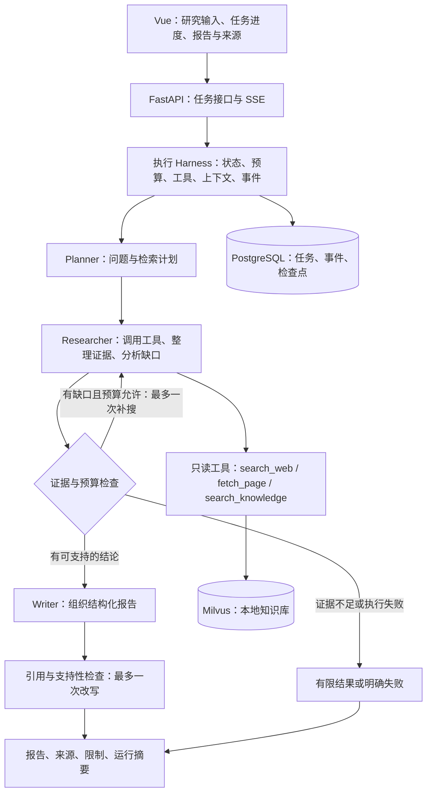

# Deep Research 完善方案：Harness 思路与适度工程化

版本：2026-10-06。本文是待实施方案，依据当前代码制定；文中的目标和验收值不代表已经实现或测得的结果。

> 根据「尽可能复用原代码、缩短开发周期」的新要求，实施以 [完善方案-复用优先.md](./完善方案-复用优先.md) 为准。本文保留为后续扩展参考；三个核心角色、自主工具循环、完整任务恢复等不再是首版必须完成的工作。

## 1. 项目定位与范围

面向 Agent 开发求职，项目定位为「面向企业 AI 技术选型的研究助手」。用户提供研究问题、候选方案、业务约束和可选内部资料，系统交付带来源的比较报告、证据缺口和下一步验证建议。

示例输入：为一个 5 人研发团队比较几个 Agent 开发方案，约束包括私有部署、Python 技术栈、内部知识库和有限维护成本。输出包括比较维度、事实依据、条件化建议和待验证项。公开资料中的结论与用户上传的内部约束分别标明来源。

第一版支持一个业务场景、三个研究角色、三种只读工具、一个后端进程。保留 Vue、FastAPI、LangGraph、PostgreSQL、Milvus、百炼和博查。以本地演示及个人使用为默认部署范围。

### 必须完成与暂缓功能

| 第一版必须完成 | 后续有需求再做 |
| --- | --- |
| 问题拆解、联网搜索、公开网页正文获取、本地资料检索 | 通用 Agent 平台、动态注册 Agent、复杂技能市场 |
| 受预算约束的研究循环、明确错误处理 | 多 Researcher 动态委派、辩论、多模型投票 |
| 证据与结论关联、引用检查、不足时有限输出 | 任意浏览器自动化、登录站点抓取、Python/Shell 执行 |
| 任务持久化、取消、SSE 重连、人工触发恢复 | Celery、Redis 队列、多 Worker 服务、自动跨机器调度 |
| JSON 日志、任务执行轨迹、基础指标、离线评测 | ELK、Jaeger、Grafana 全家桶、分布式追踪平台 |
| Markdown 报告、运行详情、来源展示 | Word/PPT 导出、定时监控、消息推送 |
| 单用户隔离、本地访问、资料幂等导入 | 完整多租户、RBAC、SSO、计费 |

Redis 暂不启用。PostgreSQL 已承担持久化，第一版的任务量与部署方式不需要再引入一个任务中间件。现有 Redis 适配代码可以保留为可选能力，不作为演示主线。

## 2. 当前基础与改造重点

当前具备：FastAPI 接口、Vue 页面、LangGraph 固定工作流、8 个角色实例、网络与本地检索、PostgreSQL 检查点和记忆、阶段级 SSE。本地简单问答和基础运行已验证。

当前不足：Agent 构建时工具列表为空，工具由节点代码直接执行；检索错误可能吞掉；无证据仍可能写长篇报告；反思节点复用规划角色的系统提示；搜索计划可能被启发式生成的词挤占；重复 fallback 函数可能掩盖解析失败；预算主要靠轮次；引用存在性检查无法说明事实是否有证据支持；每个 SSE 请求创建后台线程，缺少任务生命周期和恢复接口。

还需删除日志中的 Key 前缀，控制用户资料和模型输出的日志范围。必须移除 SSE 没拿到 final 时重新 invoke 初始状态的兜底，改为读取已执行状态或报明确错误，避免重复检索与付费调用。

改造方法：先在现有链路修复可靠性，再逐步替换角色和接口。保留可运行版本和评测基线，不同时重写前后端与基础设施。

## 3. 目标架构：三个角色和一个执行 Harness



### 三个角色的职责

| 角色 | 负责 | 不负责 |
| --- | --- | --- |
| Planner | 生成不超过 5 个子问题、比较维度、优先级、初始检索计划 | 自己执行搜索、编写事实结论 |
| Researcher | 在受限循环中选择工具、读取结果、抽取证据、形成结论、判断缺口并补搜 | 绕过预算、调用任意工具、生成无来源的确定事实 |
| Writer | 将已接受的结论组织成比较表和报告，表达限制与建议 | 独立补充未经检索的产品、数字或功能 |

原 Web Scout、Local Scout 的信息获取转为工具；Evidence Judge 和 Analyst 的分析职责合并到 Researcher；原 Reflect 的缺口处理并入 Researcher 循环，删除独立反思节点。引用检查与停止决策由明确的规则和必要的结构化模型调用完成，不再增加一个常驻角色。

角色数量与模型数量分开：第一版使用一个可配置模型。先验证当前模型及 SDK 对工具调用、结构化输出、超时和 usage 返回的支持；能力或质量不足时再调整模型，保留相同任务集比较。角色的结构化输出校验失败可修复一次，修复也计入全局预算。

页面明确区分「快速问答」与「研究报告」，默认研究模式。快速问答用一次普通模型调用，不占用独立 Agent，也不宣称经过来源验证，减少意图路由对主线的干扰。

### Harness 的具体职责

Harness 是围绕模型的执行控制代码，统一处理输入、模型和工具调用、状态、上下文、停止条件、结果验证与运行记录。模型可以提出下一步，Harness 决定这一步是否符合工具范围、预算和任务状态。

Researcher 每次只能请求允许的工具，或提交带证据的结论。执行顺序为：生成动作 → 校验动作和参数 → 预占预算 → 执行工具 → 保存结果与事件 → 更新上下文 → 再次决策。到达限制后不能靠提示词继续调用。

实现时把研究循环展开为可检查点化的 decide → execute_tools → assess 步骤，避免把所有循环藏在一个不可观察的长节点中。每个实际模型请求都经过统一调用边界；使用框架内部循环时也要接入调用计数与事件钩子，不能只按外层 Agent.invoke 次数统计。

优先使用已验证的模型工具调用接口。若当前模型或适配器不支持，则使用 Pydantic 校验的 ResearchAction 加白名单分发器，并在文档中说明实现方式。两种方式均走同一个受限执行器；不声称不具备的原生 Function Calling 能力。

## 4. 工具、证据与上下文设计

### 4.1 三个真实工具

| 工具 | 输入与结果 | 核心边界 |
| --- | --- | --- |
| search_web | 查询词、子问题 ID；返回标题、URL、摘要、发布时间（有则记录） | 401/403 不重试；429/临时网络错误有限重试；空结果与失败分开 |
| fetch_page | 已检索到的公开 URL；返回正文、标题、获取时间、内容哈希 | HTTP(S)、超时、大小限制；每次重定向检查目标；屏蔽本地和私有地址 |
| search_knowledge | 查询、知识库范围、top_k；返回文档 ID、chunk ID、片段 | 第一版仅本地用户资料；拒绝越界知识库访问 |

统一 ToolResult：status、items、error_code、retryable、duration_ms、metadata。初始错误码包括 AUTH_ERROR、RATE_LIMIT、TIMEOUT、NETWORK_ERROR、PARSE_ERROR、NO_RESULTS、BUDGET_EXCEEDED。NO_RESULTS 是正常空结果，不冒充网络错误。

工具参数、重试次数、响应长度、并发数均在服务端验证。网页内容作为不可信资料，与系统提示分开传递；网页中的指令不能扩展工具权限。第一版正文抓取只覆盖公开 HTML 与纯文本，遇到登录、反爬或复杂动态页面明确标记不可读取，不临时增加浏览器系统。

正文失败时可以保留搜索摘要，但标记为 summary_only，降低结论范围；页面不可获取不等于其内容已获验证。

### 4.2 最小数据契约

用 Pydantic 定义并校验以下对象，不建立复杂领域框架：

| 对象 | 必要字段 |
| --- | --- |
| ResearchPlan | sub_questions、dimensions、queries、priority |
| Source | source_id、kind、url 或 doc_id、title、published_at、fetched_at、content_hash、retrieval_level |
| Evidence | evidence_id、source_id、sub_question_id、quote、locator |
| Finding | finding_id、text、type（事实/推断/建议）、evidence_ids、limitations |
| ResearchAction | tools 或 finish、结构化参数、待验证缺口 |
| Report | sections、findings、citations、gaps、limitations、run_summary |

locator 对网页可以是保存的正文版本、段落索引及文本范围；对本地资料是文档和 chunk ID。未能获得发布时间时留空，不能把获取时间当发布时间。

证据流为「来源 → 片段 → 结论 → 报告段落」。去重依据规范化 URL 或文档 ID 与内容哈希；被明确排除的证据不能被后续兜底重新加入。

### 4.3 质量门与有限结果

1. 没有任何有效证据：输出已尝试的检索、失败原因、缺口和建议，不进入事实性长报告生成。
2. 有部分有效证据：输出 partial 报告，明确哪些子问题有依据、哪些未回答。
3. 有可支持的结论：Writer 生成带 finding_id 的结构化段落，程序渲染引用，参考资料只包含最终正文实际使用的来源。
4. 引用检查包括 ID 存在、引用被实际使用、事实段落关联证据；另外批量检查片段是否支持结论，对不支持的结论删除、限定表达或改写一次。
5. 区分事实、推断和建议。推断说明依据与条件，数字和确定性比较必须有可定位的支持。

结构规则能保证引用 ID 有效，不能保证语义真实性。支持性模型检查是质量辅助，仍需人工标注的评测校准；不把模型自评当事实证明。不满足质量门的内容不得因达到最大轮次而直接放行。

### 4.4 受控上下文

Researcher 只接收任务约束、当前子问题、简短进度、已接受的 findings、必要的证据片段和最近工具结果。正文完整版本保存在任务产物中，不反复全部塞进模型输入。

Writer 只接收已筛选结论、其对应证据、报告结构和限制。限制单页正文提取长度、每个片段长度、top_k 与模型上下文大小；超过时按子问题与来源相关性选择片段。

现有长期记忆在研究模式默认关闭。用户偏好最多用于预算、报告语言与关注维度，不能成为客观产品事实的来源；现有记忆模块保留为可选功能。任务状态、用户记忆、知识库三者在代码与文档中分别解释。

## 5. 可执行预算与可靠性

以下是待评测调整的初始默认值，所有限制累计覆盖初搜、补搜、重试和修复，恢复任务不会自动清零。

| 项目 | 初始上限 |
| --- | --- |
| 子问题 | 5 个 |
| 研究决策步 | 6 步，每步最多 3 个工具动作 |
| 补充检索 | 最多 1 轮，针对尚未覆盖的子问题 |
| 网络搜索请求 | 8 次，重试也占用 |
| 页面获取请求 | 8 次，重试也占用 |
| 所有工具请求 | 20 次，包含 RAG 与失败调用 |
| 模型请求 | 16 次，包含规划、分析、写作、检查与修复 |
| 最大有效来源 | 10 个 |
| 任务活动执行时间 | 180 秒，可由服务端配置，首版最高 300 秒 |
| Token | 30,000 作为初始软预算，结合上下文与单次输出上限控制 |
| 单任务工具并发 | 2 |
| 同时运行的研究任务 | 2，排队任务最多 10 个 |

在每次动作前检查并记录调用预算，不由模型自行计算。调用使用具体超时；时间、调用数和补搜次数到达限制后停止新动作，返回已验证的有限结果。终止报告和检查预留调用及时间额度，不能把全部预算花在检索上；预留不足时用确定性模板渲染已接受结论。

usage 可用时记录实际输入、输出 Token；不可用时标 unknown，并保留估算值的 estimated 标记。Token 软预算可能被一次在途调用超出，不宣称精确硬限额。每次请求仍限制输入与输出长度。费用仅在配置了对应模型、定价版本和实际 usage 时估算，不能用虚构 Token 计算成本。

瞬时错误最多重试 2 次，采用短退避且受全局预算约束；认证、非法参数和明显不可访问资源不重试。结构化输出校验失败修复一次，仍失败则给出受限结果或明确失败。不同知识源独立处理：网络失败、本地有依据时可以给出受限报告；所有渠道发生不可恢复错误时标 failed。

## 6. 任务生命周期与持久化

### 6.1 单进程任务执行

FastAPI 进程内运行一个简单调度循环和固定大小的执行池。PostgreSQL 任务表保存待执行任务；工作池只有空位时才领取任务，不为每个请求新建线程。单后端进程、2 个研究槽位是第一版明确约束，不设计跨实例协调，不启用多个 Uvicorn workers。

业务表优先只增加三张：

- research_tasks：问题、模式、状态、预算与用量、checkpoint_thread_id、配置版本、产物、错误、创建和完成时间。
- research_events：task_id、attempt、递增序号、类型、时间、节点/工具、span 关联和精简数据。
- knowledge_documents：文档 ID、内容哈希、导入状态、版本、知识库范围与分块信息。

来源、证据、工具缓存和报告先用有长度上限的 JSONB 产物保存；不一开始拆十几张表。现有 LangGraph checkpoint 表沿用。任务控制状态、graph 状态和事件序号之间定义一致性检查，更新任务时使用事务。

### 6.2 状态与接口

状态：queued → running → completed / partial / failed / cancelled。failed 可带 recoverable=true；不另加一套复杂暂停状态。部分结果仅表示确实执行过但证据或预算不足，不能当成功报告统计。

核心接口：

- POST /api/v1/tasks：提交问题、约束、知识库选项，返回 task_id；支持重复提交识别。
- GET /api/v1/tasks：查询最近任务。
- GET /api/v1/tasks/{id}：读取状态、结果、预算用量与错误。
- GET /api/v1/tasks/{id}/events：SSE，支持 Last-Event-ID 或 after_seq。
- POST /api/v1/tasks/{id}/cancel：请求取消。
- POST /api/v1/tasks/{id}/resume：显式恢复可恢复任务。

现有 /research/run 和 /research/stream 在前端迁移阶段做薄兼容；迁移完成后再决定移除，不保留两套工作流。

SSE 从持久化事件序列发送，事件只记录状态、工具与阶段摘要，属于执行事件流。断网或刷新不启动新任务。保持阶段流即可，Token 流不是本版验收项。慢客户端不会让任务的事件缓存无限增长。

### 6.3 取消与恢复

取消采用协作方式：节点开始、工具调用前后、模型调用前后检查取消标志。等待中的任务直接取消；在途请求受其超时约束，不承诺用户点击时立即中断外部服务。取消后不再启动下一步，也不再写 completed。

重启时，单进程部署中遗留的 running 任务标为可恢复失败，并说明进程中断。由用户点击恢复，读取同一任务的最近有效检查点继续，不重新提交初始 query；新 attempt 有独立执行轨迹，累计预算继续计算。

同一任务只允许一个执行者。相同 task_id 与事件序号组合唯一，完成结果写入保持幂等。已持久化的工具结果通过稳定调用键复用；进程在外部请求成功、结果落库之前崩溃时，仍可能重做该调用，这是首版接受并记录的边界，不宣称 exactly-once。

检查点不是自动恢复产品：实际 resume API、执行状态核对、预算恢复与崩溃测试都完成后，才可声明支持恢复。检查点恢复语义以项目锁定的 LangGraph 版本验证。相关概念见 [LangGraph Persistence](https://docs.langchain.com/oss/python/langgraph/persistence)。

### 6.4 最小数据与访问边界

首版后端监听本机，固定单用户，task_id 和 checkpoint_thread_id 由服务端生成；前端提交的 user_id/tenant_id 不作为权限凭据。不同任务不共用一个默认 checkpoint thread，避免状态串用。

若以后对外部署，再增加服务端验证的登录身份和资源授权，并在任务、知识库与检查点三个入口同时执行。对外部署条件不作为本地求职演示必须实现的模块。

知识库先支持现有 UTF-8 Markdown/TXT。增加内容哈希、稳定 doc/chunk ID、导入状态和按文档重建，确保重复导入不增长重复向量。文档更新涉及 PostgreSQL 与 Milvus，使用可重试的 importing/ready/failed 状态和显式重建操作，不假定跨存储事务。准备 10–20 份自有或可公开使用的资料；PDF/OCR 暂缓。

## 7. 适度可观测性与前端

### 7.1 日志、轨迹和指标

统一结构化日志字段：task_id、attempt、trace_id、span_id、parent_span_id、node、provider、duration_ms、status、error_code。请求入口、图节点、模型请求、工具请求均有关联事件和耗时，单进程内做到一份任务轨迹可查。

日志输出到控制台与滚动 JSON 文件，不打印 Key、完整个人资料和无限长模型输出。审计需要的证据片段属于任务产物，日志仅记录 ID、长度与状态。提供保留天数和清理命令，避免检查点、轨迹和产物无限积累。

这套能力可称为「任务级执行追踪」或「单进程调用追踪」。没有跨服务的 trace context 传播、统一采集和检索时，不称为完整分布式链路追踪。

增加简单 /metrics 接口，使用少量 Counter/Histogram/Gauge，记录：任务状态计数、排队数与运行数、任务/节点/工具耗时、模型调用数、已知 Token 用量、工具错误、有效来源数、引用校验失败。task_id、query、URL 不作指标标签，避免高基数。

Prometheus/Grafana 服务暂不加入 Compose。任务详情页能展示单次运行结果，/metrics 能导出基本指标即可；进程指标重启后会重置，跨重启统计从任务记录查询。

### 7.2 Vue 页面收敛为三个视图

1. 研究输入：问题、业务约束、可选内部知识库；预算服务端默认提供，页面只展示必要选择。
2. 任务进度与详情：子问题、当前阶段、来源、错误、用量、取消与可恢复提示。
3. 报告与任务历史：比较报告、引用点击展示证据片段、未覆盖问题、Markdown 下载和最近任务。

不做单独管理后台、复杂工作流编辑器和聊天渠道集成。执行轨迹展示可观察的阶段、工具动作与错误，不要求展示模型隐含推理。

## 8. 评测与交付

从第一阶段开始保存旧版本基线，测试实际可靠性边界，不为简单封装写大量镜像测试。最终构建一个 40 条的小型固定集合：20 条异常与控制行为案例，20 条带人工标注证据的研究质量案例。

### 三类检查

| 类别 | 内容 | 运行方式 |
| --- | --- | --- |
| 确定性控制回归 | 401、429、空检索、非法 JSON、引用不存在、预算耗尽、取消、重复提交、SSE 重连、任务串用 | 默认 CI；模拟工具和模型；无需外部 Key |
| 检索与报告质量 | 20 个研究问题、固定网页与文档快照、标注子问题和支持片段 | 固定检索资料，真实模型按需运行；模型裁判与人工抽检 |
| 生命周期集成 | 实际 PostgreSQL 检查点、重启恢复、预算与事件一致性；Milvus 幂等导入 | 本地 Compose 集成测试；CI 可分 job，不调用付费服务 |

离线不是全部不调用模型：免费确定性 CI 与付费模型质量评测明确分开。固定快照保证资料可比较，不能保证模型完全确定；关键质量案例运行多次，记录方差和最差案例。公开快照应控制转载内容并记录原链接，不能将大量受限全文提交仓库。

### 指标与验收目标

- 引用 ID 有效率：确定性检查达到 100%。
- 无证据、认证失败、超预算等控制回归：固定案例全部通过。
- 引用支持率：按人工标注口径统计，90% 作为第一版目标，不是已取得成绩。
- 子问题覆盖率：有支持证据的子问题数 / 计划子问题数；同时说明问题是否真的被回答。
- 任务状态正确性：失败、partial、取消与 completed 分开。
- 生命周期：刷新不重跑、恢复不用初始状态重新开始、已保存工具结果复用。
- 性能成本：报告 P50/P95 活动耗时、模型与工具调用数、实际已知 Token；样本太少时说明不足。

旧版本与新版本在相同资料快照、模型配置和案例上对比，重点解释无来源内容、引用支持、调用数和失败处理的变化。删除哪个角色、增加哪个检查都需要看结果；不根据 Agent 数量宣称效果更好。

GitHub Actions 默认运行确定性回归、Python 检查和前端类型/构建；真实 API 评测显式触发，Key 通过 Secrets 注入。模型裁判、代码规则和人工评价承担不同工作，参见 [Anthropic Agent Evals](https://www.anthropic.com/engineering/demystifying-evals-for-ai-agents)。

## 9. 代码组织与实施节奏

### 9.1 在现有目录增量调整

```text
app/
  backend/
    router/                # 任务、SSE、健康和指标接口
    schemas/               # 接口 DTO
    service/               # 任务服务、有限调度和执行入口
  mult_agents/
    graph.py               # 主图和条件路由
    agents.py              # 三个角色构建与提示绑定
    nodes.py               # 节点适配，保持薄层
    state.py               # 共享状态、初始值和 reducer
    schemas.py             # Plan/Source/Evidence/Finding/Report
    harness/
      runtime.py           # 模型与工具的统一调用边界
      budget.py            # 限额、预占、用量与停止条件
      context.py           # 片段选择与上下文裁剪
      validation.py        # 证据、引用、输出与质量门
      telemetry.py         # 结构化事件、日志与指标
    tools.py               # 三个工具和有限分发；变大后才拆文件
    rag/                   # 沿用检索、补齐导入生命周期
    memory/                # 沿用，研究模式默认关闭
tests/                     # 控制回归和生命周期集成
evals/                     # 固定案例、标注、运行与评分
docs/                      # 架构、恢复与评测说明
front/agent_front/         # 沿用 Vue
```

新建模块只在职责已形成时进行，不先搭一个泛化框架。合并旧 main.py 中重复节点定义，保留 CLI 启动职责；去掉重复 fallback、失效的占位工具和未使用 state 字段。State 中的并行写入采用明确 reducer，避免支路覆盖；第一版不增加动态多 Agent 并行扇出。

### 9.2 四个可验收阶段

按个人开发、外部服务正常估算约 3–4 周；求职者熟悉代码的学习时间另计。完成标准以验收为准。

| 阶段 | 预计投入 | 主要交付 | 验收 |
| --- | --- | --- | --- |
| M1 可靠性基线 | 3–4 个工作日 | 修复错误吞掉、零证据输出、反思提示、查询优先级、重复 fallback、日志泄密、重复 invoke；基础 schemas 与 20 条控制案例 | 模拟 401/空检索不再产生确定性长报告；正常有证据链路仍可运行 |
| M2 Harness 与证据 | 5–6 个工作日 | 三角色、三工具、受限 Researcher 循环、统一预算与上下文、正文/片段、finding 与引用校验 | 可观察模型根据工具结果选择下一步；到预算停止；引用可定位 |
| M3 工程生命周期 | 5–6 个工作日 | 任务表/事件、有限调度、SSE 重连、取消、显式恢复、日志/指标、最小 RAG 幂等、Vue 三视图 | 关闭页面不重跑；后端重启可恢复；任务不串用；导入同一文档不重复 |
| M4 评测与演示 | 3–4 个工作日 | 40 条集合、版本对比、CI、架构说明、运行与故障文档、演示脚本 | 控制回归通过；发布真实质量与成本数据，失败案例和限制可解释 |

每个阶段形成一次可运行的 Git 提交；M2/M3 的完整质量与生命周期测试随对应功能加入，不等到 M4 才开始测试。此方案文件不改变运行代码，也不自动触发 GitHub 推送。

### 9.3 第一版完成条件

完成 M1–M4 才作为本方案的完整交付。M2 可用于中间演示，但不能宣称具备尚未验收的恢复和工程能力。

最终准备四个演示：正常技术选型报告；无证据或认证失败的有限输出；预算耗尽/取消；后端重启后恢复任务。演示包括用户结果、关键工具事件、引用片段和运行摘要。

求职时可以围绕下列能力讲解：

- 为什么收敛到三个角色，哪些步骤必须由程序控制。
- 为什么空搜索、失败搜索、片段不支持结论是三类不同情况。
- 如何执行预算，为什么 Token 与费用存在测量边界。
- 为什么检查点、任务调度和幂等调用需要一起设计。
- 如何利用固定资料与人工标注判断新版本是否更好。

完成并有证据后，项目描述可写为：「基于 LangGraph 实现面向技术选型的研究助手，设计受限工具执行、证据与引用校验、持久化任务恢复及评测回归，并通过任务轨迹定位检索和生成故障。」效果数字只填写实际测得的数据。

## 10. 设计依据

本方案采用固定外层工作流和受限内层研究循环。外层明确阶段与质量门，内层保留依据检索结果选择工具的能力。这是针对当前项目规模的设计选择，不是必须使用某种大型 Harness 框架。

[Anthropic Building Effective Agents](https://www.anthropic.com/engineering/building-effective-agents) 区分预定义工作流与模型动态决定动作的 Agent，并建议从简单可组合的设计开始、通过评测决定增加复杂度。本方案遵循这一原则，用工具反馈和可验证的运行控制体现 Harness 思路。

这份方案的主线是：一个可解释的业务场景、一个完整研究闭环、一套可执行的运行约束、一组能证明改进的评测。每项基础设施都服务于这些交付。
