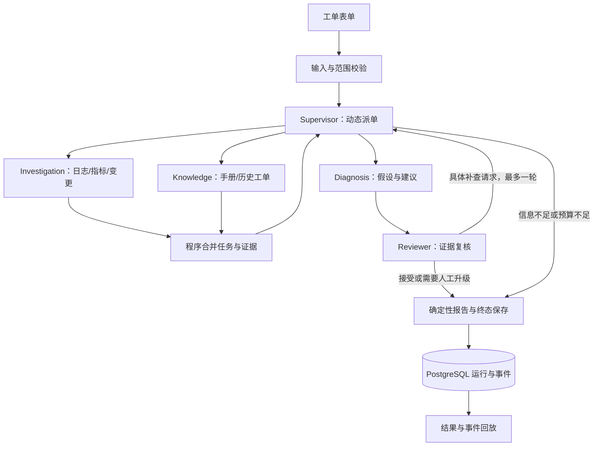

# IT 故障工单多 Agent 协同系统实施方案

> 2026-10-08 仓库初始化说明：本仓库以研究底座 `a40d80c` 建立独立副本，已包含服务端令牌身份、权限/记忆隔离与研究评估工具。下文是此前的设计方案，其中“多租户认证后移”、旧基线清理和工期假设需在实施前重新核对；已有工程能力应复用。IT 工单工具、动态协作和诊断评估尚未实现。历史研究评测不代表 IT 场景结果。

方案日期：2026-10-07。状态：设计方案，尚未实施。底座：当前 Deep Research 已提交版本。

目标是完成一个适合大四 Agent 开发方向求职展示的项目：有明确业务问题，有真实工具选择，有基于证据的角色协作，有执行约束，有可重复的评测。首版面向本地单用户演示与技术验证。

## 1. 产品定位与交付边界

产品名称暂定为“内部服务故障工单协同助手”。输入一张服务故障工单，系统收集观测与历史依据，形成原因假设，复核证据，必要时定向补查，输出处理建议和升级对象。

主要用户：接收故障工单的一线支持人员、值班开发人员和小型团队运维人员。

核心问题：面对症状不完整、历史案例可能过期、监控证据分散的工单，如何选择下一项检查，并解释诊断依据。

首版覆盖三类故障：

| 故障类别 | 示例症状 | 需要查询的观测 |
| --- | --- | --- |
| 依赖服务不可用 | 某接口 5xx、调用超时 | 上游错误、依赖可用性、其他接口对照 |
| 应用配置错误 | 发布后认证失败、连接错误或超时 | 变更记录、错误码、配置摘要和时间线 |
| 资源或连接池耗尽 | 等待增加、延迟升高、请求积压 | 连接等待、使用率、负载、应用日志 |

不要求每次一定确定根因。首版成功交付包括：证据支持的原因假设、有依据地排除部分原因、明确需要补充的信息、合理的人工升级。

首版范围：工单创建与读取、自主调用只读故障工具、动态派单、一次定向补查、证据复核、诊断报告、运行回放、人工确认结果、固定案例评测。

后移范围：账号与办公设备故障、CMDB、SLA 引擎、排班平台、ServiceNow/Jira 集成、多租户认证、自动重启/回滚/改权限、审批执行状态机、Redis/Celery、跨进程队列、断点续跑、完整文档管理和高级 RAG。建议中的 `requires_approval` 只是动作风险提示，首版没有执行或审批接口。

## 2. 现状、基线与待处理草稿

已提交底座具备 LangGraph 固定研究流程、FastAPI/Vue、Milvus 基础检索、PostgreSQL 运行与事件、预算、错误分类、证据验证、日志、指标、SSE 回放和控制测试。

当前角色在 `build_agents()` 中均使用空工具列表，业务工具由 Python 节点调用。自主工具循环、动态任务协商、故障数据和工单接口尚未实现。

工作区有此前暂停的四个草稿文件：

- `app/mult_agents/harness/coverage.py`：新增。
- `app/mult_agents/harness/validation.py`：修改。
- `app/mult_agents/nodes.py`：修改。
- `app/mult_agents/state.py`：修改。

这些草稿没有完成接口、测试与配套改造，不能作为已验收能力。实施前逐文件核对，仅保存和处理本次草稿差异，恢复可测试基线；需要的覆盖概念迁入工单契约。不得用全目录重置覆盖其他用户变更。本方案编写期间不处理这些代码。

保留原研究链路作为回归与对照，不同时维护两套产品前端。工单链路作为新增业务入口，公共执行能力共用。

## 3. 首版完整业务流程

1. 用户填写服务、环境、症状、故障时间与影响范围。
2. 程序校验服务目录、环境与时间；Supervisor 确认目标和缺失字段。
3. 缺少关键字段时，终止本次运行，返回补充信息清单。补充后新建一次诊断运行。
4. Supervisor 动态选择观测排查、知识/历史检索或两项并行任务。
5. 子 Agent 在自己的工具范围内选择查询、处理结果或结束任务。
6. Diagnosis 生成原因假设、支持证据、反证、剩余检查和建议。
7. Reviewer 独立复核适用性、时间线、证据支持和信息缺口。
8. Reviewer 返回接受、要求补查或建议升级；Supervisor 判断补查是否有价值且预算允许。
9. 最多一轮定向补查；重新诊断与复核。仍不足则输出假设与升级建议。
10. 程序从已审查结构生成报告，保存终态和最后事件。
11. 用户查询结果、回放过程；人工确认的处理结果可形成历史案例。



图内可用角色固定，任务、调用顺序、查询参数和并行选择动态变化。诊断结论必须进入 Reviewer；Supervisor 无权绕过审查输出未经检查的事实。耗尽审查预算时只输出观测、待验证假设和缺口。

## 4. 五个核心角色与职责

| 角色 | 输入 | 输出 | 工具权限 |
| --- | --- | --- | --- |
| Supervisor | 工单、任务结果、审查意见、预算摘要 | 派单、进入诊断、补查或停止的决策及简短理由 | 仅调度已注册角色；不直接查询监控或执行处置 |
| Investigation | 服务/环境/时间窗口、排查目标 | 观测证据、异常线索、工具错误、剩余检查 | 日志、指标、变更、服务元数据 |
| Knowledge | 症状、错误码、版本、相关观测 | 手册与历史案例、适用性说明、过期/冲突提示 | 排障手册、已确认历史工单 |
| Diagnosis | 工单、实际证据、已有假设、审查意见 | 假设、支持/反证、建议、缺口 | 首版无外部工具，计算派给确定性工具 |
| Reviewer | 工单、候选结论和完整对应证据 | 接受/不支持/不确定、具体补查请求、升级理由 | 首版不直接调用观测工具，提出请求交 Supervisor |

对应复用：Planner → Supervisor；WebScout → Investigation；LocalScout → Knowledge；Analyst → Diagnosis；EvidenceJudge → Reviewer。IntentRouter 可保留在原研究入口；工单入口用结构校验。Writer 首版不增加一次模型调用，报告使用程序模板，后续需要文风再启用既有 Writer 的章节安排能力。

选择五个角色是为了形成观测、案例、假设、复核的独立职责。简单工单可以不调用 Knowledge。不强制每张工单经过所有角色；多角色收益由评测验证。

实现采用集中调度、隔离子任务上下文的模式，符合 LangChain 的 [Subagents 模式](https://docs.langchain.com/oss/python/langchain/multi-agent/subagents)。协商协议、强制审查和终止规则是本项目自己的设计，不由框架自动提供。

## 5. 自主工具调用与动态协商

### 5.1 自主工具循环

执行边界：模型选择工具 → 程序验证角色权限和参数 → 原子预占额度 → 执行工具 → 保存真实结果与事件 → 返回工具结果 → 模型继续或输出结构化任务结果。

首版只让 Investigation 和 Knowledge 自主选业务工具；Supervisor 选择子任务与角色。Diagnosis 与 Reviewer 做结构化分析。外层生命周期、合并、审查和持久化继续由程序控制。

优先复用 `create_agent()`，用模型/工具调用中间件接入 Harness；方法签名和行为以项目锁定版本为准。当前依赖为 LangChain 1.0.7、LangGraph 1.0.3，不能照抄最新文档后假定兼容。先运行小探针验证当前模型、ChatTongyi 和中间件支持标准工具调用。如果不兼容，评估同一供应商兼容适配器或小型显式工具循环，只调整必要依赖，不整套升级。参考 [自定义中间件文档](https://docs.langchain.com/oss/python/langchain/middleware/custom)。

工具执行错误作为结构化结果反馈，模型可选择另一项检查。认证/参数错误不盲目重试；查询参数变化必须对应新的信息需求。

### 5.2 调度契约

Supervisor 返回经过 Pydantic 校验的决策：

```json
{
  "action": "dispatch",
  "reason": "需要核查连接等待与近期变更是否在故障窗口内同时出现。",
  "tasks": [
    {
      "role": "investigation",
      "objective": "核查应用连接等待及相关错误",
      "hypothesis_id": "h1",
      "evidence_ids": ["E1"],
      "priority": "normal"
    }
  ]
}
```

允许 action：`dispatch`、`diagnose`、`escalate`、`request_info`、`finish`。`finish` 的合法性由程序检查；有诊断结论却无当前审查结果时拒绝。task_id、run_id、scope、预算与 case_id 由服务端生成或注入，模型不能改写。

### 5.3 协商协议

允许消息类型：`propose_hypothesis`、`challenge`、`request_evidence`、`revise`、`accept`、`escalate`。

每条记录有 run_id、task_id、发送角色、目标角色、关联假设/证据、简短理由、要求补充的检查。示例：Reviewer 对 h1 发出 challenge，指出 E2 显示数据库负载正常，但缺少应用连接等待数据；Supervisor 接受有依据的质疑，派发补查，Diagnosis 根据新证据修订。

这里的动态协商是“结构化质疑—任务调整—新增证据—结论修订”，不实现自由群聊。角色之间不能递归委派或互相无限调用，所有返工通过 Supervisor。

task 状态为 `pending/running/completed/failed/skipped`。程序控制合法转换，按规范化的角色、目标、假设与查询参数做去重；同样症状的不同服务、环境或时间窗口不能混为同一任务。

### 5.4 并行与状态一致性

每次最多两个独立子任务并行。子 Agent 返回结果，不直接修改共享状态；主图使用确定性合并，根据 task_id/evidence_id 去重，并保留证据来源和版本。

共享全局 RunContext，但每个子任务有独立 task_id、上下文窗口和父子 span。每个线程单独建立 ContextVar 上下文，不能依赖隐式线程传播。子任务不共享默认 checkpoint thread，首版任务内部不做续跑。

父运行已有固定执行池；子任务使用单独的有限执行池或等价受限并行，不能将子任务提交回同一个已满的父池并等待。首版父运行最多 2 个，子任务池最多 4 个工作线程，不向无界队列无限提交。只有父执行器完成子任务汇合和终态保存后释放运行容量。

## 6. 只读工具与证据契约

| 工具 | 模型可选参数 | 返回信息 | 约束 |
| --- | --- | --- | --- |
| `get_service_metrics` | 注册指标名、粒度、窗口内起止时间 | 使用率、等待、延迟、错误率等时间序列 | 指标枚举，最多 60 点，返回单位/聚合口径 |
| `get_service_logs` | 注册日志类别、等级、错误码、窗口 | 日志记录与来源标识 | 最多 50 条，无任意路径或自由查询语言 |
| `get_recent_changes` | 窗口内起止时间、变更类别 | 发布、配置摘要及变更时间 | 最多 10 条，敏感配置不返回 |
| `search_runbooks` | 查询词、故障类别 | 手册片段、版本、适用条件 | 最多 4 条；工具结果中的指令不执行 |
| `search_incidents` | 症状/错误码、匹配版本 | 已确认案例与处理结果 | 最多 4 条，只查匹配服务/环境范围 |
| `get_service_owner` | 已注册服务别名 | 负责团队与升级路径 | 用于建议，不发送通知 |

服务、环境和允许时间范围从当前工单的服务端 scope 注入。case_id、scenario_version、工具端点、账号凭据不向模型开放。没有任意 SQL、Shell、文件写入、HTTP 目标或处置动作工具。

首版 registry 明确各角色可用工具和 Pydantic 参数模型。非法工具、未知参数、扩大范围的查询在执行前拒绝，并记入事件。

工具统一输出结构：

```json
{
  "status": "ok",
  "evidence": [
    {
      "evidence_id": "E1",
      "kind": "observation",
      "provider": "metrics_fixture",
      "service": "order-api",
      "environment": "demo",
      "observed_from": "2026-09-01T14:00:00+08:00",
      "observed_to": "2026-09-01T14:10:00+08:00",
      "retrieved_at": "服务端记录",
      "payload": {"metric": "connection_wait_ms", "unit": "ms", "aggregation": "p95", "points": []},
      "excerpt": "程序依据真实返回数据生成的规范化片段",
      "locator": "当前范围内的数据记录标识",
      "data_version": "v1"
    }
  ],
  "truncated": false,
  "error": null
}
```

status 区分 `ok/empty/error`，错误包含 code、retryable，不将正常空结果当异常。三类证据为 observation、runbook、past_incident；历史成功案例不能单独证明当前根因。

证据 ID 由程序从真实工具结果分配，模型只能引用；记录内容哈希与数据版本用于追溯。首次返回保留不可变快照，同记录相同内容去重；同记录发生变化时保留版本。对外报告显示服务、时间和数据层级。

现有引用提取只识别 WEB/LOC 格式，需要新增工单证据适配。最终 used_evidence_ids 从结构化已审查结论生成，不能靠扫描 Markdown 判断哪些来源实际使用；原研究入口保留旧编号兼容。

## 7. 数据、故障案例与模拟边界

首版采用 `FixtureProvider`：依据服务器绑定的案例、服务、环境、窗口和工具参数返回观测数据。接口应真正支持过滤与截断，不能返回整份案例答案或固定诊断结论。

数据规模建议：12 个核心故障案例（3 类 × 4 种表现）、6 个异常/对抗案例、约 20 个已确认历史案例、6–9 份短 Markdown 手册。先手工制作 3 个核心案例验证闭环，再扩充。

异常/对抗案例包括：缺失服务或时间、所有观测渠道不可用、工具限流/超时、过期历史案例误导、证据冲突、资料中夹带越权工具指令。预算和重复任务另由确定性控制测试覆盖。

每个案例数据包包含工单、指标、日志、变更和服务元数据。真值单独放在评测目录，保存实际原因、应检查的观测、合理假设、可接受升级对象和禁止结论。真值和评测注释不进入模型上下文；模型不能使用自由文件读取工具访问它们。案例 ID 使用中性编号，页面标题只描述症状。

数据一致性规则：时间统一且带时区；指标单位与聚合方式明确；发布、日志和指标的先后关系一致；有正常对照；相同症状至少包含不同原因；正确诊断不能仅由手册标题或错误码唯一推出。

第一阶段无需对接生产 Prometheus 或工单平台。模拟环境必须明确标注，模型推理和工具选择真实运行，观测来自受控快照。模拟案例成绩不等于真实生产故障诊断效果。

完成模拟闭环后，追加一个小型真实观测演示：专用本地示例 API 与依赖服务，开发者通过演示脚本在隔离环境制造依赖不可用，工具读取真实生成的日志与请求统计。Agent 仍只读。单独 Compose 项目和端口，不停止或修改现有 PostgreSQL、Milvus及其他项目服务。生成真实观测后再接入现有 Provider 协议，不做全栈监控部署。

## 8. 诊断、证据复核与结果契约

Diagnosis 输出以下结构，不输出自由长篇事实报告：

- `hypotheses`：id、原因陈述、支持证据、反证、状态、未完成检查。
- `findings`：id、事实/推断/建议类型、结论、证据 ID、关联工单要求。
- `recommended_actions`：建议步骤、适用条件、预期结果、风险提示、requires_approval。
- `missing_information`：仍缺信息与获取方式。
- `escalation`：是否建议升级、注册团队、理由与交接摘要。

假设状态为 `tentative/supported/refuted/unresolved`。`supported` 表示现有证据支持该假设，不等于根因已确认；确认解决状态只能来自人工反馈或预先定义的验证程序。模型 confidence 不作为根因确认依据。

Reviewer 为每条结论返回 verdict、实际证据对应关系和理由；为每个假设核查反证、时间先后、服务环境、版本适用性。数值与引用首先用确定性检查：ID 是否存在、引用字段/引文是否来自实际返回、单位/时间范围是否一致；语义支持另做模型审查和人工标注。

复核重点：

1. 历史同症状不同原因时，当前观测是否支持相同处理。
2. 配置变更只是时间相关，是否被错误写成已确认因果。
3. 数据库负载正常是否被忽略；当前异常是否发生在应用侧。
4. 文档版本、服务环境不匹配时是否仍当作事实依据。
5. 工具错误或空结果是否被当作“检查通过”。
6. 关键指标缺失时，报告是否仍过度确定。

Reviewer 要求补查时必须指出目标假设、已知证据、缺失观测、建议查询和价值。Supervisor 可拒绝重复、越界、无助于区分原因或预算不足的补查，记录裁决理由。

报告固定包含：工单与范围摘要、关键观测、原因假设及反证、检查过程、建议步骤、升级对象、缺失信息、引用证据、运行摘要。用户能点击或展开证据，看到来源、服务/环境、时间窗口和原始片段。

不依赖模型生成引用 URL、责任团队或最终运行状态。团队必须来自服务目录；报告只渲染通过检查的结构。未经审查的假设可以进入明确标注的“待验证”区，不能冒充已验证结论。原 Deep Research 中的“模拟限定丢失”和“具体能力泛化”问题作为业务契约与质量案例继续覆盖。

## 9. Harness、预算、失败与观测

### 9.1 初始预算

沿用当前规模，先评测再调参，不为自主循环先放开限额。

| 限制 | 首版初始值 | 口径 |
| --- | --- | --- |
| 模型调用 | 16 次/运行 | Supervisor、子 Agent 每个模型步骤、Diagnosis、Reviewer、结构修复全部计入 |
| 终态预留 | 3 次模型调用、20 秒 | 用于诊断/复核/结构修复，最终模板无需模型；预留分配由程序管理 |
| 业务工具调用 | 24 次/运行 | 包括每次实际执行的重试；委派数量单独计数 |
| 单子任务模型步骤 | 最多 4 次 | 包含终结输出步骤；不能每个子任务获得独立全局预算 |
| 派发任务 | 最多 6 个/运行 | 同时活动最多 2 个；Supervisor 调度决策最多 4 次 |
| 定向返工 | 最多 1 轮 | Reviewer 最多 2 次，不能靠创建新 task_id 绕过 |
| 运行时间 | 180 秒 | 到限不发起新调用；在途请求由独立超时约束 |
| 模型请求超时 | 30 秒 | 模型适配器有限尝试，避免不可见自动重试 |
| 工具超时 | 单次最多 10 秒 | 仅临时错误最多额外重试 1 次 |
| 输入上下文 | 最多 28,000 字符/模型步骤 | 保留全量原始证据到结果/事件，给模型传有界片段 |
| 候选证据池 | 最多 20 条摘要 | 选取观测、反证、适用手册；单任务返回摘要最多 4,000 字符 |
| 活动运行 | 最多 2 个 | 满载返回 429，无无限任务队列 |

这些是实现起点，不是最优参数或 SLA。预算不足的合理结果是 partial 与升级建议，不能跳过复核。归并批量工具调用时逐项校验和预占额度，未获额度的项不能偷偷执行。

### 9.2 调用计数与工具中间件

当前外层一次 `invoke_model()` 的计数不能覆盖 Agent 内部多次模型调用，必须将检查与记录移动到每个模型步骤和工具执行边界。不要外层计一次、内层再重复计同一次模型调用。

工具边界明确预算所有者。复用的检索函数已有 reserve 时，应统一入口或只保留一处计数，不允许中间件与旧封装双算。Embedding 请求独立记录 embedding_calls 与耗时，纳入整体工具/外部调用口径，文档注明定义。

模型与 Embedding SDK 的实际 HTTP 尝试数不可得时，继续明确标记 unknown，不把 Agent 步骤数冒充网络请求数。Token 只累计供应商实际返回的 usage；未知费用不编造。

工具权限、范围和预算由服务器注入，模型不能修改。保留有限结构修复，修复调用也占额度。结构仍不合法时不继续事实诊断。

### 9.3 失败语义与生命周期

运行技术状态仍为 `running/completed/partial/failed`：

- completed：本次诊断任务正常完成并经审查，可包含合理升级结论；不代表故障已修复。
- partial：已获得部分证据，但字段、关键观测、复核或预算不足。
- failed：模型、存储或全部关键观测渠道不可用，无法开展有效诊断。

业务结果另有 `needs_information/diagnosis_available/escalation_recommended`，独立于技术状态。工单关闭来自人工确认，不由运行 completed 推导。

错误增加或细分为 `TOOL_NOT_ALLOWED/INVALID_TOOL_ARGUMENT/SCOPE_VIOLATION/TOOL_TIMEOUT/DATA_UNAVAILABLE/STALE_EVIDENCE/DUPLICATE_TASK/NEGOTIATION_LIMIT/REVIEW_INCOMPLETE`；名称是规划，具体实施统一映射到用户可理解的提示。正常空结果单独表示。

后端重启时沿用 PROCESS_INTERRUPTED 标记，不宣称自动恢复。补充信息、重新诊断都创建新的 run_id，保留同一 incident_id。暂不引入中途人类 interrupt、持久化队列或执行审批。

### 9.4 事件与指标

事件增加 `task_created/task_started/task_completed/tool_selected/tool_result/hypothesis_proposed/challenge/rework_requested/review_completed/escalation_recommended`，继续复用 run_id/seq/span/parent_span。记录简短决策理由、实际参数和有界证据，不记录模型隐含推理过程。

指标增加角色/工具耗时、工具错误、任务数量、返工次数、复核结果和预算终止；只用固定角色、固定工具、状态与错误类别作标签。工单 ID、用户、查询、日志文本和高基数标识只进受控事件，不进指标标签。

日志和结果中的凭据、访问 Token、个人信息按字段处理。首版仅本地演示，现有 user_id/tenant_id 不构成身份认证；生产部署另做授权，不能用“有租户字段”宣称多租户隔离。

## 10. RAG、历史工单与记忆范围

### 10.1 排障手册

复用现有 Milvus 和 TXT/Markdown 入库。为工单手册建立明确命名的新演示集合，例如 `incident_runbooks_v1`，不清空原知识集合。采用一次受控导入，记录语料版本；需要更换语料时显式重建这个演示集合。

手册至少有 service、版本范围、适用环境、更新时间和章节信息。可先用伴随元数据文件和检索后过滤实现小集合的适用性检查；若元数据要求与现有 Milvus schema 冲突，使用新集合，避免静默修改原集合。扩大候选数与过滤导致的漏检需要实际检索案例验证。

没有匹配手册时可继续观测排查，检索不可用要报告。关键词实现可以作为独立基线，不能静默冒充 Milvus 检索效果。暂不新增 BM25、Reranker、OCR、复杂 PDF 或上传管理。

### 10.2 历史工单

PostgreSQL 结构化检索优先筛服务、环境、错误码和版本，再对少量结果排序。结果包括已确认原因、实际处理、确认时间和适用范围；版本未知或不同要明确标注，不默认相同。

历史案例与当前观测分开存放、分开引用。未确认的模型诊断不写进可信案例库。人工更正或案例失效通过确认状态和版本记录处理，旧运行证据快照保留。

### 10.3 会话记忆

首版关闭个性化会话记忆，防止跨案例污染。运行状态、证据快照和已确认业务历史已经覆盖当前需求。旧 memory 模块保留供原研究入口使用，暂不进行 Redis 或语义记忆扩展。

## 11. 持久化、API 与前端

### 11.1 PostgreSQL

复用 research_runs/research_events 保存诊断运行、顺序事件、任务/证据快照和最终结果，不重命名旧表。config JSONB 加入 task_type、incident_id、scenario_version、工具/提示/契约版本；运行请求保存工单快照或其引用，避免修改工单导致旧结果失去依据。

新增两张小业务表：

| 表 | 主要字段 | 用途 |
| --- | --- | --- |
| incidents | id、title、service、environment、symptoms、occurred_at、window、impact、reported_severity、business_status、latest_run_id、created_at/updated_at | 工单录入与人工状态 |
| confirmed_incident_cases | id、incident_id、service/environment/version、symptom_tags/error_codes、confirmed_cause、resolution、confirmed_at、confirmation_source、validity、revision | 可检索的已确认处理经验 |

任务、假设、协商与证据暂存在每次运行的结构化结果和事件中，避免为首版新增多张工作流表。人工确认事务写工单状态与已确认案例；诊断运行终态仍沿用结果/final 事件原子提交。数据库关联和幂等约束需迁移脚本及真实 PostgreSQL 测试。

同一工单首版最多一个活动诊断，重复点击带相同 request_key 返回原 run_id；不同请求且已有活动运行返回 409。request_key 幂等在数据库约束/事务内实现，不能只靠页面按钮禁用。终态后允许重新诊断。若创建运行成功但 executor 提交失败，保存明确失败终态并释放容量，沿用现有行为。

具体迁移保留表名：在 research_runs.config 中持久化不可变的 task_type、incident_id、request_key；为工单模式的 incident_id/request_key 建立部分唯一索引，并为 status=running 的工单模式 incident_id 建立部分唯一索引。旧研究记录不受这两个索引约束。新建运行、更新 latest_run_id 和保存启动事件在同一事务完成，重复键查回原记录，活动冲突返回 409。重启标失败后释放活动唯一约束；request_key 记录仍保留以支持历史重试。

### 11.2 接口

| 方法与路径 | 行为 |
| --- | --- |
| `POST /api/v1/incidents` | 创建工单，201 |
| `GET /api/v1/incidents` | 分页列出工单与业务状态 |
| `GET /api/v1/incidents/{id}` | 工单详情与运行摘要 |
| `PATCH /api/v1/incidents/{id}` | 补充信息；活动运行期间禁止修改诊断范围 |
| `POST /api/v1/incidents/{id}/diagnoses` | 新建诊断或幂等返回，202，返回 run_id/result_url/events_url |
| `GET /api/v1/research/runs/{run_id}` | 复用现有运行查询 |
| `GET /api/v1/research/runs/{run_id}/events` | 复用顺序事件与 SSE 回放 |
| `POST /api/v1/incidents/{id}/resolution` | 人工填写确认原因/处理结果，更新已确认案例，幂等防重复 |

诊断 POST 不兼作长连接，页面收到 run_id 后用 GET 订阅；刷新、断线和结果查看都不重新 POST。旧研究接口暂保留用于回归。

诊断请求最小字段：request_key、可选诊断范围；角色、工具许可、模型预算、case_id 不由客户端任意设置。演示案例选择由服务器认可的中性案例目录映射。

结果增加 task_type、incident_id、business_outcome、hypotheses、findings、review、recommended_actions、escalation、missing_information、used_evidence_ids、evidence、task_results、negotiation、run_summary；继续保留 final 和 run_id 方便复用页面。

原 WorkflowService 依赖研究 request 与 state 字段，不能把新增入口直接接上就算完成。提取通用“接收—限流—执行—事件—终态”部分，保留研究和工单两个轻量 workflow adapter，不创建第二套运行池和持久化实现。

### 11.3 页面

复用 Vue 页面、网络消费逻辑、运行面板和证据展示，调整业务输入输出：

- 工单表单：服务、环境、时间、症状、影响，演示案例快捷填充。
- 排查过程：已派任务、选用工具、查询结果、质疑与补查理由。
- 诊断卡片：假设、支持与反证、审查状态、缺失检查。
- 处理交接：建议步骤、升级团队、待补信息。
- 证据详情：来源、服务环境、时间、版本、真实片段。
- 人工确认：录入实际处理结果，形成已确认案例。

工单列表只做小型分页侧栏或页面，不做管理后台和流程编辑器。突出“假设”和“故障是否已解决”的区别，不将运行完成显示成故障已修复。

## 12. 代码复用、目录与兼容策略

新增业务包，不整体迁移旧目录：

```text
app/mult_agents/incident/
  contracts.py       # 工单状态、任务、证据、诊断与审查契约
  agents.py          # 五个角色、模型适配与工具绑定
  prompts.py         # 业务提示与职责边界
  graph.py           # 动态调度、受控派发、合并、复核及收尾
  tools.py           # 注册工具、参数模型、结果规范化
  providers.py       # FixtureProvider、后续真实观测适配
  render.py          # 诊断报告及实际引用
app/mult_agents/harness/
  agent_loop.py      # 新增：每个模型/工具步骤的执行边界
app/backend/
  router/incident_router.py
  schemas/incident.py
  service/incident_service.py
  service/incident_store.py
fixtures/incident/   # 工单、观测、手册与历史样本
evals/incident/      # 独立真值、开发/测试划分、评测脚本与报告
tests/              # 扩展有意义的控制与数据库测试
scripts/            # 语料导入、确认案例初始化、可选隔离演示脚本
```

如果实现中某文件过小可合并，不为目录整齐创建空抽象。

| 现有模块 | 处理方式 |
| --- | --- |
| harness/runtime.py | 复用 RunContext、原子预算与 span，增加子任务和收尾预算口径 |
| harness/telemetry.py | 复用日志、指标、脱敏，新增有限枚举事件 |
| harness/validation.py | 复用结构检查与引用理念；工单业务契约单独定义 |
| harness/embeddings.py、rag/core.py | 复用基础检索与有界 Embedding，补工单元数据适配 |
| backend/service/run_store.py | 复用顺序事件、事务终态和查询，添加必要元数据与幂等关联 |
| backend/service/workflow_service.py | 小范围提取通用执行部分，按 adapter 选择工作流 |
| main.py、graph.py、nodes.py | 保留原研究模式；复用构建方式，不强改成工单提示 |
| front/agent_front/src/App.vue | 复用 SSE 与结果恢复，调整工单输入与诊断呈现 |
| local_run.py、Compose、CI | 保留启动与测试入口，追加工单数据初始化与回归 |

不依赖新增 langgraph-supervisor/Swarm 平台。现有 requirements 虽包含 supervisor 包，但本方案用 StateGraph 和已有 Agent 能力实现受控调度，避免引入额外不透明循环。工具调用探针通过后再确认具体执行 API。

## 13. 评测、测试与验收

### 13.1 控制测试：默认 CI，无付费模型

使用可控模型/工具桩测试真正的执行边界和异常分支，不用只断言函数存在的镜像测试。沿用研究控制回归，新增：

1. Agent 内部连续模型步骤、结构修复和重试全部计入全局预算。
2. 并行子任务预占预算不超额，子任务不能绕过全局时间与额度。
3. 角色越权、未知工具、非法参数和扩大服务/环境范围在执行前拒绝。
4. 正常空观测、暂时错误、不可恢复错误分别反馈，不把错误写成成功检查。
5. 重复任务、重复工具参数与协商上限正确终止；不同范围不误去重。
6. Reviewer 的质疑触发指定补查，补查后旧结论失效或被修订。
7. 缺失/伪造证据、错误引文、单位/时间不符不能形成已验证结论。
8. 过期案例和恶意手册内容不能改变工具权限或输出确定根因。
9. Supervisor 的 finish 无法绕过当前诊断的必需复核。
10. 预算不足仍输出合法有限结果，不因备用分支继续调用。
11. SSE 断线/刷新只查询原运行，重试 POST 幂等且不重复排查。
12. 两个父运行与并行子任务不死锁、不串服务范围和事件。

### 13.2 PostgreSQL 集成

使用独立 `_test` 数据库，沿用运行事件/检查点测试，增加工单—运行关联、请求幂等并发冲突、活动运行限制、工单快照、人工确认只写一次历史案例、终态与最终事件原子性、重启中断行为。

存储是新增业务表与通用 service adapter 的高风险点，应跑真实数据库检查，不能只测内存适配器。测试只清理自己创建的记录，不操作工作库或其他项目。

### 13.3 真实模型、固定观测评测

总共 18 个手工标注案例：6 个开发集，12 个独立测试集，按案例 ID 划分并锁定。近似变体与同一事件快照不得跨集泄漏；同一故障类别允许出现在两集，但服务、时间、关键观测和干扰因素有差异。

开发集用于工具描述、提示词和参数调试；测试集用于交付验收。若看过测试错误再调整方案，需如实标注已被用于回归，并为后续泛化结论补新样本。不得把小样本模拟成绩表述为真实企业准确率。

人工标注包括：

| 指标 | 评分口径 |
| --- | --- |
| 业务结果正确率 | 给出的诊断方向/补信息/升级是否符合该案例的标注要求 |
| 结论支持率 | 可核查结论中，被实际证据支持且保留限定的比例 |
| 证据关联有效率 | 所有证据 ID、字段引用/逐字片段是否真实存在 |
| 过度确定率 | 未验证或有反证时仍称“已确认根因”的案例比例 |
| 必要检查覆盖 | 区分候选原因所需的关键观测是否实际查询 |
| 工具与任务冗余 | 无新增信息的重复检查及无效派单 |
| 复核修正收益 | Reviewer 提出有依据质疑后，最终结果是否改善 |
| 升级质量 | 升级理由、负责团队与交接信息是否正确、完整 |
| 执行成本 | 模型/工具次数、已知 Token、时长与预算终止 |

ID 有效只证明引用关系，不等于语义准确；LLM-as-judge 只辅助标注，关键结论由人工复核。记录模型配置、语料、工具数据、提示版本和完整任务路径。

首轮交付门槛建议：确定性与数据库检查全部通过；运行中零越权执行、零预算超限、零重复启动；证据关联有效率 100%；六类异常/对抗案例的规定处理全部正确；锁定测试集至少 10/12 业务结果正确。最后一项是拟定验收目标，不是已有成绩。未达到时报告失败案例、定位原因，不能调整分母或隐藏失败运行。

### 13.4 多 Agent 价值对照

必做两种模式：

- SingleAgent：一个自主 Agent 使用相同观测/知识工具和最终结果契约，自行检查。
- DynamicMultiAgent：本方案的动态调度、专业任务和独立复核。

两种使用相同模型版本、案例、工具结果、预算上限、上下文限制、确定性引用检查和人工评分。多 Agent 的额外调用计入总成本；不强行给 SingleAgent 加独立 Reviewer，使其名义单 Agent、实际多 Agent。

可选 FixedWorkflow 对照：相同业务工具、固定检查与审查顺序，用于测动态选择的收益。原通用研究流程不能直接作为公平的故障诊断基线。

先比较开发集，再锁定参数跑独立测试。对容易受随机性影响的关键案例追加有限重复，报告波动。若简单案例 SingleAgent 更便宜且效果相当，保留该结果，并考虑让入口对简单工单走单角色路径。

### 13.5 实际检索与真实观测检查

固定观测评测不能证明 Milvus 检索质量。另准备少量真实手册查询，实际入库与检索，检查是否能找对章节、排除不适用版本并保留出处。无需再次开发完整 RAG 评测平台。

至少追加一次隔离示例服务的真实观测演示，记录故障触发方式、观测时间和实际工具返回。它证明工具适配和完整链路可运行，不代表生产运维能力。

### 13.6 CI 与交付资料

CI 默认：研究与工单控制回归、资料/真值结构校验、Python 编译、独立 PostgreSQL 集成、前端类型检查和构建。付费真实模型评测由明确的手动命令触发，不在每次 push 默认运行。

保存：案例说明、工具契约、架构图、控制测试结果、固定观测评测报告、Single/Multi 对比、真实观测演示步骤、已知限制和失败案例。模型原始输出与日志按现有忽略规则保留，发布的评测摘要不含秘密或个人信息。

## 14. 实施阶段、依赖与里程碑

估算约 15–20 个有效开发日，前提是熟悉现有代码、模型账号可用、维持单机小闭环。工具调用兼容性或数据设计不顺会增加时间，不承诺日历截止日期。

| 阶段 | 估计投入 | 工作内容 | 验收与可评审交付 |
| --- | --- | --- | --- |
| M0：基线与兼容探针 | 0.5–1 天 | 保存并处理暂停草稿；恢复控制测试；验证当前模型工具调用/中间件和每步计数 | 基线可运行；真实模型一次受控工具调用成功，计数正确；不兼容则给出最小适配选择 |
| M1：契约与观测数据 | 2–3 天 | 工单/任务/证据契约；三个核心案例；六个只读工具和范围过滤 | 手动调用可获得真实观测形状；空/错/截断可区分；模型无法获取真值 |
| M2：受控自主排查 | 2–3 天 | 一个 Investigation 工具循环；参数、预算、步骤上限和事件接入 | 能自主选择不同检查；越权/重复/超时被控制；每次模型工具调用都有记录 |
| M3：动态协作与复核 | 3–4 天 | Knowledge、Diagnosis、Reviewer、Supervisor；受限并行与一次补查 | 同症状不同证据触发不同路径；质疑导致补查和修订；有反证不输出确定根因 |
| M4：工单持久化与页面 | 2–3 天 | 两张业务表、通用执行 adapter、接口、工单与诊断 UI、人工确认 | 同一请求不重复执行；刷新回放；人工关闭与运行完成区分；确认案例可检索 |
| M5：评测与展示收尾 | 3–4 天 | 扩充 18 案例、独立测试、Single/Multi 对照、实际 Milvus检查、一次真实观测演示 | 按门槛验收；报告收益/成本/失败案例；文档和演示命令完整 |

阶段按依赖推进。M0 工具调用探针失败不能先铺大量 Supervisor 代码；M1 数据不能区分原因时先修数据；M2 超额或越权不能进入多角色并行；M3 未证明协作可工作时不先扩页面。

第一批实施只交付 M0–M2：三个案例、受控工具和一个自主排查角色。它们通过后再建设多角色和工单页面，可提前发现最大技术风险。

每阶段形成小范围、可审阅的提交：基线与探针、数据与工具、受控循环、协作协议、工单闭环、评测与展示。提交描述以实际实现为准；不因角色名称或安装了库就宣称能力已经存在。

## 15. 展示脚本与面试讲述

准备三个主展示：

1. **正常诊断**：输入一个故障工单，系统自主选择观测，生成有证据的假设与建议；展开原始记录。
2. **协商修正**：历史工单暗示原因 A，当前反证与之冲突；Reviewer 要求补查，最终假设修订为 B 或明确无法确定。
3. **受控失败**：工具超时或预算不足，系统保留已获证据，输出缺口与升级对象；刷新页面仍读取同一运行。

追加展示人工确认后案例进入历史检索；强调确认前模型建议不会自动变成可信经验。

可讲清的工程问题：为什么子 Agent 只接收局部上下文；为什么限制委派层级；如何在工具循环内部计预算；如何防止并行状态覆盖；为什么相似工单不能证明当前原因；为什么 completed 不等于 resolved；如何从证据冲突产生有效补查；为什么事件回放不等于断点恢复。

完成后可使用的简历描述草案：

> 基于 LangGraph、FastAPI 和 PostgreSQL 构建内部服务故障工单协同助手，支持专业 Agent 在只读工具范围内自主取证，由 Supervisor 动态派单、Reviewer 驱动有限补查，并通过调用预算、证据契约和持久化事件控制执行。使用固定故障案例评测诊断结果与单/多 Agent 成本，并完成隔离示例服务的真实观测演示。

只有对应功能和评测完成后使用这段描述。填写实际样本量、指标和成本，不写尚未测得的提升百分比，不宣称生产 SLA、企业真实数据或自动修复能力。

## 16. 风险、取舍与停止扩张条件

| 风险 | 对应处理 |
| --- | --- |
| 工具调用适配不兼容 | M0 探针先验证模型/适配器，选择最小兼容方案 |
| 多角色只增加成本 | 与 SingleAgent 同条件比较，简单工单可采用单角色 |
| 模拟数据过于直白 | 同症状多原因、正常对照、旧案例干扰，真值隔离 |
| 审查只是重复肯定 | 设置明确反证与质疑案例，检查是否真实改变路径 |
| 根因表述过度确定 | 分离观测、假设、确认解决，保留未验证与升级结果 |
| 并行预算或状态出错 | 原子预占、隔离上下文、单点合并、独立子任务池 |
| 工具日志包含指令或凭据 | 工具白名单、固定 scope、字段脱敏、对抗案例 |
| 工单与运行持久化重复 | 数据库幂等、活动运行限制、事务终态和真实集成测试 |
| 手册检索漏召回 | 小集合实际查询检查，按失败样例改进，暂不加复杂 RAG |
| 范围不断扩大 | 首版只做三类服务故障与只读建议，平台集成/处置后移 |

故障分析方法参考 [Google SRE 的排障方法](https://sre.google/sre-book/effective-troubleshooting/)，业务上的假设—观测—检验需要用本项目数据与测试落实。成熟企业系统已覆盖多种 Agentic ITSM 工作流，见 [ServiceNow 官方说明](https://www.servicenow.com/docs/r/it-service-management/now-assist-for-it-service-management-itsm/now-assist-itsm-ai-agents-use-cases.html)；本项目目标是实现和验证一个小闭环。

达到首版门槛、完成演示和对照评测后，先整理交付，不继续增加组件。后续仅在真实需求出现时选择一项：真实监控适配、更多故障类别、审批执行、长期任务恢复或知识更新。每次追加都以新的业务需求与测得的瓶颈为依据。
