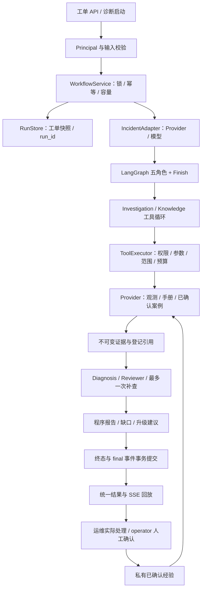

# 项目结构与模块说明

当前项目只维护 IT 故障工单诊断与处置辅助链路。入口为 `main.py`（诊断 CLI）、`local_run.py`（本地启动）和 `app/app_main.py`（FastAPI）。Python 源码路径为 app，通常设置 `PYTHONPATH=app`；main.py 和本地入口会自行准备路径。

## 文件结构

```text
app/
  app_main.py                 API 装配、生命周期与指标接口
  config/                     应用监听配置、最小 IT 运行配置
  api/                        身份、健康检查、工单、运行与 SSE
  incidents/                  工单请求契约与业务错误/归属规则
  agents/                     模型构建、角色提示词与输出契约、取证循环
  workflow/                   LangGraph 图、协调操作、执行服务与诊断执行
  tools/                      六工具的参数/范围/权限校验和执行
  providers/                  服务登记、Prometheus/Loki、合成资料与私有确认经验
  repairs/                    动作契约、审批/单次执行/有界验证、Docker执行器
  evidence/                   证据/引用契约、展开校验、覆盖判断和报告
  runtime/                    全局预算、调用计数、运行上下文和源码指纹
  observability/              JSON 日志、脱敏、调用耗时和 Prometheus 指标
  storage/                    PostgreSQL/内存测试存储与 SQL 迁移
scripts/                      身份初始化、工具探针、取证和同预算对照
tests/
  api/ agents/ workflow/ tools/ evidence/ storage/ evals/
  architecture/ runtime/      归档边界、默认入口、日志与指标检查
fixtures/incident/            Agent 可见的六个合成开发案例
evals/incident/               隔离 gold、评分和历史 IT 验收摘要
evals/common.py               公共报告写入辅助
docs/                         当前说明及保留的历史交付记录
archive/research/             退役研究代码/测试/评估/部署和原依赖快照
front/agent_front/            Vue/TypeScript IT 调试页面与报告/事件回放
```

五个模型角色共享预算与工具循环，报告由程序生成。通用接入包含ServiceRegistry、HTTPObservationProvider、repairs模块、api/repairs.py、storage/repairs.py及002迁移；Diagnosis可生成登记动作的结构化候选，审批/执行独立于只读诊断图。配置、执行流程和限制见[通用接入与受控修复](通用接入与受控修复.md)。

## 核心模块职责

| 模块与文件 | 负责什么 | 不负责什么 |
| --- | --- | --- |
| api/auth.py | Bearer 解析、服务端 Principal 与身份绑定 | 不接受模型或客户端自报可信身份 |
| api/incidents.py | 创建、列表、修订、启动、人工确认与错误转译 | 不执行 Agent 内部循环 |
| api/runs.py | 按归属读取结果、SSE 续读和回放 | 不因订阅重复启动运行 |
| workflow/service.py | 容量、工单启动幂等、线程池、事件及终态持久化 | 不注册研究执行器 |
| workflow/execution.py | 准备 Provider/模型、调用协作图、生成失败结果 | 不替代存储事务与预算控制 |
| workflow/graph.py | 五个角色节点及 Finish、条件边和终止路由 | 不实现工具权限校验 |
| workflow/coordinator.py | 任务队列、调度门禁、草稿、复核、一次补查及不同目的的完成判定 | 不提供自由群聊或无限委派 |
| agents/investigation.py | 标准工具调用循环、局部上下文、有限反馈/修复 | 不绕过共享计数或范围 |
| agents/models.py | ChatTongyi 构建、固定模型参数、SDK 错误转译 | 不管理 API Key 分发 |
| agents/contracts.py / prompts.py | 调度、诊断、复核输出契约和五角色指令 | 不填入可信的来源值或工单终态 |
| tools/executor.py | 六工具注册、角色/身份/时间/服务校验、真实尝试计数 | 不允许任意 SQL/Shell/HTTP/文件写入 |
| providers/fixtures.py | 合成资料的实际过滤、空/错/截断处理 | 不加载 gold 或制造自由工单观测 |
| providers/bound.py | 工单范围绑定、历史确认经验的归属/版本过滤 | 不把未确认诊断存成可信案例 |
| providers/registry.py / http.py / logs.py | 服务登记、固定 PromQL/LogQL、采样预算及事件日志白名单映射 | 不向模型公开凭据或任意查询地址 |
| evidence/* | 原始证据快照、引用编号展开、字段值/时间/版本校验、确定性事实与报告 | 程序校验不代替真实语义质量评估 |
| runtime/context.py | 原子预算、ContextVar、父子 span、调用数、已知 Token 和终止原因 | 不估造费用或宣称 SDK 请求已取消 |
| observability/telemetry.py | 日志轮转、消息脱敏、固定标签的计数/耗时指标 | 不部署监控平台或存储长期指标 |
| storage/runs.py / incidents.py | 顺序事件、终态事务、唯一运行、人工确认和私有经验 | 不改变已有表名或清空数据库 |
| front/agent_front/src/IncidentPanel.vue / ReportView.vue | 身份、服务选择、工单目的与预算、报告展示及事件回放 | 不自动授权付费调用或执行修复 |

agents/scripted.py 和 scripted_investigation.py 是明确标注的免费控制替身，供 CLI、API 演示及工程测试使用。真实模式仍使用模型真实工具协议，不能把这些脚本结果当自主诊断成绩。

## 请求和数据怎么流转



所有节点共用一个 RunContext。当前观测与历史知识分开登记，历史知识不能单独确立当前原因。获准补查先由程序通过原 Executor 执行，再由模型解释；最多一轮补查，两轮诊断/复核。

运行状态 completed/partial/failed 与工单状态 open/investigating/awaiting_confirmation/resolved 分开。只有人工确认才能 resolved。SSE 回放不恢复执行，后端进程中断仍标记失败。

同一协作图支持 `diagnosis` 和 `status_check`。故障诊断要求当前事实、原因假设与处理建议，缺失时保留结果并返回缺口；状态核查只复核已取得观测并说明采样与覆盖限制。Diagnosis 引用 Schema 限定本次可见编号，程序独立检查未知与重复引用，并复用一次纠正额度。六工具没有索引任务查询能力。

## 保留的兼容点

- 旧 `/api/v1/research/runs/{id}` 及 events 只是当前前端读取别名；没有研究创建、记忆 API 或启用开关。
- `research_runs/research_events` 以及原数据库账号、库名、数据卷保留。本次没有数据库改名、删表、数据迁移或删除容器/卷。
- `memory_enabled=false` 等历史结果字段继续保留，以兼容已有运行与页面。
- 新变量使用 INCIDENT 前缀；身份文件、并发数和测试 DSN 的旧变量仍可作配置别名，不会恢复研究功能。
- config.json 与真实本地凭据未改写；已弃用的配置字段被运行配置忽略。

## 日志、评估和历史归档

日志为 logs/incident.log，指标为 it_incident_*，GET /metrics 需要 operator。旧日志文件不删除，指标进程重启清零；运行/事件在 PostgreSQL 中持久化。

评估和报告辅助不再依赖研究 evals.run。源码指纹覆盖当前 app 中的 Python 模块，排除 archive；目录迁移会改变指纹，旧报告和旧指纹不会改写。

archive/research/manifest.json 记录52个历史文件的原路径及哈希。覆盖/审计的 nodes.py、state.py、coverage.py、validation.py 原样保留。该归档不加入 PYTHONPATH、测试发现、安装或 CI，也没有重新启用入口。历史文档、examples、evals/baselines 和已有失败验收记录保留供追溯。

当前试点、验证结果与后续项见[真实联调验收与稳定版收尾](真实联调验收与稳定版收尾-20261010.md)。历史目录验证见 [研究退役与目录整理记录](研究退役与目录整理记录.md)。
