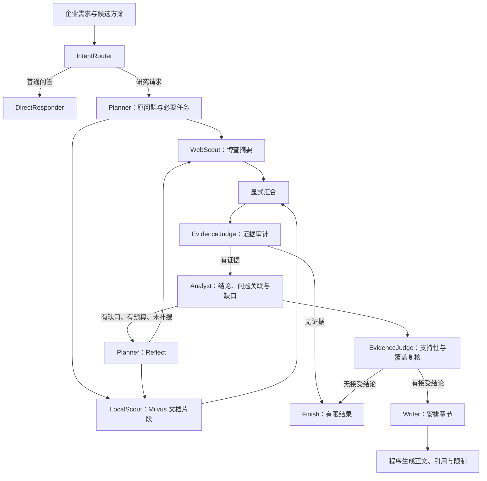

# 企业技术选型多 Agent 研究助手：面试逐字稿

核对日期：2026-10-07。当前分支：`feat/tech-selection-finish`，交付工作流版本：`harness-v1.2-evidence`；`3154411` 是收尾修复前的历史基线。

当前验证：原 56 项工程回归与新增 17 项评测器验证，共 73 项本机通过，含真实 Milvus 预过滤；前端沿用上版已通过的构建验证。20 个质量案例各两次已执行，AI 辅助复核严格报告通过率 65%，质量门禁未通过。最新范围和完整基线见《评估体系说明》；记忆/权限见《记忆与权限隔离说明》。历史故障不能当作当前持续故障。

参考《项目面试文档-逐字稿》的自我介绍、项目问答与追问结构，内容依据当前代码和已保留的验证记录重新编写。参考材料中的实习背景、生产规模及效果数据不作为本项目的事实依据。

## 一、怎么使用这份稿子

正文“口述”可以直接练习；“代码定位”和“追问”用于理解与准备，不需要逐字念出。先练开场和第 1—15 问，再练预算、回放、评测三个专题。面试时先回答一个核心观点，等对方追问再展开，不要一次报完所有字段和数字。

个人信息只保留占位符，按真实经历填写。项目贡献建议表述为“基于已有工程基础完成场景收敛和工程化完善”；不要把所有底层代码、框架能力或 AI 辅助生成代码说成自己从零独立实现。稿件中的“我做了”指你需要能够解释、演示并承担的项目工作，不代表对代码来源的认证。

当前演示主线是：企业技术选型需求 → 规划 → 网络/本地取证 → 分析 → 最多一次补搜 → 支持性和问题覆盖复核 → 有依据的结果或有限结果。

## 二、自我介绍与项目开场

### 1. 自我介绍，约 60—90 秒

**口述：**

面试官您好，我叫 XXX，是 XX 大学 XX 专业的本科生，求职方向是 Agent 开发和大模型应用开发。

我最近重点完善了一个基于 LangGraph 的多 Agent 研究助手，把场景收敛到企业技术选型。用户给出候选平台和约束，系统结合网络摘要和本地资料，整理对比依据、条件性建议，以及还无法确认的信息。

我的重点工作是研究流程的工程化：让结论能关联证据，让系统检查原问题有没有真正回答，同时限制调用次数、补搜和重试。结果通过 SSE 展示执行过程，并保存到 PostgreSQL，刷新页面可以读取同一次运行。

目前本地完成了 41 项控制和数据库集成测试，也有实际博查、Milvus、Embedding 和模型参与的验证记录。我希望重点介绍问题覆盖、证据复核和执行控制这几个设计。

### 2. 项目整体介绍，约 2—3 分钟

**口述：**

这个项目是一个面向企业技术选型的资料研究助手。例如，团队想比较 Dify 和 FastGPT 的部署方式、接口集成和维护要求。普通聊天模型可以很快写出一篇介绍，但容易混淆产品版本、把未知成本补成已知结论，或者根本没有回答企业的硬性条件。

我沿用了已有多 Agent 工程，在这上面收敛业务场景，并完善研究结果的质量约束。后端用 FastAPI，流程由 LangGraph 编排，前端用 Vue 和 TypeScript，PostgreSQL 保存运行、事件和检查点，Milvus 提供本地资料的向量检索。

一次研究先经过意图识别和规划。规划阶段把原始需求固定为第一个问题，最多再保留两个辅助问题。随后网络和本地检索分支并行执行，并在证据审计前显式汇合。分析节点输出带来源和问题关联的候选结论；有缺口且预算允许时，Planner 使用专门的反思提示，生成补搜查询，最多补搜一次。

分析完成之后还有一道复核。它检查证据是否支持结论，同时判断哪些研究问题实际得到回答。程序会继续检查来源 ID、引文和结论关联，复核不通过的结论不能进入正文。Writer 只安排已接受结论的章节，正文和参考资料由程序渲染，减少最后一步重新编造事实的机会。

执行层统一管理模型、工具、网络请求和时间预算，并记录运行 ID、节点事件、错误及已知 Token。结果分成完成、有限结果和失败；资料不够时，可以明确交付缺口，而不是为了生成长文继续猜测。

这个项目目前是固定工作流编排的多 Agent 系统，工具由代码调度。它的主要价值在于把研究过程做得可约束、可检查、可回放，复杂采购建议仍需要人工核对。

## 三、架构与业务主线



图中省略了各阶段的错误/预算终止边。整个执行外层有 RunContext、运行存储、日志、指标及 SSE 事件。

### 1. 这个项目解决什么业务问题？为什么收敛到技术选型？

**口述：**

我希望解决的是选型前期的资料整理和依据核对。用户给出目标、候选和条件，系统帮助比较已知能力，解释适配理由，并列出需要继续确认的问题。

技术选型有具体候选和判断条件，比泛泛的行业研究更容易检查有没有回答。例如“是否有 Docker 自部署依据”可以对照资料核实；总成本、性能和数据边界没有证据，就应列成待验证项。它输出的是研究初稿，最终仍需要版本核对和 PoC。

### 2. 为什么用 LangGraph？不用普通函数调用也能做吧？

**口述：**

普通函数当然可以实现。我使用 LangGraph，主要是这条流程有共享状态、并行分支、汇合和条件循环，用图能直接表达流转关系。

例如 Planner 后同时进入网络和本地检索，两个分支完成后才进入证据审计；分析后根据缺口、轮次和预算决定补搜还是复核。函数里也能写这些逻辑，但随着状态和分支增加，需要自己维护更多控制代码。这里选图编排是为了让流程边界更清晰，不代表普通函数或其他 Agent 框架无法实现。

**代码定位：** `app/mult_agents/graph.py`，`build_app()`。

### 3. 有几个 Agent？为什么有些地方数起来更多？

**口述：**

代码里有八个角色实例：意图识别、直接回答、规划、网络检索、本地检索、证据裁判、分析和写作。角色实例和图节点不是一一对应的。

例如 Reflect 节点复用 Planner，使用专门的反思提示；deep_dive 和 verify 都复用 EvidenceJudge，分别做证据审计和结论复核。图里还有不调用模型的 Finish 节点，所以总共是八个角色、十一个节点。它们当前使用同一配置模型，八个角色不等于八个不同基础模型，也不等于每次都调用八次。

### 4. 这是 Multi-Agent，还是给一个模型换 Prompt？

**口述：**

它属于角色分工和图编排的多 Agent 工作流。不同角色有独立提示和输入输出契约，共享研究状态，由图控制协作。

底层确实可以是同一个模型，这不会自动消除角色分工，但也不能因此宣称实现了自主协商。当前 Agent 没有自己自由选择工具或接管其他角色的执行权。我会把它准确介绍为固定流程的多 Agent 研究系统。

### 5. 八个角色有必要吗？是不是为了多 Agent 而多 Agent？

**口述：**

八个不是必要条件，角色越多也不代表效果越好。这一轮为了复用已有实现、控制开发范围，我保留角色，重点补齐质量控制。

最值得单独保留的是规划、分析和复核这些不同职责；网络和本地检索也可以更多交给确定性代码。之后如果做精简，我会比较合并前后的问题覆盖、错误类型、调用成本和耗时，而不是只看角色数量。当前没有完成这种消融实验，所以不能宣称八个角色就是最优配置。

### 6. 一次研究的数据怎么在节点间传递？

**口述：**

通过 ResearchState 传递。它包括原问题、研究任务、查询计划、网页和本地证据、候选结论、已验证结论、覆盖状态和终止原因等。

并行检索分别写自己的 web_evidence 和 local_evidence，避免两个分支直接覆盖同一证据字段；汇合后再构建共享 evidence_pool。消息和检索错误使用追加 reducer。运行预算放在带锁的 RunContext，而不是让模型修改 State 中的数字决定自己还能调用几次。

### 7. 并行检索怎么实现？能说耗时减半吗？

**口述：**

Planner 的条件边同时调度 web_search 和 local_rag，图使用包含两个节点的汇合边，等两个分支完成才触发 deep_dive。我用测试检查汇合后的审计和分析不会因为两个入口重复执行。

它可以减少两路检索串行等待，但实际耗时取决于外部接口、模型和后续分析。当前还有同步调用和线程执行，不能简单说全部节点都运行在 asyncio 里，也没有对照压测证明端到端耗时减半。

### 8. Planner 怎么避免跑题？

**口述：**

除了提示它保留候选和硬性条件，我在代码里把用户原始需求固定成 q1，最多再保留两个辅助问题。

这样即使模型把“比较 A 和 B，给出建议”改写成“有哪些选型维度”，最终也必须检查原问题。辅助任务仍可能生成得不合理，这属于待校准的语义问题；但原始目标不会被规划输出完全替换掉。

### 9. 如何判断报告是否回答了问题？

**口述：**

每个研究问题有 question_id，每条结论有 claim_id、source_ids 和 question_ids。分析和复核都会给问题覆盖判断，但最终只认可复核后的结果。

程序检查关联结论是否真的保留下来、是否对应这个问题，以及是否存在重复判断。模型判“已覆盖”，但支撑结论被删除，就会降为部分覆盖或未覆盖。用户明确要求建议时，仅有背景事实不能算完成，需要有已验证的 recommendation。这些关联规则能拦截结构性错误，语义上是否充分仍需要模型和人工判断。

**代码定位：** `harness/coverage.py`，`assess_coverage()`。

### 10. 为什么引入两次 EvidenceJudge？

**口述：**

第一次面向证据池，整理来源、相关性和冲突标记；第二次面向候选结论，检查资料是否支持具体陈述，并复核问题覆盖。

这是两个不同问题：来源值得看，不等于它支持分析师写的每一句话。例如一份官方部署文档可以证明存在自部署方式，却不能直接证明数据绝不外发或总成本低于某个金额。当前两次任务复用同一个角色和模型，因此复核具有独立任务输入，但不是统计意义上独立的模型审查。

### 11. 合法引用不就证明有依据了吗？

**口述：**

合法 ID 只能证明这个来源存在。一个结论可以引用正确的文档，却把文档的意思解释错。

我因此区分三层检查：来源关联是否有效，引用文本是否来自实际片段，以及片段是否在语义上支持结论。前两层有确定性代码，第三层由复核模型判断，再用一些保守规则拦截已知错误，并保留人工核对入口。不能把引用合法率直接当成事实准确率。

### 12. 引文校验具体怎么做？

**口述：**

复核输入给每条真实片段分配 quote_id，例如来源 ID 后加 excerpt。模型可以选择这个 ID，程序再取出对应原文，减少模型复制文本时的改写错误。

也支持模型直接给逐字引文，程序检查它是不是对应片段的子串。未知 ID、冲突引文、来源集合不一致和重复支持判断不能通过。复核可以删除冗余来源，但不能补进原结论没有引用的来源。结构或引文错误共用最多一次修复，之后仍不合格的判断被排除。

**追问：完整片段都拿来当引文，会不会仍然不支持结论？**

会。选择真实片段解决的是出处和誊抄问题，不会自动解决语义蕴含问题。是否支持仍由复核及人工核查判断，不能因为附了整段资料就直接接受。

### 13. Writer 为什么不直接写长报告？

**口述：**

我把 Writer 的输出限制成章节和已验证 claim_id。正文、引用和参考资料由程序从已接受结论生成，Writer 不能新增或改写事实。

这主要防止前面已经复核的内容，在最后润色时又被加入没依据的价格或功能。代价是报告更接近结构化结论清单，文风没有自由生成那么自然。当前优先保证结论和证据能对上，再考虑受约束的自然行文。

### 14. 补搜怎么触发？复核失败会再次补搜吗？

**口述：**

分析节点报告缺口，同时代码检查问题覆盖。存在缺口、补搜次数还没用完、预算也允许时，Reflect 会针对缺口生成新的查询，再执行检索和分析。

当前最多补搜一次，重复查询会被过滤，没有新查询就停止。需要强调顺序：补搜发生在最终复核之前，复核失败不会自动开启新一轮检索。这是当前为了控制范围和预算保留的边界；复核发现新缺口时，结果可以是 partial，由用户决定继续研究。

### 15. completed、partial、failed 分别是什么意思？

**口述：**

completed 表示在本次任务范围内，有通过检查的结论，必要问题被复核覆盖，且没有需要限制结果的错误或终止原因。partial 表示仍可以交付有依据的内容，但存在缺口、拒绝结论或执行限制。failed 表示执行失败，当前不能交付有效研究结果。

这些是执行和交付状态。completed 不是采购审批，也不是绝对正确；没有来源的长文也不能因为生成成功就被算作完成。

## 四、Harness 与工程实现追问

### 16. 你说的 Harness 工程，在代码里体现在哪里？

**口述：**

我把 Harness 理解为模型执行外面的控制与验证机制。在这里，它主要有三部分。

一是执行边界：统一预占模型、工具和网络预算，控制时间、补搜和重试。二是质量边界：结构契约、证据门、引文检查、问题覆盖降级和确定性报告渲染。三是反馈机制：运行和事件持久化、日志指标，以及控制测试和真实模型评测。

这些机制参与实际执行，而不只是提示词要求。模型输出不合格或者预算不足，流程会停止或交付有限结果。

### 17. 预算具体是什么？为什么要加锁？

**口述：**

默认上限是 16 次模型调用、24 次工具调用、12 次网络尝试和 180 秒。模型结构修复和反思也占模型预算，网络失败后的重试也占网络预算。

并行分支共用 RunContext，通过锁把“检查还有额度”和“占用额度”做成一个原子操作。否则两个分支可能同时看到剩一次额度，都发出请求。额度在调用前占用，失败也不会把已经发生的成本当作没发生。研究阶段还预留两次模型调用和 15 秒给收尾。

### 18. 超过 180 秒会立刻杀掉任务吗？费用能精确计算吗？

**口述：**

不会强制杀掉正在执行的线程。时间检查发生在调用和流转边界，外部请求另外设超时，因此不能承诺到第 180 秒瞬间结束。

Token 只累加适配器返回的已知用量，缺失时明确显示未知或部分已知。模型调用次数、工具调用次数和底层 HTTP 尝试也不是同一口径。SDK 内部请求次数和 Embedding 费用没有完整计量，所以当前不展示精确费用，也没有美元级硬限额。

### 19. 模型不返回合法 JSON 怎么办？

**口述：**

节点拿到输出后会进行 JSON 解析和 Pydantic 校验，检查必要字段、枚举和数量范围。结构错误最多要求模型修复一次，修复也计入预算。

再次结构失败会产生 MODEL_OUTPUT_INVALID，进入失败或有限结果路径。引文错误与结构错误共享这一次修复机会。不会填一个“看起来合理”的默认分析结果继续写报告，因为那会掩盖模型实际失败。

### 20. 外部接口失败怎么处理？会一直重试吗？

**口述：**

我区分认证失败、限流、超时、网络错误和返回格式错误。博查对临时失败最多三次尝试，每次都计入预算；401、403 和格式错误不会无意义地反复重试。

认证失败还会阻止本次运行继续使用同一供应商。没有网页结果和检索报错也分开记录。如果没有可用证据，就跳过事实报告生成；有部分可用依据，则按当前错误和覆盖状态交付有限结果。

### 21. 为什么后端选 FastAPI？阻塞调用放在哪里？

**口述：**

FastAPI 提供请求校验、接口文档和异步流式响应，适合当前 Web API。但图里有同步 SDK 和数据库操作，不能直接在事件循环里长时间执行。

路由把启动和读取等同步操作交给 asyncio.to_thread；研究执行由 WorkflowService 的有界线程池承接。业务图和路由分开，API 负责启动、读取和传输结果，Service 管理运行生命周期，图负责研究过程。async 路由本身不代表同步工作自动变成非阻塞。

### 22. 并发怎么控制？部署多个进程行不行？

**口述：**

当前默认同时执行两次研究，用有界信号量控制准入，线程池负责执行。容量满就返回 429，不接受请求后再无限排队；流式请求也在发送 SSE 响应头之前完成容量检查。

这套控制是进程内的，当前只支持单后端进程。直接开多个 worker 会各自计算容量，而且启动时的中断标记可能影响其他进程的任务。多进程部署需要任务所有权、租约或心跳，以及持久化队列和统一调度，我还没有实现这些。

### 23. SSE 是流模型 Token，还是流执行进度？

**口述：**

当前主要是执行事件流。节点、模型和工具调用产生开始结束、阶段、用量、错误以及最终结果等事件，前端用 fetch 读取流并解析 SSE。

它不是 Writer 一边生成一个 Token、页面一边显示一个 Token 的流式正文。这样做是为了让用户知道系统在什么阶段，以及最终状态是什么；不能用“已经收到一些事件”来表示研究已经完成。

### 24. 页面刷新为什么不会重新跑一次？

**口述：**

启动一次研究用 POST，并返回服务端 run_id。前端保存最近的运行 ID 和事件序号，刷新或断线后使用 GET 读取保存结果及后续事件，不再自动 POST。

事件按 seq 排序，支持 after_seq 或 Last-Event-ID 继续读取。数据库保存最终结果，所以完成后的回放不需要再次调用模型。这个机制防止重连重跑，但不是全局幂等：如果客户端主动重复 POST，当前仍会创建两个运行。

### 25. 最终结果和事件如何保证一致？

**口述：**

research_runs 保存运行状态和最终结果，research_events 保存带序号的事件。追加事件时，数据库原子更新运行的序号，避免并发追加出现同序号。

finish 会锁住运行行，检查是否还在 running，再在同一个事务更新结果并追加 final 事件。已经完成的运行不能再次提交终态。GET 和 SSE 因而读取同一份已提交结果；数据库测试也检查了并发序号和终态一致性。这不是整个系统所有外部调用的 exactly-once 保证。

### 26. run_id 和 thread_id 为什么分开？Checkpoint 能自动续跑吗？

**口述：**

客户端 thread_id 表示用户会话，可以用于记忆。同一会话里可能连续或并发发起多次研究，每次研究都应该有自己的 run_id。

所以图的检查点键使用服务端 run_id，避免两个研究共享同一个检查点状态。Checkpoint 保存状态并不等于我已经实现了业务续跑；当前重启后会把未完成任务标记为 PROCESS_INTERRUPTED，用户可重新提交。已完成结果能读取，运行中任务不会自动恢复执行。

### 27. 有日志、指标和全链路追踪吗？Redis 用了吗？

**口述：**

有滚动 JSON 日志、进程内指标和应用级执行轨迹。通过 run_id、trace_id、span_id 和 parent_span_id，可以关联节点、模型、工具、错误和耗时；/metrics 暴露调用、错误、重试、修复、活动运行数和已知 Token 等指标。

但当前没有接 OTel Collector、Jaeger 或完整跨服务追踪，指标重启会归零。Redis 在原有代码里有可选后端路径，本次实际配置使用 PostgreSQL，也没有 Redis 缓存压测结果。运行结果中的问题覆盖统计和监控指标也要区分，不能把一个结果字段说成完整监控平台。

**追问：日志完全脱敏了吗？**

控制层对凭据进行处理，普通节点日志尽量记录字段与长度。API 的新记忆管理器只记录异常类型，不记录查询与原始向量命中正文，默认研究关闭记忆。旧独立 CLI 管理器没有统一改造。运行、事件和记忆表本身包含研究数据，不能把日志收敛说成完整的数据治理。

## 五、RAG、记忆与技术选型追问

### 28. RAG 在这里承担什么职责？和普通 RAG 项目有什么区别？

**口述：**

这里 RAG 是本地取证渠道，把部署文档或内部资料召回到研究流程。它不负责单独决定选型，也不是项目的主要优化对象。

与文档问答项目相比，重点在取证之后：规划多个问题、跨来源分析、判断缺口、受限补搜、逐条复核和检查问题覆盖。因此我没有继续堆复杂解析、混合检索和文档管理，而是把 RAG 做到能可靠提供带来源的片段，保留后续替换检索实现的空间。

### 29. 支持什么文档？怎么分块和检索？

**口述：**

当前入库入口支持 UTF-8 的 txt、md 和 markdown 文件或目录。使用 RecursiveCharacterTextSplitter，默认块长 500 字符、重叠 50 字符，优先段落、换行和中文标点切分。

Embedding 使用 text-embedding-v1，向量存入 Milvus，查询调用相似度检索并保留源文件路径。当前没有 PDF、Word、OCR 解析，也没有 BM25、重排或上传接口；不能把记忆模块的数据库兜底说成知识库已经有混合检索。

**代码定位：** `rag/core.py`、`rag/ingest.py`。

### 30. 为什么选 Milvus，为什么不是 pgvector？

**口述：**

对这个版本来说，最直接的原因是复用已有向量检索实现和本地服务，减少为了换存储而产生的开发与验证成本。知识库和记忆向量索引都有现成路径，这一轮先把研究闭环完成。

我不会用当前四份演示笔记证明必须选择 Milvus，也没有做同等数据、索引和查询条件下的 pgvector 对照实验。如果从零做这类小规模项目，我会把向量数据集中在 PostgreSQL 的方案纳入评估，比较部署成本、过滤需求、召回质量和延迟。选型依据应当是实际约束和实验，而不是泛泛地说另一个方案性能不行。

### 31. Milvus 不可用，所有检索都有 PostgreSQL 兜底吗？

**口述：**

需要分开说。本地知识库检索没有完整的 PostgreSQL 文本副本兜底，故障会返回 RAG_UNAVAILABLE；如果还有网络证据，可以在限制条件下给出部分结果，没有证据就停止事实生成。

可选长期记忆模块则有 Milvus 检索以及 PostgreSQL 文本查询的回退路径，但字面匹配和语义检索的效果不同。这不是知识库的故障转移，也不是向量库故障时系统质量完全不受影响。

### 32. 记忆和 Checkpoint 的区别是什么？当前记忆默认启用吗？

**口述：**

Checkpoint 保存单次工作流的中间状态，例如执行到哪个阶段、有哪些证据。对话记忆则为后续请求提供用户偏好和历史上下文，两者用途不同。

本轮 API 使用隔离后的 ScopedMemoryManager：短期对话与摘要存在 PostgreSQL，按租户、用户、会话三元组隔离；用户画像、明确保存的背景和可选完成任务历史用于跨请求记忆。API 每次研究默认关闭，用户勾选且服务端 ENABLE_MEMORY=true 后启用。旧 SQLite/Redis 管理器只保留给独立 CLI 实验，没有自动迁移旧表数据。

### 33. 可选记忆如何存储和注入？会被当成研究证据吗？

**口述：**

PostgreSQL 保存权威消息、摘要、画像与长期记录，Milvus 提供可选索引。Service 在图执行前读取个人上下文，构造最多 2800 字符的 JSON，with_memory_context 将它作为低优先级历史数据追加到部分节点的用户消息，不是系统提示词。它用于称呼、表达偏好和理解背景，不能覆盖当前要求。

verify 和 write 不注入记忆，结论仍要关联本次实际检索证据。自动偏好提取只识别很窄的明确句式；更多背景由用户显式保存。用户可以查看、修正和删除自己的记忆。任务历史默认关闭，开启后也标注为须重新取证的历史输出。

### 34. 短期记忆超过 20 条就压缩吗？双写能保证一致吗？

**口述：**

默认超过 30 条消息触发压缩，保留最近 20 条；总字符数超过 16000 也触发压缩，并进一步缩小保留窗口。Qwen-Plus 做滚动摘要，失败或预算不足时使用有界文本摘要；同一用户的写入用 PostgreSQL 事务锁串行化，消息、摘要和裁剪原子提交。会话默认最后活动后 7 天过期。这不是精确 Token 计数。

PostgreSQL 与 Milvus 不是跨存储强一致。向量索引失败时走同范围的关键词回退；命中 ID 会回数据库检查有效期、归属和删除状态，使用数据库正文。删除和手动改画像会增加记忆版本，在途研究不能用旧版本写回。向量旧行没有同步物理删除，当前也没有索引自动补偿队列。

### 35. 有 tenant_id，就能保证多租户隔离吗？

**口述：**

字段本身不能。我新增服务端令牌映射，客户端不能任意指定身份；运行与 SSE 查询 SQL 带租户和用户条件，越权返回 404。短期记忆加会话条件，Milvus 检索先按身份预过滤，再回 PostgreSQL 校验。私有资料按当前租户共享、用户私有的集合路由，只有管理员明确指定的公共集合会共享。

本机验证覆盖不同用户相同会话 ID、同名用户跨租户、越权回放、过期和删除、真实 Milvus 预过滤。当前是静态令牌的演示级认证，没有账号注册、复杂组织权限或数据库 RLS；运维角色只额外能读聚合指标，不能读取别人的研究。

## 六、效果、难点与项目贡献

### 36. 项目最大的难点是什么？举一个你实际解决的例子。

**口述：**

我认为最大的难点是模型看起来“有依据”，却没有真正回答问题。最初只检查引用 ID，报告可能全是平台背景，选型建议和硬性条件反而没有回答。

我通过固定原问题、把结论关联到问题、在复核后重新计算覆盖，以及对明确建议请求检查 recommendation，减少这种结构性完成假象。

另一个实际例子是预算误判：资料说团队每月预算上限 2,000 元，而且没有明确是否包含服务器和模型费用，模型却说方案满足预算。最终新增保守规则，拦截这个已知错误，并用回归测试验证“不确定是否满足预算”的表述仍然允许。规则覆盖有限，不能替代一般语义判断，但它来自可复现的实际失败。

### 37. 你的评测怎么做？有什么真实指标？

**口述：**

我把控制可靠性和回答质量分开。控制测试使用 FakeAgent 和固定检索输入，不调用付费 API，检查预算、重试、来源、覆盖、并行汇合和回放等不变量。另有真实 PostgreSQL 集成，验证事件序号、终态事务和持久化。

目前工程和评测器验证共 73 项本机通过。质量侧是 20 个带标准答案的虚构案例，其中 16 个开发、4 个保留，每个用当前 qwen-turbo 跑两次。完整保留了 40 次原始报告、来源、结论、调用与 Token，以及图外 AI 辅助逐项复核；不是把工作流自己说 supported 当作外部评分，也没有把 AI 复核说成人工评审。

这次引用 ID 合法率是 100%，但严格报告级语义通过率只有 26/40，也就是 65%；两次均通过的案例只有 10/20。它暴露了“未提及 SDK 变成没有 SDK”和“拒绝正确纠错结论”等问题，所以初始 85% 门禁没有放行。人工复核模板仍保留，可以复查 AI 辅助判断。

另用真实 Embedding、Milvus 和测试 PG 做小型基准：5 段虚构资料、8 个知识查询的 Recall@3 为 100%，3 个记忆查询的 Recall@2 为 100%，外用户、删除和过期记录没有返回。这只能验证小型链路，不能当企业全量召回率；固定记忆注入的生成评测与真实记忆召回是分开的。没有用这些数据声称改造带来多少提升。

### 38. 真实演示跑得怎么样？平均耗时是多少？

**口述：**

有一条实际运行是只依据本地知识库，比较 Dify 和 FastGPT 是否有 Docker 自部署资料依据。它经过真实 Milvus、Embedding 和模型调用，返回两条事实和两个来源，状态 completed，7 次模型调用、8 次工具调用、零联网搜索，耗时约 27.6 秒。

这是单次业务样本，不是平均延迟或 SLA。另有固定虚构语料的 40 次质量运行，平均 27.65 秒、p95 44.29 秒，但不包含真实博查搜索耗时。此前联网核实阶段的认证失败按那条运行的时间解释；本轮没有重新评测博查状态。复杂推荐仍有过度拒绝和误判，失败记录保留。

### 39. 模型选什么？能换更强模型来解决所有问题吗？

**口述：**

当前本机配置是 qwen-turbo，八个角色沿用同一配置模型，Embedding 是 text-embedding-v1。这个选择首先是沿用当前可运行配置，并没有完成多模型性价比实验。

更强模型可能改善规划和复核，但不能代替预算、证据来源、引用和持久化控制。如果评估升级，我会固定资料和案例，对照语义支持、问题覆盖、成本和耗时，同时记录提示与结构契约版本，而不是仅凭一份看起来更流畅的报告下结论。

### 40. 你个人贡献是什么？用了多少 AI 辅助开发？

**口述：**

我基于已有工程基础推进场景收敛和工程化完善，重点工作是明确研究任务的完成条件、设计并检查证据与问题关联、落实预算和异常边界，并把质量结果贯通到 API、保存和页面。

开发中使用了 AI 辅助编码和文档整理。我的责任是理解关键路径、核对实现与需求是否一致、检查失败记录，并通过测试和演示确认行为。我不会把 AI 生成代码本身当成能力证明，也不会声称每个基础模块都是从零手写。面试时可以沿原子预算、覆盖降级和 SSE 回放三条路径具体解释。

### 41. 和成熟 Deep Research 开源项目相比，有什么竞争力？

**口述：**

我不会用这个小项目宣称超越成熟系统。作为求职作品，我希望展示的是：面对一个具体研究任务，我能定义完成条件、把模型输出约束到可追溯的证据，并处理预算、故障和持久化这些实际问题。

辨识点是把场景收敛到企业技术选型，展示“为什么这个问题仍未完成”以及“某条结论为什么被排除”。它还有同质化的研究助手外形，所以我会用真实失败与修复过程证明工程理解，而不是仅强调用了 LangGraph 和多个 Agent。

### 42. 如果再做一版，优先改什么？

**口述：**

我会先补当前闭环的薄弱处：恢复联网凭据，扩充明确版本的资料，建立独立于调参样本的评测集，重点统计建议缺失、误拒绝、预算与版本混用这些错误。

其次评估是否合并检索角色，减少不必要模型调用；新增能力应通过对照验证。业务上可以在另一分支改成 IT 故障工单协同，复用预算、证据和回放机制，但工单工具、审批和动态调度目前都只是规划，不能当作现有功能介绍。

## 七、面试现场演示逐字稿

### 1. 演示前先检查

- Docker、PostgreSQL、Milvus、后端和前端正常；页面地址 `http://127.0.0.1:5173/`。
- 知识库为 `tech_selection_v1`，本地已导入四份带官方来源的摘要笔记。
- 默认关闭记忆，避免历史内容影响现场案例。
- 联网搜索只有在有效凭据验证成功后才作为成功演示；当前先使用本地资料。
- 如果打开的是保存结果，明确说“回放”，不要说成刚刚重新运行。

### 2. 提交一条范围明确的问题

```text
只依据本地知识库，比较 Dify 与 FastGPT 是否有 Docker 自部署方式，
给出两个候选的资料依据。只回答这一项，
不扩展成本、性能、部署门槛或推荐。
```

**口述：**

这条问题刻意限定了范围，目的是演示资料取证和完成条件。这里“只依据本地”限制来源，不代表模型和 Embedding 都在本地部署；它们当前仍调用云端 API。

可以看到系统先规划，随后做本地检索、证据审计和复核。结果除了正文，还有来源片段、问题覆盖和调用用量。这个例子只验证有没有部署依据，不把它扩大成成本或数据不外发结论。

### 3. 展示失败或有限结果的价值

```text
只依据本地知识库，判断 Dify 与 FastGPT 的实际月度总成本是否低于
2000 元；需要包含模型调用和服务器成本，资料不足请明确说明。
```

**口述：**

这条问题需要笔记里没有完整提供的成本数据。我想展示的是系统如何说明缺口，而不是要求它一定选出赢家。

具体状态仍由本次输出决定，可能部分完成，也可能没有足够结论。假如模型错误地给出已覆盖，我会对照来源说明这是质量缺陷，不把演示包装成通过。现有规则主要拦截已经观察到的预算误判，不能保证识别所有措辞。

### 4. 刷新并查看证据

**口述：**

现在刷新页面，运行 ID 和模型调用次数保持不变。页面读取的是保存结果或后续事件，没有再发起一次研究。这能避免断线重连重复消耗模型额度。

展开证据还能核对报告引用的实际片段。当前网页路径只使用搜索摘要，本地资料是人工整理的官方文档摘要，都不能冒充已经读取全部文档或完成真实部署。

### 5. 保存的演示记录

已完成运行：`224103e3-76f9-4af1-80ea-4c65255e7d07`。

这条业务运行早于最终引文选择器和预算规则补丁。最终补丁通过控制回归、实际错误记录复查和后端重启回放验证，不能将回放算作一次新的真实模型评测。

本机截图：`output/tech-selection-ui.png`；原始结果：`output/selection-local-final.json`。这两个文件被 Git 忽略，不随代码仓库发布。

## 八、简历可用表述

项目名称建议：**面向企业技术选型的多 Agent 研究助手**。

以下三条依据当前实现编写；使用前确认能解释和演示对应代码：

- 基于 LangGraph 编排规划、并行双源取证、受限反思及证据复核流程，面向企业技术选型输出关联来源的结论、条件性建议与资料缺口。
- 完善模型执行 Harness，落实原子调用预算、有限重试和结构修复，结合结论—证据—问题关联检查与确定性渲染，控制无依据输出和问题覆盖误判。
- 使用 FastAPI、Vue、PostgreSQL 实现 SSE 执行事件、运行结果持久化与 GET 回放；完成 24 项控制回归及 4 项数据库集成测试，并通过实际 Milvus、Embedding 与模型演示验证本地取证链路。

不要自行补充“服务数万用户”“准确率 95%”“幻觉降低 80%”“压测提升数十倍”等没有测量依据的数字。将来建立独立评测后，再按数据更新简历。

## 九、参考稿与当前版本的关键差异速查

| 参考稿中容易沿用的说法 | 当前可准确表述 |
| --- | --- |
| 硕士背景、奖学金、公司实习、从零主导全部设计 | 个人信息按真实经历填写，项目贡献围绕实际理解和参与范围 |
| 七个角色，或八个角色每次都执行 | 八个角色、十一个节点；分支、复用和修复使调用次数变化 |
| 最多补搜两轮 | 最多一次；请求仅接受 0 或 1 |
| Agent 自主选择工具、动态协商 | 工具由 Python 节点调用，固定图编排 |
| Analyst 判断够了直接写自由长文 | 先进行结论支持性和问题覆盖复核，Writer 仅安排章节 |
| 引用 ID 有效就说明结论正确 | ID、引文真实性和语义支持是三个不同层次 |
| 所有错误都填默认 JSON 继续执行 | 最多修复一次，仍失败则停止或有限交付 |
| Redis 缓存使节点从 100ms 降到个位数 | 可选 Redis 代码保留，当前实际配置 PostgreSQL，没有对应压测 |
| 知识库、记忆都有 PG 文本兜底 | 记忆存在回退路径，本地知识库无完整 PG 副本兜底 |
| 具备完整企业 IAM 与独立数据库租户隔离 | 记忆使用 Milvus 所有者预过滤和 PG 校验，知识库公私集合路由，API 静态令牌身份隔离；仍为演示认证 |
| Checkpoint 就是长期记忆，重启自动续跑 | 检查点与记忆不同；当前中断标记失败，不自动续跑 |
| 超过 20 条消息就压缩 | PG 路径默认超过 30 条触发，保留 20 条近期消息 |
| 支持 PDF、Word、OCR | 当前入库支持 UTF-8 TXT/Markdown |
| 本地知识库意味着所有数据都本地计算 | 云端模型和 Embedding 仍接收相应输入 |
| 召回率 95%、幻觉率 6%、引用准确率 94% | 没有当前有效测量依据，不沿用 |
| 20 个案例全部质量通过 | 20 个案例各两次实测，AI 辅助语义复核通过 26/40，门禁未通过 |
| 27.6 秒就是平均响应时间 | 一条窄范围任务的单次实际结果 |
| 全链路追踪、高并发生产系统 | 应用级轨迹、进程内指标；单进程并发控制 |
| 每日清理和按月分区已经落地 | 有手动运行清理脚本，未配置完整自动生命周期管理 |

## 十、讲解前应能独立找到的代码

| 面试主题 | 代码位置与阅读重点 |
| --- | --- |
| 八个角色如何构建 | `app/mult_agents/main.py`：AgentBundle、build_agents，工具列表为空 |
| 并行与汇合、补搜时机 | `app/mult_agents/graph.py`：build_app、should_continue_research |
| State 和 reducer | `app/mult_agents/state.py`：ResearchState |
| 结构修复、复核和 Writer | `app/mult_agents/nodes.py`：_invoke_json_agent、verify_node、write_node |
| 问题覆盖降级 | `app/mult_agents/harness/coverage.py`：assess_coverage、final_coverage |
| 引用、限定和报告生成 | `app/mult_agents/harness/validation.py`：supported_findings、qualifier_violation、render_report |
| 原子预算与调用边界 | `app/mult_agents/harness/runtime.py`：RunContext.reserve、invoke_model |
| 日志和指标 | `app/mult_agents/harness/telemetry.py`：Metrics、configure_logging |
| 线程池、容量与 run_id | `app/backend/service/workflow_service.py`：_admit、_execute |
| 事件序号与终态事务 | `app/backend/service/run_store.py`：_append、finish |
| SSE 和只读回放 | `app/backend/router/research_router.py`；`front/agent_front/src/App.vue` |
| 本地文档取证 | `app/mult_agents/rag/core.py`、`rag/ingest.py` |
| 可选记忆和实际边界 | `app/mult_agents/memory/manager.py`：search_semantic、_search_milvus、_compress_pg_thread |
| 控制测试与数据库集成 | `tests/test_controls.py`、`tests/test_postgres.py` |
| 模拟资料与模型评测 | `evals/run.py`、`evals/cases.json`、`evals/fixtures/solutions.md` |

建议先能不看稿解释三个例子：并行分支为什么要原子占预算；结论被复核拒绝后覆盖为什么必须降级；SSE 重连为什么只能 GET。能沿代码讲清这三件事，比背出所有组件名称更有说服力。

## 十一、2026-10-07 联网闭环修复补充

前文提交基线和历史验证数字保留；最新本地实现已通过 36 项控制回归和 4 项 PostgreSQL 集成，共 40 项。联网研究原问题最终完成，run_id 为 `98037b84-f055-4145-8130-58a243207c4b`，时长 37 秒、模型 7 次、博查 2 次、原问题覆盖 1/1。这是一次开发验证，不是平均性能或准确率。

可以补充一个 Harness 案例：“网页证据整理曾连续输出到 2,400 Token 上限而失败。我将模型输出改成来源 ID 选择，Python 保留原文，增加实际 ID 与 Schema 校验、字段级诊断和有限修复。真实校对还发现模型把 fork 当官方，我用维护过的官方域名与仓库目录约束检索，并适配博查原生域名过滤。最终验证了官方来源、问题覆盖与只读回放。”

## 十二、现有版本收尾口述补充

当前固定工作流版本harness-v1.2-evidence，共37项控制回归与4项PG集成通过。官方单项核实、本地笔记对比及费用不足有限结果都有记录；本轮官方案例只回放，没有重新联网。完整演示与边界见《现有版本交付说明》。

另一个可讲的修复：“我发现复核剔除一条额外费用结论后，即使所有必要问题已经回答，程序仍把排除历史当作资料缺口，误标partial。我将两者分开：排除记录保留审计，覆盖只依据通过复核的结论计算。测试同时证明无关候选被剔除不误降级、必要结论被剔除仍返回有限结果。”

质量追问应说明：固定资料q15仍有保守拒绝，模型可能扩大辅助任务；支持检查不是事实准确性保证。三个核心角色、自主工具选择和复核反馈回路仍是未实施的备选设计，不写成当前能力。

当前官方入口目录仅登记 Dify、FastGPT；明确要求官方来源的其他产品需要补充已核对入口。普通研究的原有检索路径保留，网络证据仍是搜索摘要。所有中间结果与限制见 [证据整理输出修复说明](证据整理输出修复说明.md)。
