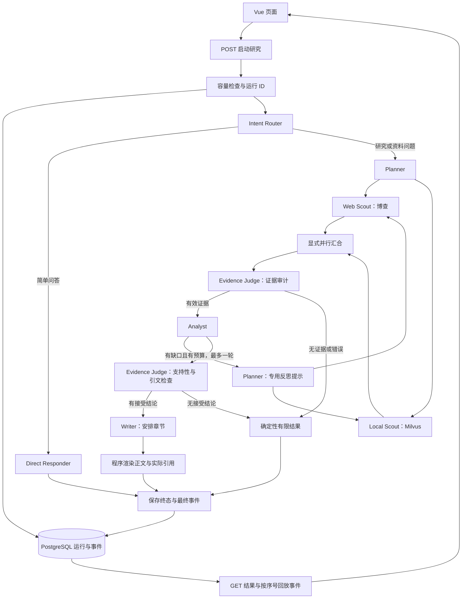

# Deep Research 首版调整说明

交付日期：2026-10-07。实施依据：[复用优先方案](完善方案-复用优先.md)。

## 1. 这版解决什么问题

保留 LangGraph、FastAPI、Vue、PostgreSQL、Milvus、现有 8 个角色和主要检索/记忆实现，把执行控制加入实际工作流。核心变化是：运行有预算、有证据门、有状态、有记录，出错后能解释，刷新后能读取同一次运行。

原来网络检索认证失败、本地检索为空时，仍可能输出缺少引用的长篇报告。现在遇到这种情况返回失败/有限结果，展示认证问题与证据缺口，跳过 Analyst 和 Writer。模型有合法来源 ID 仍不够：写作前检查支持性，并核对模型给出的引文是否逐字存在于对应片段。

这仍是工作流编排的多 Agent 系统。工具由 Python 节点调用，角色实例的工具列表没有改成自主工具循环。

## 2. 当前执行链路

8 个角色实例保留：IntentRouter、Planner、WebScout、LocalRAGScout、EvidenceJudge、Analyst、DirectResponder、Writer。共有 11 个图节点；新增 `verify` 和 `finish`。反思复用 Planner，但替换成专用系统提示；验证复用 EvidenceJudge，没有新增第九个业务角色。

节点、模型、网络、本地检索和 Embedding 调用都带运行关联。应用轨迹不是 OTel 分布式追踪，数据库 SQL 与 Milvus 服务内部没有单独的 span。

## 3. 新增文件与职责

| 文件/目录 | 职责 |
| --- | --- |
| `app/mult_agents/harness/runtime.py` | 每次运行独立上下文、线程安全预算、调用边界、错误类型、span 与 Token 累计 |
| `app/mult_agents/harness/validation.py` | Pydantic 结构、结论来源关联、疑问句排除、报告章节契约、确定性正文与引用渲染 |
| `app/mult_agents/harness/telemetry.py` | JSON 滚动日志、敏感文本处理、进程内计数与耗时直方图、Prometheus 文本 |
| `app/mult_agents/harness/embeddings.py` | 复用 DashScope Embedding，限制适配器重试，增加请求超时、调用预算与 span |
| `app/backend/service/run_store.py` | PostgreSQL 两张运行表、顺序事件、终态原子提交、重启中断标记、到期记录清理；内存适配器只用于测试 |
| `tests/test_controls.py`、`tests/support.py` | 十条不依赖付费服务的控制回归与测试桩 |
| `tests/test_postgres.py` | 三条独立测试库集成测试 |
| `evals/fixtures/solutions.md`、`evals/cases.json` | 四段人工资料与十个质量问题 |
| `evals/run.py`、`evals/README.md` | 固定检索、可选真实模型、结果保存与人工评分说明 |
| `.github/workflows/checks.yml` | 控制测试、前端构建与 PostgreSQL 集成 CI |
| `scripts/cleanup_runs.py` | 手动清理到期终态运行和事件，不影响知识库、记忆与检查点 |

没有增加运行依赖，沿用现有模型、数据库和前端库。

## 4. 修改了哪些已有模块

| 原文件 | 主要改动及原因 |
| --- | --- |
| `app/mult_agents/graph.py` | 增加失败/有限结果路由、显式双检索汇合、验证和终止节点，避免错误后继续事实写作 |
| `app/mult_agents/nodes.py` | 统一模型入口；查询按规划覆盖；失败查询保留轨迹；统计实际执行数；补搜去重；拒绝来源不重新加入；覆盖模型改写的 URL/片段；接入支持性检查与确定性报告 |
| `app/mult_agents/main.py` | 保留 Agent 构建；设置模型适配器重试/超时；为反思提供原始模型的专用系统提示；CLI 使用独立运行 ID 与预算；显式 PostgreSQL 检查点失败时不静默降级 |
| `app/mult_agents/prompts.py` | 规划减少不必要扩展；分析必须输出陈述并保留限定；统一 confidence 枚举；Writer 改为章节安排 |
| `app/mult_agents/state.py` | 增加运行 ID、状态、停止原因、累加错误、接受结论；保留原有证据和查询轨迹结构 |
| `app/mult_agents/tools.py` | 空结果与错误分开；认证失败不重试；临时错误有限重试；移除 Key 前缀日志；限制响应、返回条目和搜索摘要 |
| `app/mult_agents/rag/core.py` | 保留分块和 Milvus 入库，接入 Embedding 边界与连接/检索超时 |
| `app/mult_agents/memory/manager.py` | 保留原记忆后端；摘要模型纳入预算；Embedding 纳入调用边界；数据库连接/SQL 与向量查询增加超时 |
| `app/backend/service/workflow_service.py` | 统一执行准备与运行逻辑，独立检查点 ID、容量拒绝、固定执行池、持久化事件、查询/回放；流式未返回 final 时只读检查点，不再次执行初始状态 |
| `app/backend/router/research_router.py` | 保留原 POST 接口，新增 GET 状态和事件回放；SSE 事件序号、运行响应头；满载在发送 SSE 头之前返回 429 |
| `app/backend/schemas/research.py` | 查询长度与补搜范围检查；新增运行元数据；请求默认关闭记忆 |
| `app/app_main.py` | 启动运行存储、关闭执行池、注册指标接口、结构化日志、暴露运行 ID 响应头 |
| `front/agent_front/src/App.vue` | 保存最近运行 ID/事件序号，刷新/断线只读 GET；展示运行状态、用量、错误和引用片段；可选记忆开关；保留原页面和聊天交互 |
| `config.json`、`.env.local.example` | 补搜默认改为一轮，增加预算与并发配置样例 |
| `local_run.py` | `init` 同时初始化运行存储，结束后释放资源；保留启动方式与端口 |
| `.gitignore`、`README.md` | 忽略日志；更新运行、API、预算、验证与实际范围 |

清理了 `main.py` 中不参与当前图的重复节点，以及 `nodes.py` 中已失效的 JSON 兜底、启发式查询、参考资料和长报告辅助函数。实际保留了现有检索记录整理、来源编号、查询轨迹、RAG 与记忆路径。没有重建目录或改成三个角色。

### Writer 的具体变化

原 Writer 自由生成 Markdown，可能增写未验证事实，之后只修补引用。现在 Writer 返回章节和 `claim_id`；程序从通过验证的结论生成正文，不接受 Writer 新增事实。支持性检查不通过、无效 ID、无效逐字引文或疑问句会被排除；遗漏的接受结论由程序补入章节。

这会让报告更偏向结构化结论清单，文风和篇幅更克制。第一版先让结论和证据对应，后续再改善自然行文。

## 5. Harness 如何控制实际执行

默认配置如下，数值可在 `.env.local` 调整，重启后生效。

| 控制项 | 默认值和口径 |
| --- | --- |
| 补搜 | 最多 1 轮；API 只接受 0/1 |
| `RESEARCH_MAX_MODEL_CALLS` | 16；包含结构修复、反思、支持性检查和可选记忆摘要 |
| `RESEARCH_MAX_WEB_CALLS` | 12；博查实际 HTTP 尝试，失败和重试也计入 |
| `RESEARCH_MAX_TOOL_CALLS` | 24；网络/本地检索、记忆操作、Embedding 批次 |
| `RESEARCH_MAX_SECONDS` | 180 秒；研究阶段留出 15 秒和 2 次模型调用收尾 |
| `RESEARCH_MAX_CONCURRENCY` | 2；不排无限队列，满载返回 429 |
| 上下文 | 模型输入最多 28,000 字符，共享池最多 10 条，来源保留片段最多 1,200 字符 |

模型与 Embedding 适配器设置一次尝试和 30 秒请求超时；博查 10 秒、临时失败最多三次尝试，每次占预算；认证和格式问题不自动重试。SQL 与向量调用也设有超时。时间预算检查发生在边界，不保证 180 秒瞬间结束，也不强行终止在途线程。

关键模型结构最多修复一次；仍失败返回 `MODEL_OUTPUT_INVALID`。没有有效证据时跳过分析/写作；没有通过支持性检查的结论时使用模板返回缺口。达到预算时不能通过备用路径再次请求模型。

## 6. 运行、日志、指标与页面

新增 PostgreSQL 表：

- `research_runs`：独立运行 ID/检查点 ID、会话标识、查询、状态、模型/提示与契约版本、预算、结果与时间。
- `research_events`：运行 ID、单调序号、节点/模型/工具开始结束、错误、修复、重试与最终事件。

最终结果与 final 事件在同一事务中提交；同一运行只能提交一次终态。客户端 thread ID 仍用于记忆，检查点 thread ID 改用服务端运行 ID，避免不同研究互相串状态。

接口：

| 方法/路径 | 行为 |
| --- | --- |
| `POST /api/v1/research/run` | 新建运行并等待结果 |
| `POST /api/v1/research/stream` | 新建一次运行，返回 `X-Research-Run-ID` 和带序号 SSE |
| `GET /api/v1/research/runs/{run_id}` | 查看状态、配置和已保存结果 |
| `GET /api/v1/research/runs/{run_id}/events` | 使用 `after_seq` 或 `Last-Event-ID` 回放/继续读取 |
| `GET /metrics` | 聚合计数、活动运行数、耗时直方图、已知 Token、错误、重试和结构修复 |

日志位置 `logs/research.log`，JSON 格式，2 MB 滚动，最多三个备份。普通节点日志只记录名称、字段和长度，不输出完整用户问题、记忆和模型正文；Key、Bearer 和数据库凭据进行处理。日志目录与评测原始输出均忽略 Git 提交。

span 带 `run_id/trace_id/span_id/parent_span_id`。指标标签只使用操作、状态、错误等有限类别，不把查询、运行 ID 或用户 ID 放入标签。指标存于进程内，重启归零；历史运行和事件存于 PostgreSQL。没有安装 Prometheus/Grafana/OTel 服务。

页面显示 completed/partial/failed、模型/网络/工具次数、已知 Token、耗时、停止原因、错误与实际引用来源。刷新恢复最近一次运行，断线有限重试 GET，不重新 POST。首版不提供完整会话历史列表。

## 7. 本次实际验证

### 确定性与数据库检查

- 10 条控制回归通过，包含并发预算、认证失败、空检索、有限重试、结构失败、错误来源、错误引文、疑问句、反思去重、并行汇合、容量拒绝和 SSE 回放。
- 3 条真实 PostgreSQL 集成测试通过，在独立 `deepresearch_test` 库验证并发序号、终态原子性、重开持久化、重启中断标记和检查点隔离。
- Vue TypeScript 检查与 Vite 生产构建通过；Python 编译与 `git diff --check` 通过。
- CI 配置已写入，尚未推送触发 GitHub Actions，因此没有宣称远端 CI 已通过。

### 真实模型与人工检查

使用配置模型 `qwen-turbo` 跑十个固定资料案例；检索为人工资料快照，记忆关闭，不代表实时网络质量。最终结果：3 个 completed、7 个 partial、没有 failed；共接受 39 条结论。十个案例引用 ID 合法性和关键词代理覆盖率均为 1.0，这两项不是事实准确率。

实际评测促成三处修复：旧提示词的 uncertain 枚举冲突；OCR 研究请求误走直答；把数据保留期问题本身写成结论。修复后该案例能返回“30 天”并带来源。

人工逐条对照固定资料：主要事实、数字和已知/未知区分能够找到对应片段，但发现两处表述仍需更严格限定：q05 将“模拟套餐每月 2000 元”简写成“B 的价格每月 2000 元”；q07 将“支持导入格式”写成“通常采用格式”。q10 提供了团队与产品事实，但适配性建议不充分。保留这些观察，不能据此宣称语义准确率 100% 或十个问题全部完整回答。

本地原始结果：`output/eval-final.json`；首次结果与复测记录也保留在 `output/`，均不提交。小样本和模型辅助审核仍需人工复核，下一步优先优化限定词与问题覆盖。

### 实际后端与页面

- `/health`、`/metrics` 返回 200，真实 SSE 和事件 GET 回放成功。
- 页面提交普通问候，2 次模型调用完成；刷新后运行 ID 和调用次数保持一致，读取了原结果。
- 实际网络研究遇到博查 `AUTH_ERROR`，当前知识库没有可用证据：本次只执行 2 次模型调用、1 次网络尝试，最终 failed，来源数 0，跳过事实报告生成。认证失败被明确展示，未继续重复请求该凭据。
- 页面实测截图保存在 `output/harness-v1-page.png`。

## 8. 当前使用和边界

前端 `http://127.0.0.1:5173/`，后端 `http://127.0.0.1:8002/`，接口文档 `/docs`。沿用 PostgreSQL 5433、Milvus 19530，不增加 Redis。当前网络研究需修正博查凭据，本地研究需导入资料；这两项由明确的运行错误/空证据处理反映。

服务仅支持单后端进程。重启后未完成任务标记为 `PROCESS_INTERRUPTED`，用户可重新提交；事件回放不等于断点恢复。没有持久化任务队列、取消、续跑、跨进程容量调度或多用户权限系统。租户/用户字段不是认证和授权。

网络来源为搜索摘要，未读取全文；本地 TXT/Markdown 入库仍是追加行为。记忆默认关闭，保留可选路径，但本次验收没有把所有记忆后端作为覆盖目标。Token 只累计适配器返回的已知用量；模型/Embedding SDK 内部 HTTP 尝试次数和费用不声称精确。

运行记录可用 `scripts/cleanup_runs.py --days 14` 手动清理到期终态记录。脚本未自动运行，检查点、知识库和长期记忆仍需后续生命周期管理。

本版修改保留在本地工作区，尚未提交或推送 GitHub。

## 9. 面试讲解可以落在哪些工程点

可以展示：为什么调用预算要在线程间原子预占；为什么空结果与认证失败必须分开；如何避免两个并行检索分支重复触发分析；为什么引用 ID 合法不等于语义支持；如何通过结构、引文、确定性渲染逐层约束报告；如何把会话键与运行检查点键分离；为什么 SSE 重连只读取事件而不重新执行；如何用无付费控制测试与真实模型固定资料评测区分控制可靠性和回答质量。

这些都能沿代码、数据库事件与实际验证结果说明。系统仍保留固定工作流和八个角色，不宣称自主调度工具、真正多租户隔离或生产级分布式运行平台。
