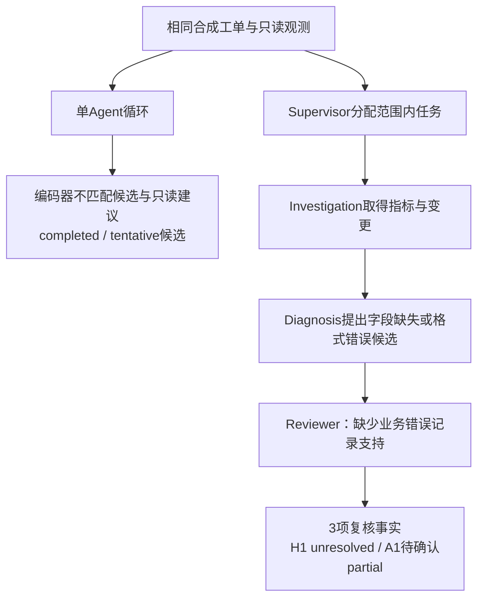

# 定向真实对照与面试讲解

2026-10-10，使用当前应用指纹 `ba7f01ad1e477d7d` 完成两个定向案例和一个工单修订版的真实模型对照。没有修改 Agent、提示词、预算或工具权限。原独立集、原专项集、旧结果和所有本轮运行保留。

本轮拿到了**独立复核拒绝为不充分候选背书的真实片段**，适合说明生成与核验分工。没有取得“多 Agent 完整诊断明显优于单 Agent”的证明。面试重点应放在已实现、可追踪的协作机制，不使用未观察到的胜率或准确率。

## 案例如何针对当前架构设计

**推送与历史扩容（show_001）**：推送错误、队列积压表面上类似历史容量故障；当前 CPU 低、Worker 存活，业务请求收到未知字段拒绝，编码器与接收端协议不同。适合展示当前取证与历史适用性对照。完整样本可由两个链路使用相同六个工具读取。

**绿色探针与导出失败（show_002）**：本地健康探针、元数据读成功，业务写入返回 403，业务身份变为 export-reader；历史故障则是读写都连接超时。适合展示业务路径与探针范围、历史条件的区分。

**补充告警摘要的修订工单（show_101）**：show_001 的所有观测语义保持一致；工单增加用户反馈的 HTTP400 UNKNOWN_FIELD recipient_id，并明确此次只需要机制诊断与一个只读核查建议。告警摘要仍需观测核对。它是在查看第一批结果后修订的开发案例，不是独立测试。

与原专项案例相比，首次两个案例在试跑前缩短窗口、去掉重复基线采样，并明确业务目标和实际登记的监控项，减少上下文噪声；第二例移除无关旧磁盘事件。每一版都先冻结数据与评价参考，再运行配对。两条链路收到完全相同的工单和数据，没有限制单 Agent 使用知识工具或人为降低其预算。

## 实际运行结果

模型都是 qwen-turbo，temperature=0，输出上限2200；每条链路16模型/8工具/180秒上限，预留3模型/20秒收尾，SDK每步一次尝试。执行顺序交替；修订版仅再运行一对，之后停止。

| 案例 | 链路 | 实际模型 / 工具 | 耗时 | 状态 / 复核 | 实际产出 |
| --- | --- | --- | --- | --- | --- |
| show_001 | 单 Agent | 4 / 3 | 11.953s | partial / not_performed | 指标、Worker、变更观测；无H/A |
| show_001 | 多 Agent | 13 / 3 | 55.609s | partial / not_performed | 进入Diagnosis/Reviewer，复核输出校验未通过 |
| show_002 | 单 Agent | 3 / 2 | 7.687s | partial / not_performed | 取得探针与写403；无H/A |
| show_002 | 多 Agent | 10 / 2 | 34.969s | partial / not_performed | 取得写403，诊断建议类型校验未通过 |
| show_101 | 单 Agent | 4 / 3 | 13.609s | completed / not_performed | 编码器不匹配候选、接收端兼容性核查建议 |
| show_101 | 多 Agent | 13 / 3 | 41.438s | partial / needs_information | 复核保留3项事实，原因unresolved，建议待确认 |

总计 **6次真实运行、47次模型调用、16次合成只读工具尝试、259664个已知Token**。费用未估算，没有真实 IT 写操作，也没有额度、认证或网络错误。6份报告各6项机械检查通过，共36项；它们验证轨迹、计数、引用、快照、契约与预算，不是36项诊断质量成绩。

正式外部语义评分仍待人工确认。[完整配对记录](curated-live-comparison.json)保存配置、源码/数据/报告哈希、各角色调用、工具轨迹、校验错误和全部结果；[助手辅助审阅](curated-live-assistant-review.json)没有伪装成人工评分。show_002 的参考答案留有旧例文字，人工审阅应同时查看 `evals/showcase_live/answer-errata.json`，不以当前快照不存在的旧runner为要求；未回填或调整成绩。

## 可以展示的真实复核片段

show_101 的多 Agent 实际调用：Supervisor 4、Investigation 7、Diagnosis 1、Reviewer 1。Knowledge 未运行；本批三条多 Agent 都没有使用 Knowledge，不能将设计意图说成已测出的知识分工收益。

1. Diagnosis 根据编码器变更提出：“HTTP400 错误可能是由于 recipient_id 字段在配置中缺失或格式错误导致的。”引用只指向编码器变更记录，未取得具体业务拒绝记录。
2. Reviewer 对 H1 给出 `uncertain`，指出缺少直接支持该具体解释的 HTTP400 错误记录。
3. 报告把 H1 发布为 `unresolved`，仅列出获复核支持的3项事实。建议 A1 进入 `pending_actions`，`executable=false`，没有包装成可执行修复。

[真实草稿、复核意见与发布结果](curated-review-evidence.json)都来自同一份原报告，没有脚本替代模型响应。

这里能展示**候选生成与独立判断分开、复核意见影响最终发布、过程可审计**。它并不表示整个复核都正确：本次对只读建议的拒绝偏严格，补查提出重复过滤，被共享Harness拒绝；没有执行新证据补查，也没有最终定位完整机制。重复调用拒绝、权限、审批和预算是两个链路共有的程序控制，不能算多 Agent 独有优势。

单 Agent 在修订例的候选方向合理，读取了配置日志，比多 Agent更快、取证更多；它的 H 本来就标为 tentative，没有宣称根因已确认。不能将这一对照描述成“单 Agent 自信误诊、多 Agent 正确修复”。



## 面试可以这样回答

“我把故障排查拆成取证、资料检索、诊断和独立复核，由Supervisor在预算内调度。这样做的价值是给候选生成和最终核验不同职责，并把证据、质疑及发布决策留在可审计的轨迹里。一个真实模型跑的合成推送场景中，Diagnosis把一次编码器变更解释成字段格式问题，Reviewer指出缺少直接业务错误记录支持，最终系统没有为这个具体解释背书，保留了已核查事实和待查项。”

“我保留单 Agent 作为同模型、同数据和同预算基线。单 Agent 对简单或线索清楚的问题更快，也可能给出更好的候选；多 Agent 的定位是增加独立复核和协作过程控制，而不是保证每次答案更准。我的演示证明了这个复核机制实际运行并影响发布；总体准确率提升仍需要更多独立样本。”

如果被问“明显优势是什么”，具体回答：**分工责任可明确、假设能被另一角色质疑、发布依据能追踪**。这三项是当前实现能力，其中复核影响发布已有本轮真实片段。不要报“准确率提升X%”“所有角色同时并行”“已稳定胜过单 Agent”或“真实复核补查成功”；本批没有这些证据。

## 复现与文件入口

免费准备检查：

```powershell
.\.venv\Scripts\python.exe scripts/compare_showcase_live.py --check
.\.venv\Scripts\python.exe scripts/compare_showcase_revision.py --check
```

新付费复现须使用自己的项目模型和登记身份配置，经授权后显式指定案例与预算：

```powershell
.\.venv\Scripts\python.exe scripts/compare_showcase_live.py --live --execute-live --cases show_001 show_002 --model-budget 16 --tool-budget 8
.\.venv\Scripts\python.exe scripts/compare_showcase_revision.py --live --execute-live --cases show_101 --model-budget 16 --tool-budget 8
```

原报告保存在：

- `output/showcase-live-first/3144422c-c3db-4e9b-905e-f4a23608338a/`
- `output/showcase-live-revision/6ecf8485-a3cb-40ed-9d61-74311aec157a/`

两个目录都有bundle、原JSON/Markdown报告、comparison、待确认人工评价表。可离线核验，无模型请求：

```powershell
.\.venv\Scripts\python.exe scripts/evaluate_showcase_live.py --suite showcase_revision --bundle output/showcase-live-revision/6ecf8485-a3cb-40ed-9d61-74311aec157a/bundle.json --output output/showcase-revision-checked.json
```

展示案例与参考评价放在 `fixtures/incident_showcase_live`、`fixtures/incident_showcase_revision`、`evals/showcase_live`、`evals/showcase_revision`。四项新增免费测试覆盖答案隔离与日志过滤、显式付费执行参数、默认计划不加载凭据或执行模型、修订版观测语义一致性。没有重新跑整套后端回归，因为应用源码未变；没有提交或推送Git。
