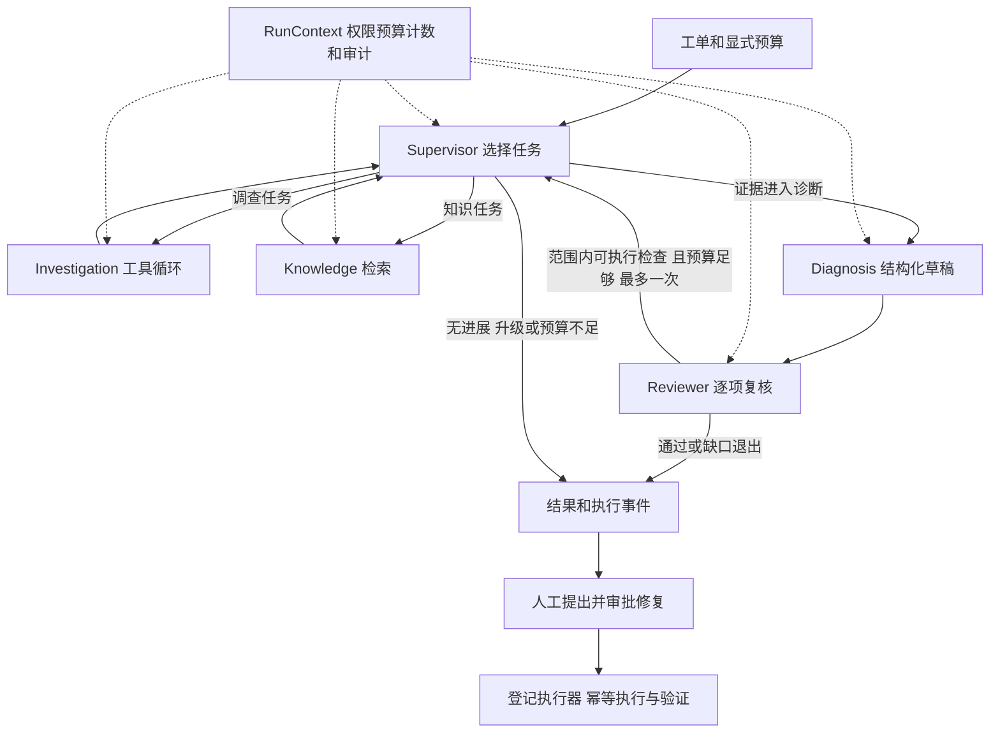

# 编排与 Harness 设计说明

## 模型决策与确定性控制

系统采用预定义的角色与工具边界，边界内由模型选择调度、只读查询、原因候选及具体补查。模型生成的计划需要经过程序校验，不能改变身份、登记范围或预算。

图表示主要路径；完整异常边和门禁以源码为准。脚本演示真正运行 LangGraph，但脚本模型的选择是预设控制响应，不能用它证明自主推理。

## 为什么拆成五个角色

Supervisor 管理任务；Investigation 收集当前观测；Knowledge 收集适用手册与已确认历史；Diagnosis 组织解释；Reviewer 检查事实、假设和建议。这一分工让工具权限、输入范围和输出契约更明确。

代价是更多模型调用、延迟和接口失败点。同一模型的不同角色仍可能犯相关错误；Reviewer 不能被视为独立真值。当前历史样本没有证明多角色整体优于单 Agent。简单任务的单 Agent 路由可在有评测支持后再决定。

核心文件：`app/workflow/coordinator.py`、`app/agents/contracts.py`、`app/agents/models.py`、`app/agents/single.py`。

## 为什么目前串行，不急于添加恢复

`app/workflow/graph.py` 用 StateGraph 条件边切换角色。串行执行便于共享预算、去重、证据目录和审计顺序，适合当前短时诊断范围。尚未证明并行收益，因此未增加并发协调复杂度。

业务状态主要在协调器对象，图状态记录阶段与计数快照。RunStore 持久化报告和事件；SSE 可以续读事件，但不能从中断节点继续模型运行。若实现 checkpoint，需要先处理可序列化状态、剩余预算与重复执行，特别不能自动重放修复写操作。

## Harness 如何约束不可靠的输出

`app/runtime/context.py` 的 RunContext 统一计数、预算和调用跨度；`app/tools/executor.py` 在真实查询前检查工具角色、身份、参数、服务与时间范围，重复查询受抑制，重试也消耗工具尝试预算。

各模型输出经严格契约校验；当前可见引用由服务端列出，引用值与来源字段、时间、单位、版本和快照一致。结构修复和复核补查都有上限；无当前支持的历史线索不能直接升级为已支持原因。

格式正确、引用存在不等于陈述正确。例如，引用基线池使用率和池上限，仍不足以证明当前负载造成等待。该问题需要语义评测与人工审阅，不能只增加 Schema 约束解决。

总时间预算在调用边界和结果处理时检查，并配合各调用超时；不是保证所有在途请求在总截止点强制取消。Token 及 HTTP 尝试计数只报告已知部分，费用不凭调用次数估算。

## 上下文如何组织

`app/evidence/model_view.py` 生成面向模型的观测视图，保留来源目录和可引用字段，减少不必要的原始内容。工具返回有记录数和消息体积上限，截断、空结果与缺失渠道作为覆盖限制传递。

当前观测与历史工单分开；每个角色使用对应提示词与局部任务输入，补查携带相关证据与明确检查目标。可以解释“为什么选择这些观测”，不展示或依赖模型隐藏思维过程。

## 为什么修复由执行器处理

Agent 和人工可以提出意图；`app/repairs/` 负责登记动作、目标、审批摘要、工单与证据版本绑定、幂等执行及后置验证。批准与执行是不同步骤，模型不能生成任意脚本并直接运行。

当前真实 Docker 执行器支持已登记目标的 restart_service。其他动作的契约不等于默认执行器具备实现。诊断 completed、复核 passed、修复 verified 均不自动确认业务工单解决。

## 评测为什么检查结果和轨迹

`scripts/compare_incident.py` 在同预算 Harness 下比较单／多 Agent；模型执行结束后评测端才读取 gold。`evals/incident/comparison.py` 校验报告哈希和实验配置，并把机械性质与人工语义指标分开。

必要观测覆盖衡量取到什么，最终引用衡量使用了什么，语义评分判断是否支持陈述。路径可以不同；预算、权限和来源真实性必须满足约束。失败和 partial 不从分母删除。

模拟成绩不进入模型质量。历史一组开发案例不代表当前版本，也不能推出总体准确率。项目规模、长任务恢复、更多真实场景和独立测试集仍有边界，应如实说明。
