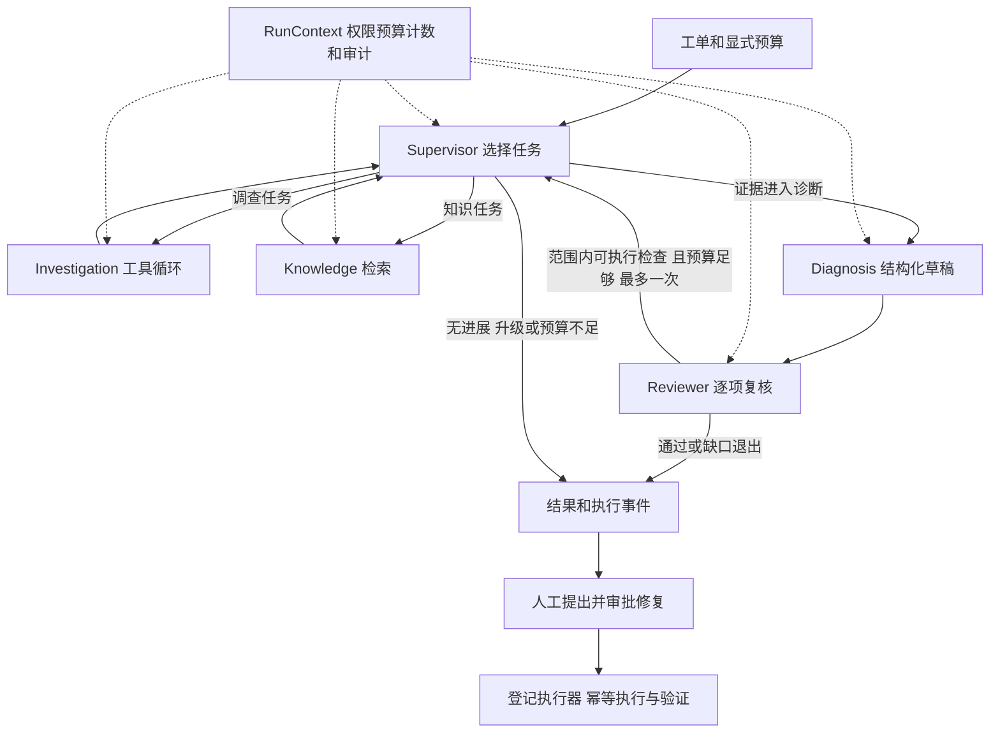

# 编排与 Harness 设计说明

## 模型决策与确定性控制

系统采用预定义的角色与工具边界，边界内由模型选择调度、只读查询、原因候选及具体补查。模型生成的计划需要经过程序校验，不能改变身份、登记范围或预算。

图表示主要路径；完整异常边和门禁以源码为准。脚本演示真正运行 LangGraph，但脚本模型的选择是预设控制响应，不能用它证明自主推理。

## 为什么拆成五个角色

Supervisor 管理任务；Investigation 收集当前观测；Knowledge 收集适用手册与已确认历史；Diagnosis 组织解释；Reviewer 检查事实、假设和建议。这一分工让工具权限、输入范围和输出契约更明确。

代价是更多模型调用、延迟和接口失败点。同一模型的不同角色仍可能犯相关错误；Reviewer 不能被视为独立真值。当前历史样本没有证明多角色整体优于单 Agent。简单任务的单 Agent 路由可在有评测支持后再决定。

核心文件：`app/workflow/coordinator.py`、`app/agents/contracts.py`、`app/agents/models.py`、`app/agents/single.py`。

## 为什么目前串行，不急于添加恢复

`app/workflow/graph.py` 用 StateGraph 条件边切换角色。串行执行便于共享预算、去重、证据目录和审计顺序，适合当前短时诊断范围。尚未证明并行收益，因此未增加并发协调复杂度。

业务状态主要在协调器对象，图状态记录阶段与计数快照。RunStore 持久化报告和事件；SSE 可以续读事件，但不能从中断节点继续模型运行。若实现 checkpoint，需要先处理可序列化状态、剩余预算与重复执行，特别不能自动重放修复写操作。

## Harness 如何约束不可靠的输出

`app/runtime/context.py` 的 RunContext 统一计数、预算和调用跨度；`app/tools/executor.py` 在真实查询前检查工具角色、身份、参数、服务与时间范围，重复查询受抑制，重试也消耗工具尝试预算。

各模型输出经严格契约校验；当前可见引用由服务端列出，引用值与来源字段、时间、单位、版本和快照一致。结构修复和复核补查都有上限；无当前支持的历史线索不能直接升级为已支持原因。

格式正确、引用存在不等于陈述正确。例如，引用基线池使用率和池上限，仍不足以证明当前负载造成等待。该问题需要语义评测与人工审阅，不能只增加 Schema 约束解决。

## 任务检查与复核

2026-10-10 的真实开发案例暴露出任务目标与实际取证之间的缺口：目标包含配置核查，实际只查询指标，叶子循环结束后 Reviewer 仍通过。随后优化复用原有五角色、六工具和一轮补查，不增加角色或并行执行。

Supervisor 的 `TaskRequest.checks` 最多声明两项必需的 `tool/args`，与 Reviewer 补查复用 `ReadOnlyCheck`。程序先按目标角色的工具、身份、登记来源和工单窗口校验。初次取证仍由 Investigation/Knowledge 选择实际工具；没有强制查询所有渠道，也没有从评测 gold 提取检查。

`ToolExecutor.check_results` 记录规范化参数、返回状态、截断及证据编号。`workflow/task_checks.py` 将声明检查与这本程序台账匹配：窗口必须覆盖要求，限制级别的日志不能替代不限制级别的日志，指标集合须覆盖且所需窗口内各指标有样本。查询成功但为空、失败、截断或缺少样本时保留缺口；重复拒绝不会覆盖此前成功的记录。

任务结果区分 `execution_status`（叶子执行循环状态）和 `completion.status`（声明检查是否满足）。`checks_satisfied` 仅是有界样本覆盖，`checks_incomplete` 表示必查项未满足，兼容的未声明任务为 `not_specified`。`goal_verified` 固定为 false：程序没有泛化的目标语义或因果判定器。报告会展示该区别，未满足的声明检查阻止整份报告直接通过；已有观测和成立的条件式建议仍可保留。

Supervisor、Diagnosis 和 Reviewer 接收任务目标、检查结果和缺口，Reviewer 另获得完整工单症状。Reviewer 判断缺口是否影响争议假设，有价值且预算足够时提出已登记的具体补查；服务端只执行审批过范围的只读检查，最多一轮。后续检查满足原要求时，台账重新计算覆盖，原任务缺口可解除；预算不足、渠道缺失或检查仍未满足时返回 partial。

Reviewer 提示词加强了“异常数字、故障机制、深层触发原因、操作条件”的区分，不能仅凭引用有效通过；未知深层原因也不一律否决有依据的条件式恢复建议。单 Agent 的原提示词保留。语义判断仍来自模型，未声明或错误拆解的任务仍需复核；本轮免费脚本测试只证明门禁和补查控制，没有优化后真实模型成绩，之前真实对照的文件和评分保持历史属性。

对应源码：`app/agents/contracts.py`、`app/agents/prompts.py`、`app/tools/executor.py`、`app/workflow/task_checks.py`、`app/workflow/coordinator.py`、`app/evidence/render.py`。回归场景见 `tests/workflow/test_task_checks.py`。

后续真实对照又暴露出提前结束路径：取证角色直接返回合法空结果，声明查询仍未执行，Supervisor 重派相同任务后被去重门禁终止。现在 `app/agents/investigation.py` 在接受最终 JSON 前检查台账；仅对 `not_executed` 检查发送一次执行提醒，要求现有步骤和非收尾模型预算至少容纳工具选择及结果总结，不增加原步骤、预算或结构修复额度。空结果、失败查询和已满足项不触发这条重复取证提醒。

提醒后仍未调用工具，或没有纠正空间时，叶子记录 `NO_TOOL_PROGRESS`。协调器停止重复派发并清空剩余取证队列，逐项记录暂缓事件；已有当前观测时交给 Diagnosis/Reviewer 收尾并保留缺口，否则以 partial 返回。该结果不表示目标满足。新回归 `tests/workflow/test_leaf_progress.py` 重放真实提前结束响应，覆盖接受提醒、持续无进展、预算不足、空结果/失败、已有观测收尾、Knowledge 和证据复用。修复后的免费控制验证通过，尚未追加真实模型质量复测。

总时间预算在调用边界和结果处理时检查，并配合各调用超时；不是保证所有在途请求在总截止点强制取消。Token 及 HTTP 尝试计数只报告已知部分，费用不凭调用次数估算。

## 检查选择与建议补查

取证推进修复后的真实配对仍暴露出漏查关键指标、重复关注空日志、复核只列缺口等问题。后续优化继续复用原图与工具，围绕候选机制选择检查；本轮没有付费复测，不将免费脚本场景当作模型质量。

`TaskRequest.expected_value` 可说明检查的区分价值，由模型选择具体检查，未填写仍兼容。叶子结果中的 `candidate_mechanisms`（暂定假设）传给 Supervisor、Diagnosis 与 Reviewer，和实际观测分开。提示词要求将同一机制相关的少量指标合并查询，搭配相关日志或变更；没有运行时读取评测 gold，也没有把所有渠道写成固定必查项。协作角色的合成案例工具 Schema 列出实际可查询指标，SingleAgent 原工具与提示词指纹保留。

`app/tools/query_coverage.py` 比较同一已授权运行内的窗口、字段与过滤条件。完整、不截断的空查询可以覆盖更窄筛选，工具执行器返回复用的空结果，记录 `query_reused`，不新增 Provider 尝试或伪造新来源。限制级别的空日志不覆盖不限制级别的查询；失败、截断、不同类别或更大窗口不能通过此规则跳过。SingleAgent 基线沿用原行为。

协调器在派发和每个同批任务开始前检查台账：声明检查全都已覆盖或精确执行过时，记录 `task_reused` 并跳过该叶子的模型请求。混合新旧检查的任务保留声明要求，由叶子复用已有结果、选择新检查。已执行不表示成功；空、失败与截断缺口仍按台账动态计算，并在诊断或受控退出时保留。没有当前观测时不能直接诊断，没有解除因果验证与报告通过门禁。

原 `EvidenceRequest.hypothesis_id` 继续关联原因，新增可选 `target_id` 明确争议的 H/A；未填时沿用质疑 H。建议条件不足可指定 A 编号，允许相关 H 保持 supported。目标必须存在且该目标未获支持，检查仍验证角色、身份、工单范围、重复查询和登记能力，经 Supervisor 分派后由已有补查路径执行。A 补查不是操作审批或修复执行。

当 Reviewer 在诊断中只给 H/A uncertain、没有请求补查也没有 `follow_up_reason`，且仍有充分研究及收尾预算时，最多发送一次 `review_follow_up_correction`。模型必须自主选择有价值的检查，或解释为何没有可用检查、需要人工实验或条件不影响结论；程序不从自由文本猜测参数并自动执行。提醒消耗正常模型预算，不占结构修复额度；仍允许最多一轮补查和一轮修订后的复核。理由保存在复核记录与事件中，仍无有效请求时保留 partial。

新场景见 `tests/workflow/test_information_gain.py`。接受建议补查的预设场景11模型/3工具完成；持续不给检查的场景仅提醒一次后以 partial 结束；已有检查的同批任务跳过后为5模型/2工具。上述是特定控制场景，不能拿来替换此前真实15模型/5工具的成绩。下一次真实对照应检验模型的任务选择、信息增益、建议条件和有效补查，而不是只看格式通过或状态标签。

## 共享证据需求与完成门禁

`app/workflow/evidence_needs.py` 建立与查询任务独立的共享问题清单。故障诊断初始为症状、候选机制、替代解释三个问题；状态核查只有症状问题，不预设故障原因。Supervisor 根据工单和实际观测聚焦问题，最多六项，保留已有编号与用途；可追加深层触发原因与建议条件。它不是运行时 gold、固定查询顺序或一份必查所有渠道的清单。

`EvidenceNeed` 保存 N 编号、问题、用途、状态、证据编号、理由及可选只读检查。`TaskRequest.need_ids` 将调查任务关联到问题；`EvidenceRequest.need_id` 可将既有 H/A 补查关联到问题。提案只验证工具、角色、登记和工单范围，不会直接执行，实际读取继续走原执行器。模型未返回清单时保留原问题；部分返回删除已有问题、改变用途、未知编号、重复编号或越界检查均不能覆盖台账。

Supervisor 的 supported 是模型判断，须有当前观测引用，程序不将工具名称、历史线索或局部执行完成当作证明。Diagnosis 同时读取共享问题与实际任务覆盖。Reviewer 用 `need_assessments` 对每项问题独立说明 supported、uncertain 或 not_required，不能只评估 F/H/A。症状与机制不能 not_required；合理替代解释确实不适用时可说明理由后停止检查。遗漏评估自动成为 uncertain，不生成模型未给出的支持判断。supported 没有当前观测引用也会降为 uncertain。

最终通过还要求关键问题没有未解决项；渠道缺失、预算不足和 unresolved 关键因果环节保留 partial。深层触发原因及执行前人工条件尚未确认可保留在信息缺口，条件明确的建议不因此一律失败；是否有条件适用仍由 Reviewer 的 A 评估判断。程序不保证条件式建议语义正确，也不放宽独立修复审批。

补查仍最多一轮，结构纠正及预算上限不增加。有预算但关键问题 uncertain、既无有效补查也无解释时，复用原本最多一次复核提醒；无可用 H/A 目标时保留缺口，不能发明假设或不可执行检查。第二次复核重新评估全部问题，后来的有效证据可以解除原缺口。`evidence_needs_updated` 和 `evidence_needs_reviewed` 记录状态快照，报告显示最终清单；获支持的问题引用纳入已用证据。

角色请求采用紧凑 JSON，保留相同信息和原28,000字符输入预算。既有真实对照记录没有重写。脚本模型新增显式预设问题评估，仅用于验证程序控制，不将其结果计为真实模型质量；单Agent原提示词与工具指纹保持。

新增 `tests/workflow/test_evidence_needs.py` 的9个免费场景覆盖局部任务完成但关键问题未解决、替代指标取证、人工条件限制、漏评与小预算、补查关闭缺口、状态核查、禁止删除或改变用途、越界提案、历史线索不能代替当前观测。完整免费回归277项：270通过、7项隔离PostgreSQL跳过；最后报告记账补充后的定向43项通过。本轮不调用付费模型或操作真实服务；尚未证明优化后的诊断准确性、总体优势或成本变化。

## 查询推进与输出协议

2026-10-10 独立对照后的修正采用通用状态语义，不读取案例编号、参考答案或错误码选择检查。`app/workflow/task_checks.py` 分开记录 `query_complete`、`goal_verified=false`、阻塞缺口和 `limitations`。完整无匹配的日志、变更和知识检索标为 `checks_completed_empty`，只证明所选范围查询完成，不能生成来源引用或确认健康；空指标仍缺少必要测量样本，保留 `checks_incomplete`。宽查询中的非匹配事件可证明更窄查询为空，指标仍须在目标窗口取得指定指标样本。

`app/workflow/coordinator.py` 判断一批任务的推进时比较已执行查询台账，而非只比较新增证据编号。新的空查询仍有查询状态可交接，返回 Supervisor 决定是否换有价值的渠道；没有新增读取则沿用受控诊断收尾。程序没有制定必查全部渠道清单，调度仍受四次决策、六个任务和原预算限制，语义不足仍由共享问题及独立复核阻止通过。

有效的复核补查经过原来的目标、引用、工具、范围和重复校验后，若关联 N 被同时标为 supported/not_required，则保守重新置为 uncertain，记录 `review_need_reopened` 和原状态；不把 uncertain 自动提升为 supported，也不直接调用工具。H/A 目标已被支持时仍拒绝其补查，A 条件补查允许相关 H 保持 supported。一轮补查耗尽后仍按原上限退出。结构纠正最多一次；状态收紧不消耗它。

原最多一次复核选择提醒现在根据程序校验后的结果判断，被拒绝的重复请求也能在有足够原预算时选择新检查或解释无法补查。拒绝原因进入提醒；没有预算时直接保留缺口，不添加请求或重试额度。

`app/evidence/contracts.py` 的 `OwnerReferenceSelection` 与普通 `ReferenceSelection` 分开，`app/evidence/ownership.py` 只列本次真实负责人 team 引用。未观测负责人时模型 Schema 仅允许 null；读取后刷新枚举与 `owner_options`。最终仍执行原来源/字段校验，不能将任意有效 REF 当负责人。公共报告的 `escalation_team` 和严格旧格式兼容不变。单 Agent 也使用共享契约，因此系统提示词虽未改变，版本标识已从 `ba34bfdaff0d` 变为 `6f9f6efc54dd`，后续实验必须记录新基线。

`app/agents/prompts.py` 合并重复规则并移除具体 Worker/连接池案例，按观测、机制、替代解释、查询结果和预算组织五角色指令。没有放宽引用、因果复核、修复审批或工单解决门禁。

验证：`tests/workflow/test_protocol_progress.py` 新增8项失败类型响应重放与边界验证；相关151项免费回归通过。冻结验证集6案例各 single/multi 共12条脚本运行，序列、计数、快照、引用、契约及预算机械校验全通过，语义质量标为 `excluded_scripted`。未释放保留集、未改变观测/答案/评分规则、未追加付费调用或真实IT操作。保存轨迹没有被拒绝模型的原始JSON，因此新增场景是失败类型重建，不能称为逐字重放或真实模型改善证据。

## 实时查询状态与诊断完整性

最新真实验证中，叶子拿到结果后仍引用任务开始时的“未执行”状态，Supervisor又将该摘要继续作为缺口。`app/agents/investigation.py`现在每次模型请求都重新计算`objective.check_completion`并刷新`collection`，保留同样的目标、授权检查和预算，不修改调用者原objective。失败和截断仍明确未完整，空查询完成与语义充分仍分开。

`task_input`交接带`query_state_source=server_read_ledger`和`model_summary_verified=false`，共享指令明确：查询执行状态以程序completion/collection为准，模型旧摘要不能覆盖台账；已有查询仍可能存在语义未知。没有用关键词删除缺口或替模型选择下一项检查。

`app/workflow/coordinator.py::supervisor_decision`在ask已有纠正循环内验证动作与任务关系：只有dispatch允许任务，dispatch至少一个任务。Schema用oneOf表达相同分支，错误包含字段位置及具体说明。一次纠正耗尽仍MODEL_OUTPUT_INVALID，冲突任务不会自动被转换成dispatch或执行，其他角色、范围和重复校验保留。

`app/evidence/completion.py`统一诊断内容门禁。诊断至少具备findings、hypotheses、recommended_actions三部分；缺项不编造、不强制调用、不占结构纠正额度，保留已有观测及具体缺口。单Agent在取证循环结束、task_completed和RunContext收尾前应用门禁，保证状态、终止原因和事件一致：partial/DIAGNOSIS_INCOMPLETE/needs_information。状态核查仅要求findings，不强制原因和建议。多Agent复用同一函数，依然另需Reviewer和核心证据问题通过；单Agent完整也仍not_performed，内容完整不等于语义获复核。

新增`tests/workflow/test_live_protocol_regressions.py`的8项免费场景覆盖动态输入、空/失败/截断、调度纠正及上限、缺任务、单Agent缺项、事件一致性和状态核查。172项相关回归通过，独立验证集12条脚本运行六项机械检查全部通过；脚本故意不作诊断，因此两组都为partial，质量excluded_scripted。用最新函数检查已保存四条真实输出的缺项，没有改写原始状态或报告哈希，也没有新真实模型成绩。

本次输入与完成标准都改变，后续真实实验应记录新源码指纹`3bf80cace99da12b`，不能把门禁导致的partial变化解释成模型退步或把免费控制通过当作质量提升。

随后同预算真实配对见[实时台账修复后对照](live-ledger-comparison.json)：DNSsingle真实触发DIAGNOSIS_INCOMPLETE，DNSmulti进入诊断及复核并取得DNS机制，但N3未完成；证书两组均漏查依赖日志，single内容齐全但仅TLS方向，multi复用重复空配置查询后收尾。30次真实模型请求、四条机械检查通过；未触发调度冲突纠正，不能拿免费分支覆盖替代真实触发证据。预算与去重保护没有保证模型选择有信息价值的检查，语义质量尚未证明普遍提升。

## 有界调度推进与补查预算

`app/workflow/coordinator.py`在重复任务全部复用、包含完整空查询且核心问题仍pending时，允许最多一次返回Supervisor重新选择；成功结果的正常复用及同批跳过仍沿用原快速路径。准备diagnose但关键问题未评估时，也可使用这同一份一次提醒机会。`planning_guidance`公开关键问题、next_check及台账判断的adds_information，模型选择新检查、基于已有观测评估或说明停止原因；程序不自动提升问题状态，也不指定案例工具顺序。Supervisor通用提示在`app/agents/prompts.py`要求need_ids关联检查、expected_value解释信息价值，并允许有理由地结束替代解释核查。

Reviewer输入与提醒使用`rework_budget`估算：待发生请求＋Supervisor一次＋批准检查后的解释一次＋原收尾预留。默认三次预留时，复核后剩6次可负担一次提醒及补查，剩5次不提醒；直接补查需要5次。rework调度按一次叶子解释估算，并要求全部批准检查的工具额度满足。总上限、时间预留、四次有效调度、六任务及一次返工不变。

新增`tests/workflow/test_general_progress.py`的8项控制场景与180项相关回归全部通过，独立验证集12条脚本控制的六项机械检查通过。真实模型未重测，测试集仍冻结，保留集未释放。模型仍可能错误选择渠道或给出不充分理由；一次提醒和预算保护不能替代独立语义评估。

## 诊断层级、建议类型与报告完成

`workflow/review_outcome.py`统一Supervisor、Diagnosis、Reviewer的`diagnosis_policy`。报告需要复核观测、至少一个有支持的机制和一个有效下一步；被排除的候选不再单独阻止完成，uncertain机制与关键N仍阻塞。N的可选`blocking`必须说明影响程度，symptom/mechanism不能关闭阻塞；默认保持旧保守规则。

H新增`level`（mechanism/trigger/alternative）与`evidence_explanation`；A新增`kind`（read_only_check/manual_change/registered_repair）和登记只读`checks`。程序校验来源及范围，模型仍判断因果与建议相关性。旧输出使用unspecified兼容，不声称已分类。

有依据的只读建议无需预先取得查询结果；变更仍需人工条件和审批。通过复核的建议进入recommended_actions，uncertain的分类建议作为pending_actions显示、剥离repair且executable=false，原意图留在草稿。顶层diagnosis_readiness区分可用报告及关键缺口；completed不等于所有候选均成立、修复获批或工单解决。

10项新免费场景与324项全量回归通过（317通过、7项数据库集成跳过）；冻结验证集12条脚本机械核验、离线演示及模拟审批闭环通过。0付费调用、0真实服务写入。未修改冻结数据或历史成绩，没有证明真实模型质量提升；下一次对照需要记录更新后的契约版本。

## 上下文如何组织

`app/evidence/model_view.py` 生成面向模型的观测视图，保留来源目录和可引用字段，减少不必要的原始内容。工具返回有记录数和消息体积上限，截断、空结果与缺失渠道作为覆盖限制传递。

当前观测与历史工单分开；每个角色使用对应提示词与局部任务输入，补查携带相关证据与明确检查目标。可以解释“为什么选择这些观测”，不展示或依赖模型隐藏思维过程。

## 为什么修复由执行器处理

Agent 和人工可以提出意图；`app/repairs/` 负责登记动作、目标、审批摘要、工单与证据版本绑定、幂等执行及后置验证。批准与执行是不同步骤，模型不能生成任意脚本并直接运行。

当前真实 Docker 执行器支持已登记目标的 restart_service。其他动作的契约不等于默认执行器具备实现。诊断 completed、复核 passed、修复 verified 均不自动确认业务工单解决。

## 评测为什么检查结果和轨迹

`scripts/compare_incident.py` 在同预算 Harness 下比较单／多 Agent；模型执行结束后评测端才读取 gold。`evals/incident/comparison.py` 校验报告哈希和实验配置，并把机械性质与人工语义指标分开。

必要观测覆盖衡量取到什么，最终引用衡量使用了什么，语义评分判断是否支持陈述。路径可以不同；预算、权限和来源真实性必须满足约束。失败和 partial 不从分母删除。

模拟成绩不进入模型质量。历史一组开发案例不代表当前版本，也不能推出总体准确率。项目规模、长任务恢复、更多真实场景和独立测试集仍有边界，应如实说明。
