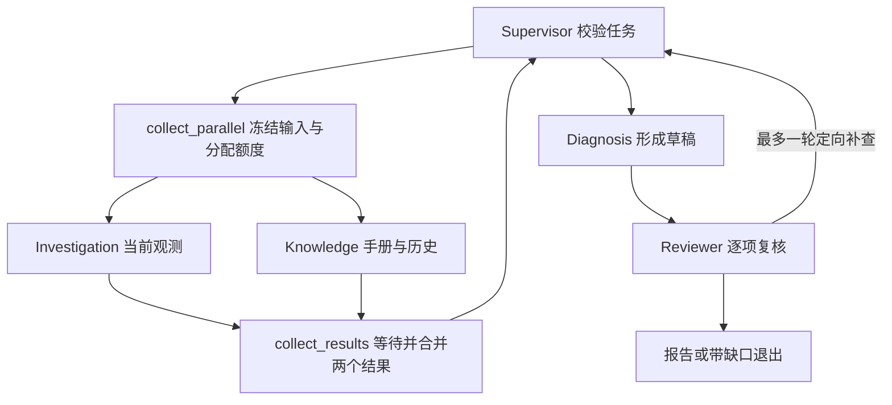

# Investigation / Knowledge 并行取证

Supervisor 同轮派出一个 Investigation 和一个 Knowledge 时，系统在预算允许的条件下并行执行，然后汇总证据继续调度。五个业务角色保持不变，额外的两个图节点只负责分叉准备和结果汇总。



## 何时并行

- Supervisor 必须自主派出这两个不同角色；不会为演示强行增加 Knowledge 查询。
- 两个任务只依赖分叉前已知信息。如果知识检索需要先读取调查结果，应分成两轮派单。
- 剩余工具预算至少四次，扣除收尾预留后剩余模型预算至少四次。
- 单任务、同角色任务、小工具预算以及 Reviewer 定向补查继续串行。复核和诊断不能在取证结果尚未汇总时提前开始。

默认开启；开发对照可调用 `collaborate(..., parallel_collection=False)` 使用原串行路径。当前开关是后端调用参数，没有新增前端或部署环境配置。工作流版本为 `incident_graph_v2_parallel_collection`。

## Harness 约束

`app/runtime/branch.py` 的 BranchContext 持有分支计数，调用前仍通过原 RunContext 的锁扣减全局预算。每个角色分得剩余额度的一半，奇数余量给 Investigation；模型步骤最多四次。分配不会预扣调用，未用额度留给后续轮次，同批另一分支不会借用它。模型调用和工具重试按实际尝试计数，分支不能占用 Diagnosis/Reviewer 的模型收尾预留。

`ToolExecutor.fork()` 复制同角色已有的证据、引用、查询去重与检查台账。输入在分叉前冻结；执行阶段各自写局部数据，通过共享事件锁写全局审计记录。图状态的 `collection_results` 使用 reducer 合并两个角色结果，批次编号校验拒绝过期结果。两个节点完成后只运行一次汇总，以 Investigation、Knowledge 的固定顺序发布任务与来源；事件记录仍反映实际执行先后。

全运行仍只允许一次结构修复，两个线程原子争用这一次额度。角色工具权限、身份、服务、时间范围、引用与复核门禁继续由已有执行器和校验代码约束。并行不会放宽通过条件。

某个分支失败时保留另一个分支的来源与具体缺口。已有当前观测可继续诊断、复核；只有历史知识不能形成当前诊断。认证、额度与范围权限错误汇总后受控终止。已发出的请求不能瞬时撤回，总时间预算按原调用边界检查，并配合 SDK 超时；没有新增 checkpoint 恢复。

主要源码：`app/workflow/graph.py`、`app/workflow/coordinator.py`、`app/runtime/context.py`、`app/runtime/branch.py`、`app/tools/executor.py`、`app/agents/investigation.py`。

## 免费复现与验证边界

```powershell
.\.venv\Scripts\python.exe scripts/demo_parallel_collection.py
```

命令使用原 case_003、相同脚本角色响应与预算，分别运行串行和并行 LangGraph。每个取证任务首个模型响应加入人工 250ms 延迟，原始报告、调用跨度与校验摘要保存在 `output/parallel-collection/<批次>/`。不会加载真实模型凭据，不访问业务服务，不产生付费调用。

两个路径应均完成复核与一轮补查，都是 12 次脚本模型步骤、5 次合成只读工具尝试。检查六项机械门禁和初轮取证时间跨度是否重叠；耗时只用于展示等待可重叠的调度机制，不能宣称真实模型提速比例、诊断质量提升或费用降低。

`tests/workflow/test_parallel_collection.py` 用线程屏障验证图节点实际重叠，并覆盖汇总一次、补查串行、局部故障、异常脱敏、预算切片、全局修复额度、任务计数与事件父子跨度。前轮查询摘要在隔离分支中仍保留，重复取证继续沿用台账。

2026-10-11 的[免费验证记录](parallel-control-result.json)：全量357项中350项通过、7项因未配置隔离 PostgreSQL 测试库而跳过；三个原面试演示全部通过。串并行演示均通过六项机械检查，初轮取证跨度分别524ms、269ms。这些跨度来自人工250ms等待；整轮耗时还包含调度与启动开销，不外推真实性能。

面试可解释：独立的当前取证与历史检索允许并行等待，汇总后统一诊断和复核；核心工程工作是预算原子扣减、状态隔离、确定性汇总与失败保留。此前真实对照是串行版本历史结果，本次未执行真实模型性能或质量对照。
